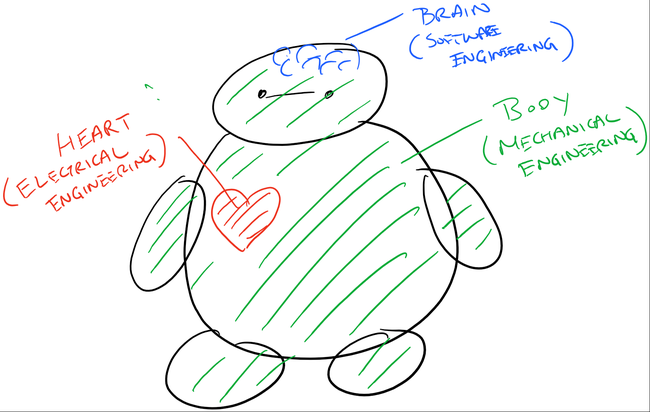

#### Instructor Mindset
* There are a variety of ways to present new concepts to students.  Think of different ways to explain new concepts and multiple methods of engaging students in learning these concepts.
* Set up your classroom in a “community-building” environment (e.g. chairs arranged in a circle; carpet space to sit in a circle, etc.)

### Step 1: Introducing Barnabas Robotics (10 minutes)
#### Project Objective
The overall goal of all Barnabas Robotics’ projects is to create a robot, while learning more about engineering - and about ourselves.  Throughout the Barnabas-Bot project, students will explore the various disciplines of engineering--including mechanical, electrical, hardware, and software engineering--which each play a critical role in robotics.  Additionally, students will have the opportunity to learn about themselves and their peers, as the project also promotes teamwork, communication, and self-reflection.

Take the time at the very beginning of the project to explain these goals to your students to set the tone and expectation for the rest of the project.

#### Creating a Culture of Encouragement
The name “Barnabas” means “Son of Encouragement.”  The Barnabas-Bot curriculum provides opportunities for students to be an encouragement to their peers and to themselves.  This is especially important because there are parts of the robot-building process that may be challenging.  Creating a culture of encouragement in the classroom will motivate students to try and persevere, even when they encounter frustration during the robot-building process.

Do not assume that all students understand what “encouragement” means or how they can be encouraging to themselves or others.  You can initiate a classroom discussion about what “encouragement” means by prompting students to share examples of encouragement they have witnessed or experienced in their own lives.  Lastly, discuss the four goals of the class:  1) Build, 2) Learn, 3) Teach, and 4) Inspire.  Then delve into the meaning of each one with your students.

### Step 2: Connecting the Disciplines (40 minutes)
#### Background Knowledge
Robotics is a cross-disciplinary field in which electrical engineering, mechanical engineering, and software programming concepts are applied to create a moving system (or a "robot").  Below is a brief explanation of how each of the three disciplines plays a part in robotics:

1) _Mechanical Engineering​_ i​s a branch of engineering that focuses on the design, construction, and use of machines and robots.  By definition, a robot has to have a moving part -- like an arm, which has joints at the shoulder and the elbow so that the arm can move back and forth. The mechanical component of a robot may be a motor, lever, or gear that helps the robot move.  A mechanical engineer may also design the exterior of the robot, which helps to protect the internal parts of the robot.

2) _Electrical Engineering​_ ​is a branch of engineering that focuses on the design, use, and distribution of electricity.  A robot must have a power source from which to draw electricity.  A robot’s power source may be a battery or an electrical outlet.  Just as the human heart pumps blood to the rest of our organs for our body to function, a battery or power source for a robot “pumps” electricity to the rest of the robot’s body parts so that the robot can move and function.  In order for electricity to reach the rest of the robot’s body parts, a robot has a network of wires and circuits through which electricity can travel.  This is similar to how human bodies have veins and arteries for blood to travel through to reach other organs.

To process information, the human body has a central nervous system consisting of a brain and a network of nerves and muscles.  Likewise, a robot needs a “brain” to tell its body parts to move and function. The “brain” of the robot is the computer chip or circuit board. 

3) _Computer Science​_ is the study of how computers function and process information. In order for humans to move their arms, the brain must send a message to the arm telling it to move. This message is similar to a computer program/code.  The program/code dictates the way a robot behaves and functions.  This is essentially the robot’s personality.

Building a robot requires collaboration amongst a team of individuals with varying skills.  Students going through the Barnabas-Bot curriculum will get a taste of each of the above engineering disciplines and work in collaboration with others (teacher, parent, mentor, classmate, etc.) as they build their robots from the ground up.

#### Discussion
Open up the robotics discussion by asking what the similarities and differences are between a human and a robot.  Throughout this discussion, students may name certain parts of a robot, or of a human, to help them compare and contrast the two.  As the students give examples of either similarities or differences, write them down on a whiteboard, putting some emphasis on the parts of either humans or robots, as this will segway nicely into the next part of the discussion.



{% include badge.html type='activity' content='<em>“Is This A Robot?”</em>  
 Ask the students if a commonly used appliance is a robot.  For example, “Is a washing machine a robot?”  Have the students plead their case one way or the other for why the object is or is not a robot.  The goal of this exercise is not to correctly identify whether the appliance is a robot or not.  Rather, the goal should be to guide the discussion toward using the four parts of a robot to assess whether the object is a robot or not.  Have the students attempt to match the appliance in question to that criteria of a robot (body, heart, brain, personality).' %}



{:class="image fit"}
{:class="image fit"}