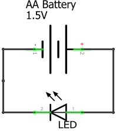
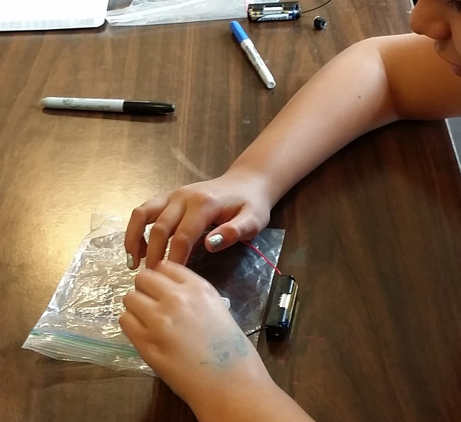
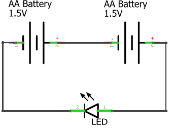
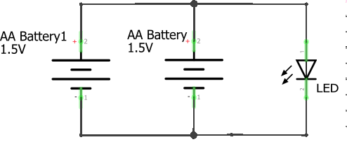
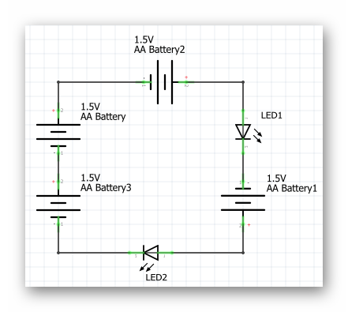
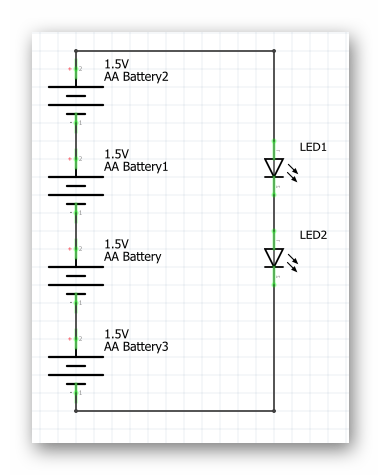

### Review
- What are the four main parts of a robot?
- Which kind of engineer works on each part of the robot? 

### Step 1: Electronic Basics (20 minutes) 
Draw a robot. I like to draw Eve from Wall-E. Eve’s battery is analogous to a human heart. Draw a heart on your robot. We cannot live without our hearts pumping blood to the rest of our bodies, and robots cannot turn on without a battery. Human hearts pump blood, similar to how robots batteries supply electrical power.  

Eve’s wires are analogous to a human’s arteries, veins, and capillaries. Draw a full circulatory system on your robot. We cannot be healthy if our arteries are blocked or veins are weak and cannot supply appropriate blood flow to our body. Similarly, issues with wiring can seriously affect the robot even if the battery is fully charged.  

Eve’s current flow is analogous to human circulation. Just as blood flows in one direction in our bodies: from our heart out to arteries into capillaries in our bodies where oxygen is used to veins that carry the blood back to our heart where the oxygen can be replaced (actually the blood also flows separately to the lungs to be reoxygenated, it is written here thusly for simplicity), electricity flows through a circuit in a particular direction so that the robot works best. Just as the circulatory system makes a loop, a circuit makes a loop too.  

#### Vocabulary
- **Closed-circuit**: A closed-circuit is when there is a complete loop in your electrical system. In this case electricity can flow.
- **Open-circuit**: An open-circuit is when the loop is broken. In this case electricity cannot flow. The robot cannot live if we have an open circuit, much like how we cannot live if blood is not circulating through our bodies.
- **Short-circuit**: A short circuit is when you have a loop, but electricity is flowing too fast. Just like blood being pumped through our bodies too quickly, too much electricity flowing through a circuit can harm the robot.



### Step 2: Building Our First LED Circuit (1.5V) (10 minutes) 
Draw the LED circuit schematic shown below. Encourage the students to determine the voltage of the circuit by examining their parts. HINT: it is written on the battery.

{:class="image"}

Explain that the voltage determines how fast electricity flows through our circuit. The higher the voltage, the faster electricity moves. Explain that electricity flowing through a circuit is called ‘current,’ and that there are positive and negative sides on both the battery as well as the LED. They need to line up the positives and negatives for the circuit to work.

The schematic is the plan for our circuit. You can compare it to the blueprint of a building. At this point, distribute the robotics kits to your students. Have them take out:
- AA Battery
- AA Battery holder
- LED

Have the students build the circuit with the components they just took out. Let them figure out how to correctly put the battery into the battery holder, as well as which side is positive(red) and which is negative(black). The positive end of the LED has a longer wire.

{:class="image right"}

...IT DOESN’T WORK!

Your students will notice that the LED does not light up. Ask them why (HINT: the 3V LED needs at least 3 volts to turn on). At this point, use the metaphor of a waterfall to describe voltage. Explain that the taller a waterfall is, the more power you will get out of it. It is the same with voltage. More voltage, more power. Ask the students how we can get the necessary 3V to light up the LED (DO NOT use the 9V battery. Instead, combine two AA batteries!).

#### Vocabulary
- **Current**: Current is simply the flow of electricity.
- **Voltage**: Voltage is what creates current, or the flow of electricity through a circuit. A larger voltage will cause a faster flow of electricity through a circuit.

{% include badge.html type="tidbit" content="Not all electronic components have positive and negative ends, as we will see later. However the LED being used must be placed in the following way due to some fairly simple physics. Have you ever made a lemon or potato battery? The key to getting a potato battery to work is that either side of the potato must be poked with some sort of metal AND a different metal must be used for each side. When the two metals are placed side by side one seems slightly negatively charged and the other seems slightly positively charged. This is what allows the potato to generate voltage and make current travel in a specific direction. The LED likewise has two different metals at either side of it, so it prefers current to flow in one direction through it." %}



### Step 3: Building The 3 Volt Circuit (15 minutes) 
Start by drawing the 3V LED schematic.

{:class="image "}

Ask the students to identify the difference between this schematic and our previous one (there are two batteries). How many total volts is the LED getting now.

Have the students work together to build the circuit. Everyone will need to find a partner to have enough batteries for the circuit. If you have an odd number of students, you as the instructor can fill in as a partner for one of your students.After giving the students an opportunity to build the circuit themselves, bring the class together and walk through building the circuit one step at a time.





{% include badge.html type='troubleshoot' content='Students often connect the positive terminals and negative terminals of the batteries together, rather than connecting the negative to positive (as shown in the schematic).  This incorrectly creates a parallel circuit.  If they do this, they will see that the LED still does not light up.  You can take this opportunity to talk about "series" circuits versus "parallel" circuits, if you like.  A "series" circuit stacks the batteries on top of each other, so that the voltage is added together (like putting two same height waterfalls on top of each other).' %}

A "parallel" circuit puts them next to each other so that the voltage stays the same, but there is more current available (like putting two same height waterfalls next to each other).

{:class="image left"}

Another error is for students to attempt to use more than two batteries to light a single	LED. While this will likely give a blighter glow to the LED it is likely to damage it as well. Another common error is to connect the batteries incorrectly. Remember that The red wire of one battery must be connected to the black wire of the other battery. In a circuit where the two red wires are connected or the two black wires are connected electricity will not flow. Going back to the waterfall analogy, we can increase the height of our waterfall by connecting batteries together from negative to positive. We are taking additional steps in the same direction, up. However connecting two like ends, whether negative or positive, has the opposite effect. One battery is attempting to increase the height of the waterfall while the other is decreasing it.

### Step 4: The Two LED Circuit (15 minutes or as time permits)
Now that the students have successfully made the 3V LED circuit it’s time to give them a bigger challenge. Instead of pairs, have the student’s get into groups of four. Between the four of them they should have enough batteries to light two LEDs. Give them the opportunity to attempt a two LED circuit on their own. Unlike the one LED circuit, this two LED circuit has multiple working schematics. See below. 

{:class="image "}
{:class="image "}
{:class="image "}

You should challenge your students to build the circuit without showing them the schematics above. These are more for the benefit of the teacher, so you may be more equipped to help your students with troubleshooting issues.

