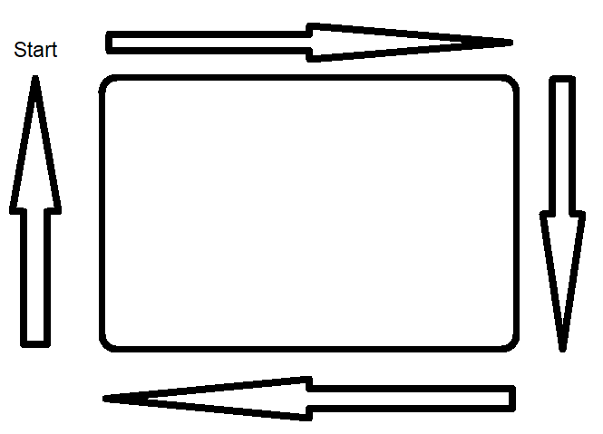

#### Review
   * Previous week  
   * Critical think based on previous question

### Step 1: Navigating the box
For our last obstacle course challenge let’s try to move our robot around a box.  
Have your robot travel around the box until it reaches its starting location. See below;

{:class="image fit"}

#### Things to consider
- Like the other challenges the appropriate delays for forward and turn will take experimentation to find.
- There are multiple ways to complete this challenge. For example, you can closely follow the outside of the box and make sharp turns, or you can create a large arcing circle around the box that doesn’t come remotely close to it.

