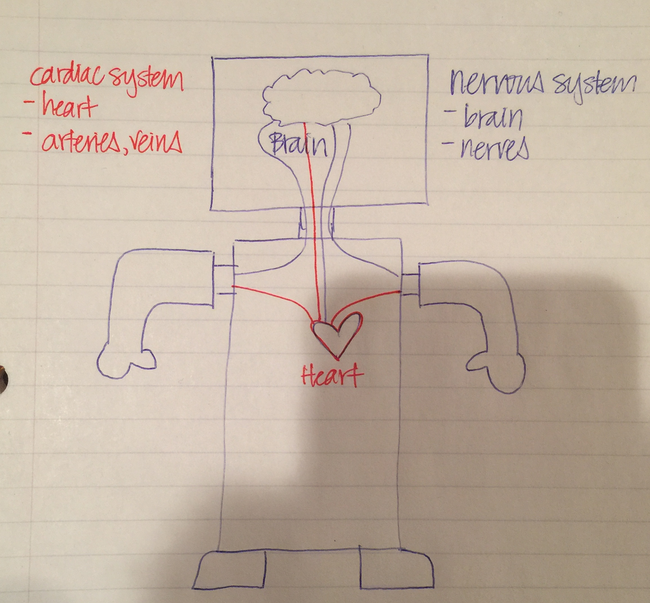
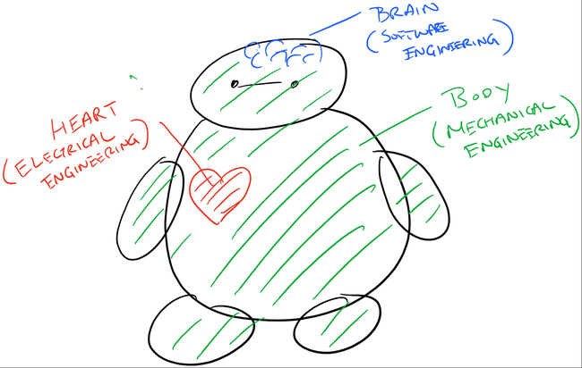

### Connecting the Disciplines 
#### Background Knowledge
Robotics is a cross-disciplinary field in which electrical engineering, mechanical engineering, and software programming concepts are applied to create a moving system (or a "robot").  Below is a brief explanation of how each of the three disciplines plays a part in robotics:

1) _Mechanical Engineering​_ i​s a branch of engineering that focuses on the design, construction, and use of machines and robots.  By definition, a robot has to have a moving part -- like an arm, which has joints at the shoulder and the elbow so that the arm can move back and forth. The mechanical component of a robot may be a motor, lever, or gear that helps the robot move.  A mechanical engineer may also design the exterior of the robot, which helps to protect the internal parts of the robot.

2) _Electrical Engineering​_ ​is a branch of engineering that focuses on the design, use, and distribution of electricity.  A robot must have a power source from which to draw electricity.  A robot’s power source may be a battery or an electrical outlet.  Just as the human heart pumps blood to the rest of our organs for our body to function, a battery or power source for a robot “pumps” electricity to the rest of the robot’s body parts so that the robot can move and function.  In order for electricity to reach the rest of the robot’s body parts, a robot has a network of wires and circuits through which electricity can travel.  This is similar to how human bodies have veins and arteries for blood to travel through to reach other organs.

To process information, the human body has a central nervous system consisting of a brain and a network of nerves and muscles.  Likewise, a robot needs a “brain” to tell its body parts to move and function. The “brain” of the robot is the computer chip or circuit board. 

3) _Computer Science​_ is the study of how computers function and process information. In order for humans to move their arms, the brain must send a message to the arm telling it to move. This message is similar to a computer program/code.  The program/code dictates the way a robot behaves and functions.  This is essentially the robot’s personality.

Building a robot requires collaboration amongst a team of individuals with varying skills.  Students going through the Barnabas-Bot curriculum will get a taste of each of the above engineering disciplines and work in collaboration with others (teacher, parent, mentor, classmate, etc.) as they build their robots from the ground up.

#### Discussion
Let's learn about the similarities and differences between a human versus a robot.



{:class="image "}
{:class="image "}
