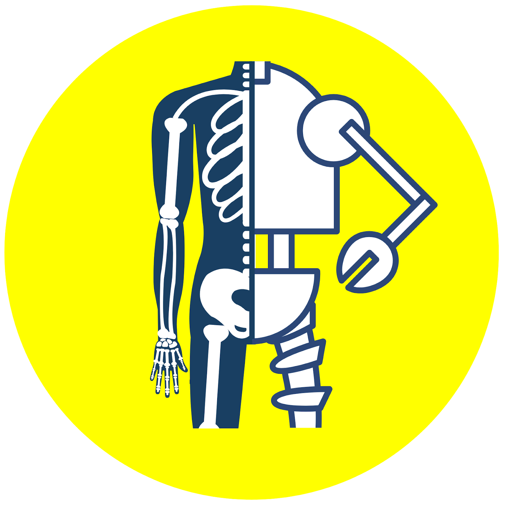

### What is a Robot?

A robot is a type of moving machine powered by electricity that can automatically perform one or more tasks based on a computer program.  We can learn about the essential parts of a robot by comparing it to the human body.

**Body (Skin & Skeleton)** - Just as the human body is made up of skin and bones to give our bodies structure and protects our internal organs, a robot’s body also has an exterior protective shell to protect its fragile components inside.  While the human body is made up of joints that allow us to move, a robot may have a motor, lever, or gear to help it move.  

**Heart** - The human heart pumps blood from the heart to the rest of our organs for our bodies to function. Similarly, a battery or power source is like the robot’s “heart” which supplies electricity to the rest of the robot’s body parts so that the robot can function. While human bodies have veins and arteries for blood to travel through to reach organs in the human body, robots have a network of wires and circuits for electricity to move throughout the robot’s body.

**Brain** -  To process information, the human body has a central nervous system consisting of a brain and a network of nerves. Likewise, a robot needs a “brain” to tell its body parts how to move and function. The “brain” of the robot is a computer chip or circuit board.  

**Personality** - Personality refers to a person’s unique pattern of thinking, feeling, and behaving. Everyone’s personality is different and it’s one of the things that makes you so special. Similarly, the computer code for a robot is like the robot’s personality because it determines how the robot will behave.  The robot’s computer code is processed through its “brain” or circuit board.  We can see the output of the code through the robot’s movement and function. 

### Robots Bring Together Different Engineering Disciplines

Robotics is a type of engineering that combines 4 other engineering disciplines to create a moving machine: (1) mechanical engineering; (2) electrical engineering; (3) computer engineering; and (4) software engineering. Below is a brief explanation of each of the different types of engineering and the important role they play in robots:

1) *Mechanical Engineering* focuses on the design, construction, and movement of machines. Mechanical engineers help design the parts of the robot that help it move.  They also help design the outside of a robot to help to protect the fragile parts inside.

2) *Electrical Engineering* focuses on the design and distribution of electricity within machines. A robot must have a power source for electricity in order to turn on. A robot’s power source may be a battery or an electrical outlet that it plugs into. Imagine how the human heart pumps blood from the heart to the rest of our organs for our bodies to function. Similarly, a battery or power source is like the robot’s “heart” which supplies electricity to the rest of the robot’s body parts so that the robot can function. For electricity to move throughout the robot’s body, it must have a network of wires and circuits through which electricity can travel. This is similar to how human bodies have veins and arteries for blood to travel through to reach organs in the human body. 

3) *Computer Engineering* involves the design of circuits, computers.   A computer is a robot’s brain which is a complex network of electrical circuits like nerves.  These circuits come together to help the robot store information (memory) and to make decisions.  Computer engineers design the computer of a robot. Computer engineers may also work on a system's software. However, the design of complex software systems is often the domain of software engineering, which is usually considered a separate discipline. Desktop computers represent a tiny fraction of the devices a computer engineer might work on, as computer-like architectures are now found in a range of devices including video game consoles and DVD players.

4) *Software Engineering* is the study of how computers function and process information. For humans to move their arms, our brain must send a message to the arm telling it to move. This message is similar to a computer program/code. The program/code dictates the way a robot behaves and functions. This is essentially the robot’s “personality.”

Professional engineers who design and build robots need to depend on others in the above engineering fields and a team of artists and other types of designers. In other words, building a robot requires teamwork among individuals with varying skills. 

As you go through the Barnabas-Bot project, you’ll get a taste of each of these engineering disciplines and how they work together in the process of building a robot from the ground up!


