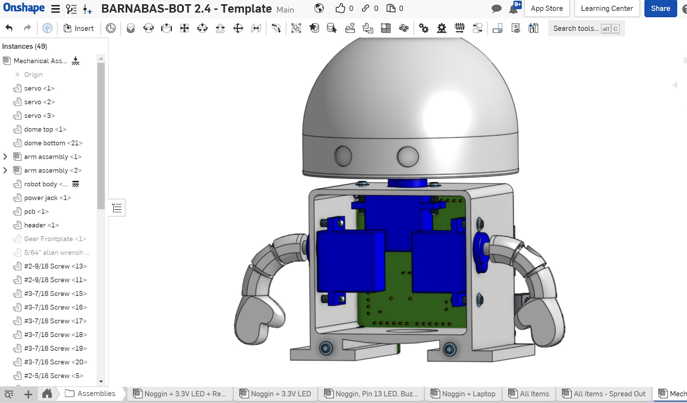

### Computer Aided Design

Computer-Aided Design (or CAD) is used by engineers across many disciplines. Specifically, when building a robot, CAD is used by a mechanical engineer to create the frame or body of the robot. CAD software allows us to create very precise designs with perfect lines and shape, that would be difficult to sketch by hand. CAD is also advantageous because the blueprint is stored digitally and can be accessed on most devices anywhere in the world at a moment’s notice. With an electronically-stored blueprint, an engineer can then create the design using a machine and material of their preference. Our robots will be 3D-printed using plastic.

### 3-D Printing
“What is 3-D printing?”. That question is much more complicated than it originally seems. We can begin to answer it by drawing similarities and differences between a 3-D printer and your paper printer at home. The big difference is that a 3-D printer will print layers one on top of another, accumulating height while doing so. Using an analogy we can say that the 3-D printing process is much like writing your name on a cake, the icing sits atop the rest of the cake.

3-D printers are used by engineers in the field to quickly build designs. They are used as rapid prototyping machines more often than not, giving engineers the opportunity to design, build and test an idea in the same day. This means that while 3-D printers are not always creating the finished product, they are still crucial to the design process.

The process of getting a 3-D file to the printer isn’t as simple as you may suspect. It is not as easy as throwing the file we designed into a 3-D printer and turning it on. The CAD file we designed previously can be exported from Onshape as what is called an STL file. STLs are a common format for 3-D files. Unfortunately for us, a 3-D printer does not accept STL files. Instead they are made to accept g-code files. A g-code file is a file made up of many two dimensional drawings which will ultimately be printed one on top of the other to create the finished product. A g-code file tells the 3-D printer the specifics of how it should move and how much plastic to extrude at any one time.

What is needed is some way of converting an STL file to a g-code file. This can be done with a slicer program. A slicer will take the 3-D STL file and slice it into each 2-D piece.

Watch a 3-D printing simulation of the Barnabas-bot parts!


### Industrial Design 
Industrial design is a term that refers to two different aspects of a manufactured product. The first is the object’s usefulness (function). The second is the object’s beauty (form). When engineers design products for the public they need to carefully consider the role of the product and determine how much of their effort goes into the form of the product and how much goes into the function of the product. Some things do not need to look pretty, they just need to work. Others need to draw people’s attention to have a chance in the market.

Think about common items (especially electronics) and ask yourself whether the form or function of each is more important.




