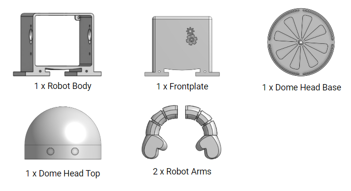

### What You'll Need

Before we get started, let's make sure that we have all the parts.

{:class="image center"}

### Examining The Parts

Take out your robot body parts (body, arms & head). Examine them and think about how each 3-D printed part was laying on the bed as it was printed. HINT: look at how the lines on the 3-D printed bots are oriented.

Check out the 3-D model of your robot to make sure the components on the screen match what you have in your kit. This was the original 3-D printed file that was used to print your robot!



### Designing Your Robot
Remembering what we learned about industrial design, think about who this robot is for, and what it does. Is it for yourself? Or perhaps for someone else? Think of colors and even sketches or words that you want to put on your robot. Keep in mind who you are designing for. This will guide you in making your design decisions!

To see what your robot will look like with different colors, click <a href="https://www.tinkercad.com/things/9RUh82CEU99" target="_blank">here</a>. Note that you'll need to create a TinkerCAD account.

### Decorating Your Robot
It's time to decorate!  Use permanent markers, acrylic paints or even spray paint!
