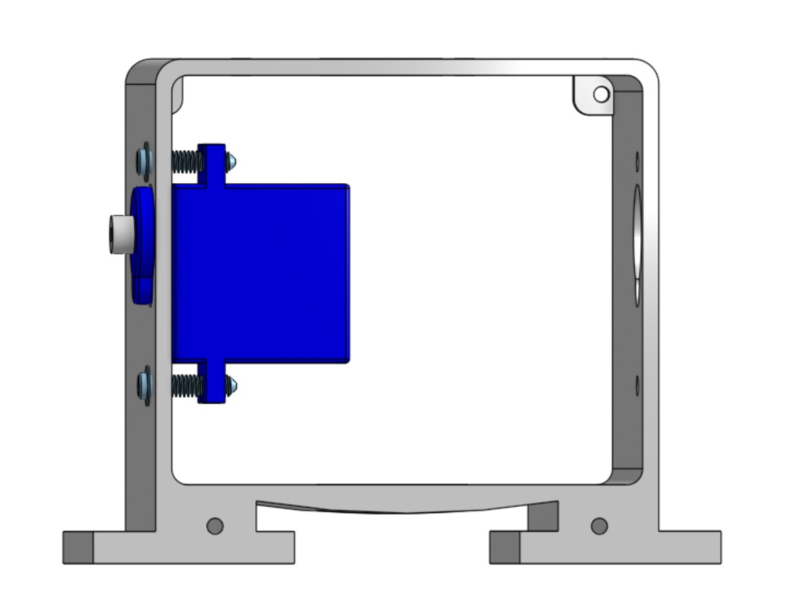



### What You'll Need

Before we get started, let’s make sure that we have all the parts.

{:class="image center"}

### Attaching The Servo Motors

Servos motors are used to move your robot’s right arm, left arm, and head. Servo motors can move a half-circle (or 180 degrees). We’ll see it in action later, but let’s get it attached to our 3D-printed body. 

{:class="image right"} Take one servo motor and place it into the right arm socket of the robot body. Note: The servo motor should be placed inside of the plastic robot body casing. The top of the motor (with the white plastic tip) will stick slightly out of the robot’s body.
{:style="overflow: hidden;"}

{:class="image right"} 
Take a #3-7/16” servo screw and screw it through the outside of the body and into the corresponding hole on the wing of the servo motor. Use the L-shaped allen wrench to fasten it.  Be careful not to over tighten.
{:style="overflow: hidden;"}

{:class="image right"} Take another #3-7/16” servo screw and fasten the other side of the servo motor.
{:style="overflow: hidden;"}

{:class="image right"}  Repeat steps to fasten the servo motor for the right arm socket.
{:style="overflow: hidden;"}

{:class="image right"} Repeat steps to fasten the servo motor for the head.
{:style="overflow: hidden;"}

### Attaching The Faceplate
In this step, you will now cover your robot’s motors by installing your faceplate.

{:class="image right"} Find the front of your robot body. (Hint: It is the open side of the body that is closest to the arm motors and has 2 holes at the bottom.) Align your faceplate to your robot’s body so the screw holes line up.  
{:style="overflow: hidden;"}

{:class="image right"} Use your allen wrench, to screw in 2 x #2-5/16” screws to fasten the faceplate to the robot’s body.
{:style="overflow: hidden;"}

{:class="image right"} Take the electrical cables from the servo motors (3 total) motor wires and feed them through the hole at the bottom of the robot.
{:style="overflow: hidden;"}

### Attaching The Barnabas Noggin
In this step, you will now cover the backside of your robot’s body by installing your Barnabas Noggin.

{:class="image right"} Take the electrical cables from the servo motors (3 total) motor wires and feed them through the hole at the bottom of the robot.
{:style="overflow: hidden;"}

{:class="image right"} Find the back of your robot. (Hint: It is the open side of the body that is furthest from the arm motors with 4 holes.) Align your Barnabas Noggin to your robot’s body. The screw holes on the four corners of the robot body and the Barnabas Noggin should line up.
{:style="overflow: hidden;"}

{:class="image right"} 

Use 4 x #2-5/16” screws to attach the noggin to the body.
{:style="overflow: hidden;"}

### Attaching The Arms

Now you will connect your arms to your robot’s body.{:class="image right"}  Take one #2-9/16” screw and put it through one of the arm’s holes.
{:style="overflow: hidden;"}

{:class="image right"} Using the allen wrench, attach the arm to either the left or right arm servo motor.  Make sure that the tip of the screw goes into the hole on the white tip of the servo motor.

Notice that there will be a gap between the blue part of the motor and the arm.  

Be careful not to over tighten.  Once the arm is snug, you’re good to go!
{:style="overflow: hidden;"}

{:class="image right"} Repeat for the other arm.
{:style="overflow: hidden;"}

### Attaching The Head
Every robot needs a head! You will be fastening the head to the servo motor sticking out of the top of the robot.

{:class="image right"}  Find the bottom of your head (i.e. the base) and align the hole to the top of the hole on the servo motor shaft head.
{:style="overflow: hidden;"}

{:class="image right"} Use 1 x #2-5/16” screw to fasten the head base to your head servo motor.  You want it to be tight enough so that the base doesn’t wobble.
{:style="overflow: hidden;"}

{:class="image right"} Now fasten the top of the head to the bottom part. It should fit in over the top. You may want to use glue (Elmer’s glue or super glue) to secure it further.
{:style="overflow: hidden;"}