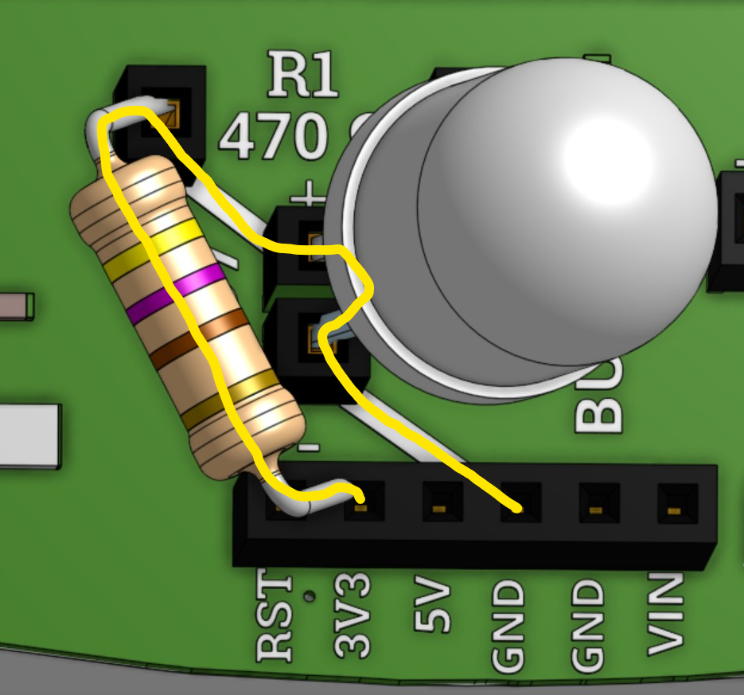

### What You'll Need

Before we get started, let’s make sure that we have all the parts.

### Overview

Now that your robot is decorated and assembled, the next step is to give your robot a heart, or give it power. In this lesson, we’ll learn more about electrical engineering. We’ll be covering:

1. *How to give your robot a heart*
2. *How to turn on a light using the robot’s heart*
3. *How to change the amount of power that is used in a robot*

### Give Your Robot a Heart

To give your robot a heart (or give it a power), take the USB cable included in your kit and connect it between the Barnabas Noggin (connected to the back of your robot) and your computer. 

A little red light on your Barnabas Noggin should turn on.  This means that your robot now has a heart!  Your computer is acting as the power source that is giving your robot power.  If the red light did not turn on, check to make sure that your computer is turned on.

### The Path Of Electricity

Now that your robot has power, let’s look at some basics of how electricity flows throughout your robot.  We’ll need to learn what a circuit is. A circuit can simply be defined as a pathway for electricity to flow.

#### Heart = Power source Blood = Electricity

Just as humans cannot live without a heart pumping blood to the brain and body parts, robots cannot turn on without a power source to supply electricity to its brain and other robot parts. 

#### Electricity Needs a Complete Loop to Travel

In our bodies, blood pumps out of the heart, into our body parts, and then loops back into the heart. This series of loops for blood to travel is called the human circulation system. The loops in our human body must be complete and unbroken. If there is a broken loop, then blood can’t reach the rest of our organs, and we wouldn’t be able to live.  

Electricity in robots works in a very similar way. For electricity to travel throughout your robot’s body, there needs to be a complete and unbroken loop for electricity to flow.  When the pathway of electricity creates a complete loop without any breaks, this is called a closed circuit.  A closed circuit in a robot allows it to power on.

If a circuit does not create a complete loop or if the loop is broken, then electricity cannot flow.  This is called an open circuit because there is an opening in the circuit.  An open circuit in a robot will power the robot off or make it inoperable. 

### Designing Your Light Circuit

Now that your robot has power and we understand how circuits work, let’s build a light circuit so that your robot can light up! The diagram below is a schematic (pronounced “ske-mad-dic”) for your light circuit.  A schematic is a diagram showing the plan for building a circuit.

#### LEDs

In the schematic above, you’ll notice a heart with “3V3” and “GND” on it.  The heart represents the power source for your robot’s light.  The other triangle symbol with a line underneath in the schematic represents your light.  In this project, we'll be using a special type of light called an LED, which stands for Light Emitting Diode. LEDs are great because they are inexpensive and don’t require much energy to turn on. You probably even have LEDs in your home since they help us save energy (and save money on our electricity bills). 

#### Positive & Negative Ends

In the schematic above, you’ll notice that there is a plus sign (+) labeled on top of the LED and a minus sign (-) on the bottom.  The plus sign (+) refers to the positive end of the LED, and the minus sign (-) refers to the negative end.  Using these markings of +/- will come in handing as you build your robot.

One thing to note about LEDs is that they only allow electricity to flow one way (like a one-way street). Electricity can only flow from the positive (+) end to the negative (-) end, so we’ll need to make sure we get our pluses and minuses in the right position in our circuit.  

Notice that the schematic above is a closed circuit in our schematic.  As a reminder, a closed circuit is an unbroken loop for electricity to travel through.  When built correctly, the electricity in your light circuit will flow in a loop from 3V3 all the way around to GND.  See the green path below that shows how electricity flows through your light circuit.  See how it flows through the positive (+) end of the LED to the negative (-) end.

### Building Your Light Circuit

Now that you understand how your light circuit is designed, you’re ready to start building! 

First, examine the LED included in your kit. Notice how the LED has 2 legs and how one leg is longer than the other.  The longer leg is the positive (+) end of the LED. The shorter leg is the negative (-) end of the LED.  This fact will be important to remember as we build our circuit. 

Follow the diagram below and carefully insert the LED into your Barnabas Noggin. Make sure the positive (+) end of the LED is inserted into the hole marked “3V3” on the Barnabas Noggin.  The rectangular holes along the top and bottom of the Barnabas Noggin are called “pins,” which will be important to remember when we start coding in the next lesson. Make sure the negative (-) end of the LED is inserted into the “GND” pin in the Barnabas Noggin.

Voila!  Your light should turn on!  You did it! You just built your first circuit.  

### Dimming Your Light 

#### Introducing Resistors

You may be wondering what the pin marked “3V3” means. It means 3.3 volts.  A volt is the amount of power going to a circuit. The more volts you have, the more power you have.  But here’s the thing—more power is not always better.  Sometimes we actually want to reduce the amount of power going through your circuit.  For example, we may want to reduce the amount of power to a light to make it dimmer (like for a night light).  For your LED, one benefit of reducing power through the LED is to help it last longer.  If you constantly give your LED the maximum amount of power, it may burn out faster over time.

The way you can reduce power through the LED is by adding a resistor to your light circuit.  A resistor absorbs some of the power away from the circuit so that parts in the circuit don’t get damaged.  You can think of resistors as a type of protection for circuits. 

#### Updated Schematic with a Resistor

See below for a new schematic that connects to 3.3V but adds a resistor.  The resistor is represented by the zig zag line at the top of the schematic.

### Building a New Light Circuit with a Resistor

Find your resistor included in your kit.  It resembles a small bead on a thin metal wire.  Follow the diagram and the instructions below to build your new light circuit with a resistor.   

Instructions:

1. Disconnect your LED from the Barnabas Noggin.
2. Take your resistor.  Insert one end of your resistor into the 3V3 pin. 
3. Connect the other end of the resistor to the left R1 hole.
4. Insert the positive (+) end (or longer leg) of your LED into the + LED7 hole
5. Insert the negative (-) end of your LED into the - LED7 hole

See the diagram below to help.  The white lines show a connections between two holes that are already made on the Barnabas Noggin. This is like a tunnel underground that connects these two holes together to create a complete loop or closed circuit once your LED and resistor are connected.  Can you see the closed circuit that electricity travels through starting from 3V3 to GND?

The path of electricity is shown in yellow.

Once you have your new light circuit wired correctly, the light should turn on.  However, it’ll be just a little dimmer than before.  This is because the resistor is helping to reduce the power.
