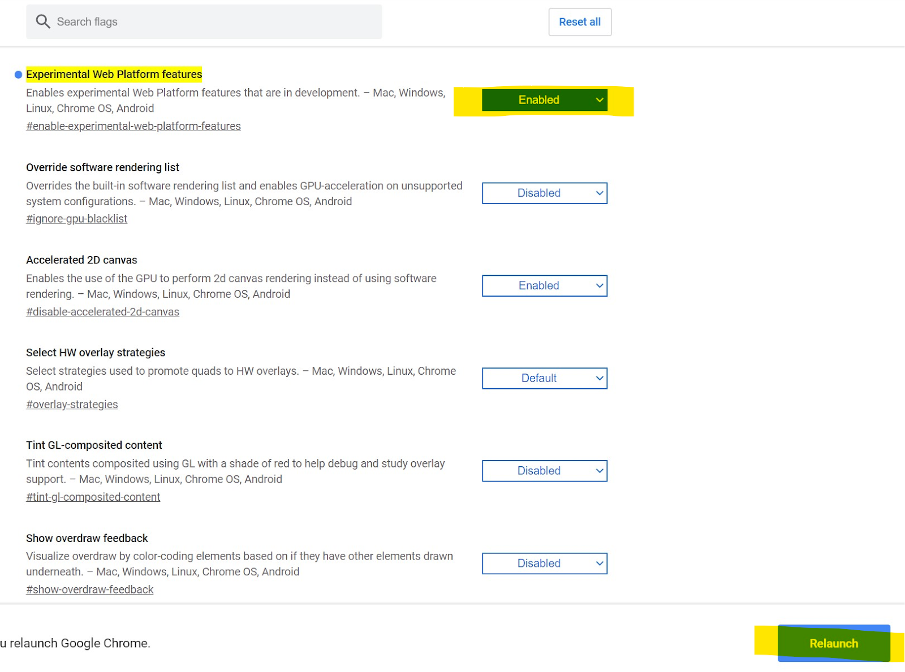
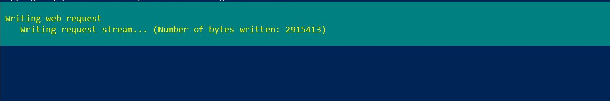

layout: lesson
title: Lesson 6 &middot; Setting Up Our Computer
suggested_time: 60-75 minutes

### What You'll Need

Before we get started, let’s make sure that we have all the parts.

### Overview

In this lesson, we’ll be learning about the tool that software engineers need to do their job and also how to set up that tool on your computer.

### The Tool For Software Engineerings

To start, we need to set up your computer with an integrated development environment (IDE).  An IDE is just like any tool that allows someone to do their job.  For example, a chef needs a knife.  A car mechanic needs a wrench.  A software engineer needs their IDE.  Specifically, an IDE is the thing that allows a software engineer to:

1. Write code
2. Prepare the code to be sent out

There are lots of types of IDEs.  There are IDEs for video games, apps for your smartphone, making websites and lots more.  The IDE we will be using is designed to allow us to write code for our robot and to prepare that code to be sent out to our robot’s brain.

Each type of computer has their own version of the IDE, so your first task is to figure out which type of computer you have: Chromebook, Macbook or Windows PC.

Click on either the Chromebook, Macbook or Windows PC link to find the right instructions on how to set up your IDE.

### Chromebook IDE Setup

For Chromebooks, your IDE will be a website called Barnabas Blocks.  Follow the instructions below to get it working.  

Before starting:

- [ ] Make sure that your Chromebook is powered on and charged (or charging)
- [ ] Make sure that your Chromebook has access to the internet

#### Enable Experimental Web Platform features

Your Chromebook has special secret features that we need to enable so that it will be able to communicate with our Barnabas Noggin.  We’ll go through how to enable this cool feature.

1. 
   Open your Google Chrome browser

2. Copy and paste this link into your address bar.  

   ​				**chrome://flags/#enable-experimental-web-platform-features**

3. Select “Enabled” on the “Experimental Web Platform features”

   

4. Click “Relaunch”

Your Chromebook is now ready.  That was easy, right?  Type the link below into your address bar to check out your IDE!

**https://code.barnabasrobotics.com/webserial/**

### Macbook IDE Setup

For Macbooks, your IDE is called Ardublock.  We’re going to need to download something called a package file (.pkg) from the internet and then run the .pkg so that it can install the IDE onto your Macbook.  

We’re going to use a super cool software engineering tool called the terminal to do this.

Before starting:

- [ ] Make sure that your Macbook is powered on and charged (or charging)
- [ ] Make sure that your Macbook has access to the internet

#### The Terminal

The terminal is a place where you can use the keyboard to type direct commands to tell your computer what to do.  In the early days of computers, the terminal was the only way to communicate with a computer.  Whether you wanted to open an app, print something out, or even shut down your computer, you needed to use the terminal.  This was because there were no computer mice or touch screens yet!  Software engineers today still use the terminal because it is the best way to give special commands to your computer.  In fact, there are secret commands that you can use in the terminal that you can’t use with a mouse or touch screen.  It’s an important tool for any software engineer to master.  Let’s try it out! 

1. After you power on your Macbook, log into an administrative profile on your Mac so that you’re able to make changes to your Macbook system.  This is likely the parent profile.

2. Press **Command (or Cmd) ⌘ + space** on your keyboard at the same time to open your Spotlight Search function.  In the search bar, type “**terminal**”.  The Terminal should show up as your “TOP HIT”.  Double-click on the Terminal app to open it.

   

3. After the Terminal opens, we’re going to use the curl command to download the barnabas.pkg file.  In the terminal, type the following command.  

   ​								**curl -L -o barnabas.pkg go.barnabasrobotics.com/pkg**

   Hint!  Make sure to type it exactly right. Upper-case letters, lower-case letters, spaces, no spaces, dots, slashes and dashes all matter!  When you’re done, press enter on your keyboard to execute the command.  If you get it wrong, no need to panic.  Your terminal will just respond with an error because it can’t understand the command.  Just type it again, double-check everything and press enter again.

   The curl command downloads the barnabas.pkg file from the web address go.barnabasrobotics.com/pkg.  We will later run the barnabas.pkg file to install the IDE onto our Macbook. If you get it right, the file will begin to download.  This download confirmation comes out at the end.

   

4. Next, let’s use the sudo installer command to run barnabas.pkg, which will install the IDE.  Remember to press enter to execute the command.

   ​											**sudo installer -pkg barnabas.pkg -target /**

   Hint!  Don’t forget the -target / at the end of the command!

   If you get it right, a password prompt will come up.  Type in the password for your administratie profile here and press enter.  After you do that, the Macbook will begin installing your IDE.

   

​		If installation was successful, you’ll see the following confirmation from the terminal:

​								installer: Package name is BarnabasArdublock

​								installer: Upgrading at base path /

​								installer: The upgrade was successful.

​		Troubleshooting Tip!

​		If you get the prompt below, it means that the current profile can’t install the banabas.pkg file.

​		To fix this, you’ll need to log out of your profile and log back into an administrative profile (this is likely 		a parent profile).  Once you’ve done that, start again on step 1.

5. Now that our IDE is installed, we no longer need the barnabas.pkg file.  Let’s remove it from our computer.  To do this, use the rm command.  Remember to press enter to execute the command.

   ​																**rm barnabas.pkg**  

6. You’re done!  Go to Finder-> Applications and double-click on BarnabasArdublock to check out your IDE!

### Windows PC IDE Setup

For Windows PCs, your IDE is called Ardublock.  We’re going to need to download something called an executable file (.exe) from the internet and then run the .exe so that it can install the IDE onto your Windows PC.  

We’re going to use a super cool software engineering tool called the terminal to do this.

Before starting:

- [ ] Make sure that your Windows PC is powered on and charged (or charging)
- [ ] Make sure that your Windows PC has access to the internet

#### The Terminal

The terminal is a place where you can use the keyboard to type direct commands to tell your computer what to do.  In the early days of computers, the terminal was the only way to communicate with a computer.  Whether you wanted to open an app, print something out, or even shut down your computer, you needed to use the terminal.  This was because there were no computer mice or touch screens yet!  Software engineers today still use the terminal because it is the best way to give special commands to your computer.  In fact, there are secret commands that you can use in the terminal that you can’t use with a mouse or touch screen.  It’s an important tool for any software engineer to master.  Let’s try it out!  

1. After you power on your Windows PC, log into an administrative profile on your Windows PC so that you’re able to make changes to your Windows system.  This is likely the parent profile.

2. We will use a terminal called PowerShell on your computer.  To access it, type “powershell” in your search bar and click on the “Windows PowerShell” App to launch it.

   

3. After PowerShell opens, we’re going to use the wget command to download the barnabas.exe file.  To do this, type in the following command.  

   ​									**wget go.barnabasrobotics.com/exe -o barnabas.exe**

   Hint!  Make sure to type it exactly right. Upper-case letters, lower-case letters, spaces, no spaces, dots, slashes and dashes all matter!  When you’re done, press enter on your keyboard to execute the command.  If you get it wrong, no need to panic.  Your terminal will just respond with an error because it can’t understand the command.  Just type it again, double-check everything and press enter again.

   The wget command downloads the barnabas.exe file from the web address go.barnabasrobotics.com/exe.  We will later run the barnabas.exe file to install the IDE onto our Windows PC. When done correctly, a download pop-up will show up in your terminal.  The download pop-up will go away once it finishes downloading.  It may take a few minutes, so be patient!  

   

4. Next, let’s run barnabas.exe, which will help us install the IDE.  To do this, we need to use the .\ command.  Remember to press enter on your keyboard to execute the command.

   ​																		**.\barnabas.exe**

   Hint!  There is no space between . and \ or between \ and b!

   When done correctly, a screen will pop up asking: “Do you want to allow this app from an unknown publisher to make changes to your device?”.  

   Click **Yes**.

   

   When installation finishes, you’ll see the BarnabasArdublock icon appear on your computer desktop.

5. Now that our IDE is installed, we no longer need the barnabas.exe file.  Let’s delete it from our computer.  To do this, use the del command.  Remember to press enter to execute the command.

   ​																**del barnabas.exe**

6. You’re done!  Double-click on the BarnabasArdublock icon to check out your IDE!

   