### What You'll Need

Before we get started, let’s make sure that we have all the parts.

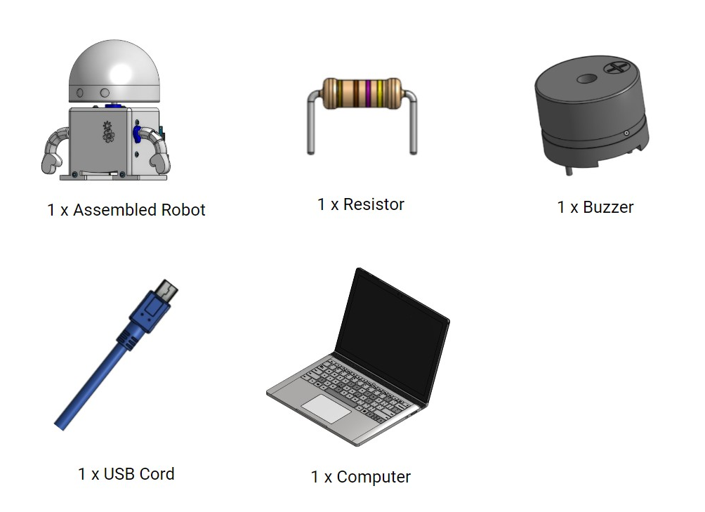

### Overview

Now that our robot can blink on and off with the LED, it’s time to get it to make some sound!  We’ll again be learning about electrical engineering, computer engineering, and software engineering. Specifically, this lesson will cover:

1. How to connect a buzzer to your robot’s brain;
2. How the heart gives power to the buzzer and robot’s brain; and
3. How the robot’s brain and personality work together to make music.

### Connecting Your Buzzer To Your Robot’s Brain



Make sure your Barnabas Noggin is plugged into your computer via the USB cord.  The red light on your Barnabas Noggin should be on.

Before we build the buzzer circuit, let’s look at the plan for the circuit.

Just like the LED circuit, we want to connect to a pin on the Barnabas Noggin.  In this case, however, we are connecting to pin number 6 instead of pin number 13.  

If pin 6 turns on, it will be as if there is a battery in the circuit.  This would cause electricity to flow, causing the buzzer to turn on.

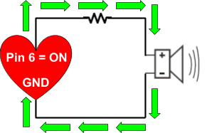

If Pin 6 turns off, it will be as if the battery is shut off.  This would cause electricity to NOT flow, causing the buzzer to turn off.

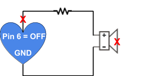

#### Inserting the Resistor

We’ll begin building our buzzer circuit by first inserting a resistor.  This time the resistor is not built into the Noggin, so you’ll need to add it yourself.

Find your resistor.  It is the object that looks like a sausage.  Just like in the LED circuit, the resistor limits the amount of electricity that goes through the buzzer.  

Go ahead and insert your resistor into the holes next to the R2 label.  It doesn’t matter which legs go into which holes for the resistor, so no need to worry about getting it mixed up :).

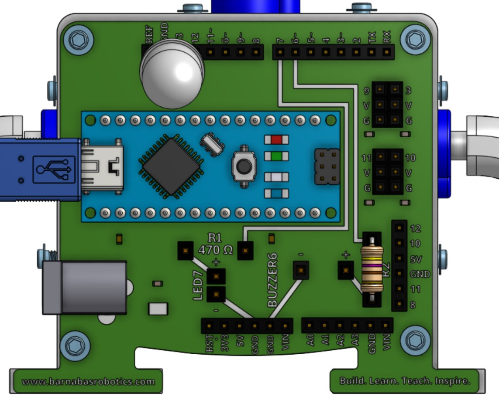

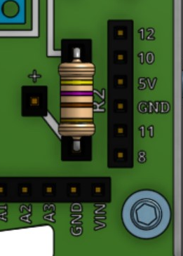

#### Inserting the Buzzer

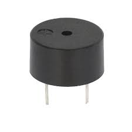

Find your buzzer.  Find the little “+” on the top of the buzzer.  That refers to the “+” leg of the buzzer.  Just like the LED, electricity only flows one direction (from + to -).

Go ahead and insert your buzzer into the holes next to the label BUZZER6.  Make sure to match the plus leg with + on the noggin and the minus leg with - on the noggin.

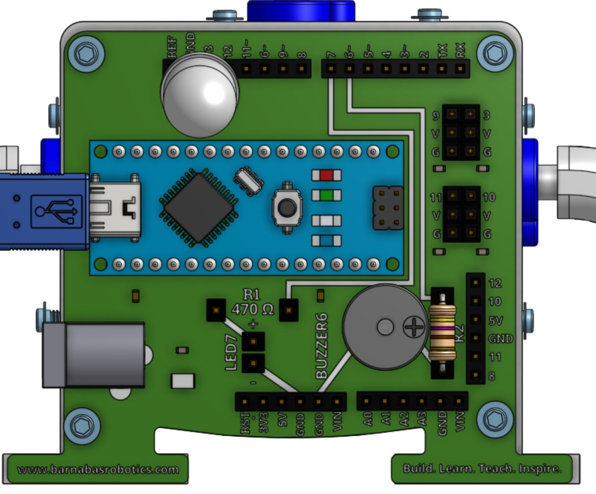

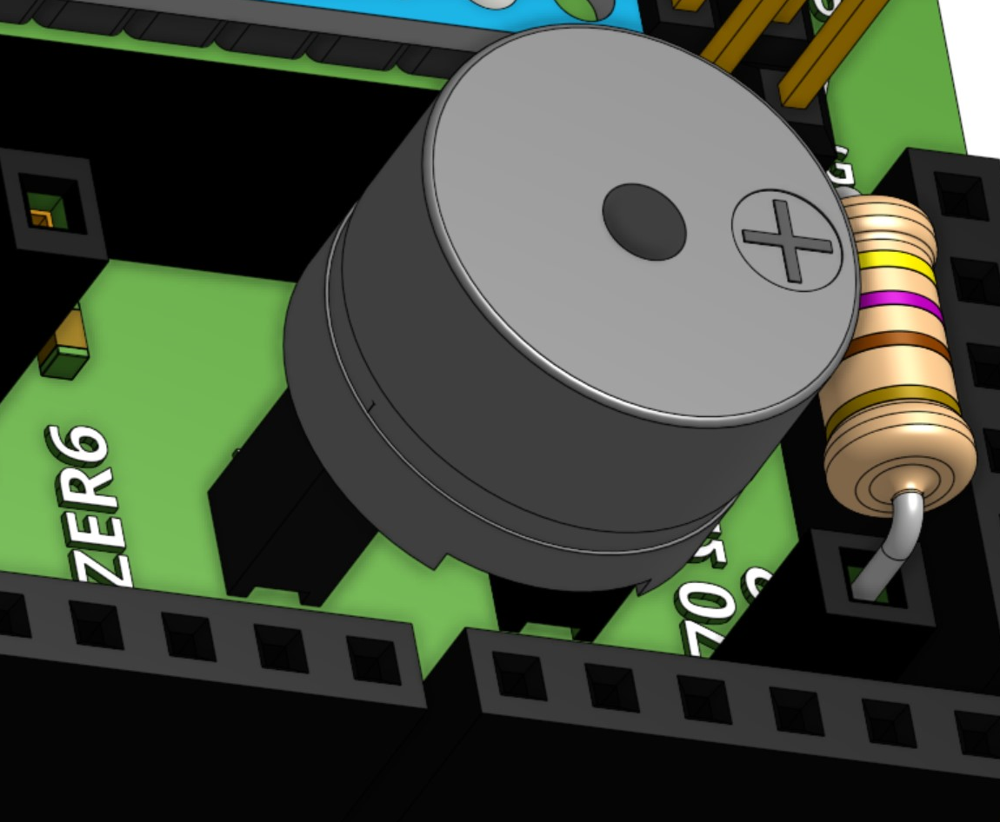

#### The Path Of Electricity

Let’s examine the path of electricity here.  As we’ve learned, we always need a complete loop in order for a circuit to work.  In this case, the main power comes from pin 6, which we will program to turn off and on.  Again, we have subways that connect pins together.  Can you find the path of electricity below?  It has been marked in yellow.

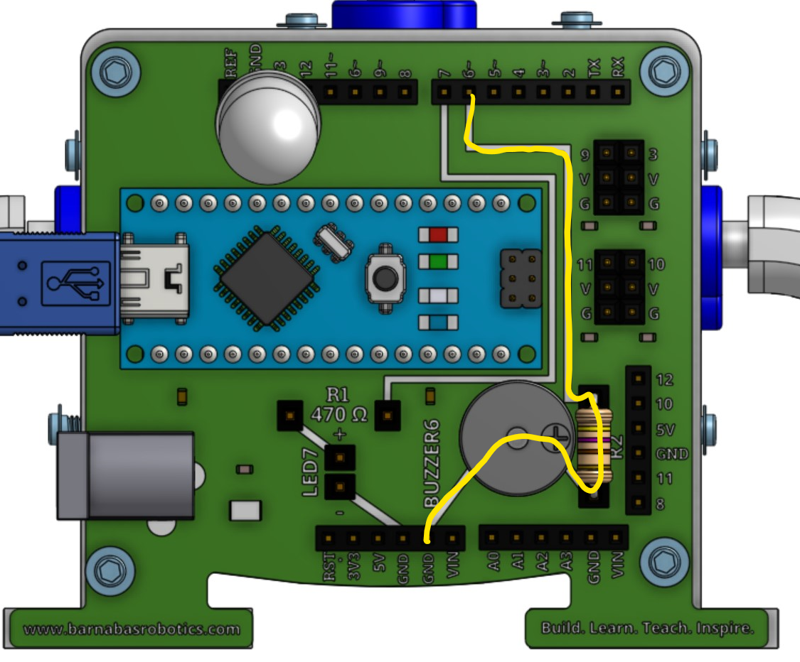

### Getting Our Buzzer To Make A Sound!

#### The Tone Block

It’s time to teach our robot to make a sound!  Let’s start coding!  To program our buzzer we will use the tone block.

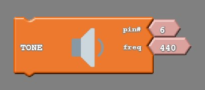

The tone block, like the LED block, requires us to input two pieces of information. These pins include:

- The pin the buzzer is located on (pin 6), and
- The frequency of the tone we would like the buzzer to make

#### What is a frequency?

A frequency is the rate or speed that something goes back and forth.  Did you know that all the sounds that you hear are from air being pushed back and forth at different speeds?  If it is getting pushed back and forth very fast, you get a higher frequency sound, which is a high pitch sound.  If it is getting pushed back and forth very slowly, you get a lower frequency sound, which is a low pitch sound.  We’ll be creating these low and high frequency sounds using our buzzer circuit.

#### Frequencies and Music

Have you ever played piano?  Each key on a piano creates a musical note, which is actually done through hammer striking strings that vibrate at specific frequencies.  Musicians take these notes and combine them to sound good, which forms music!  We’ll eventually be able to do this same thing but through our robot.

#### Our First Note

To start, let’s just play a single note.  The code below plays frequency 440 forever.  Try it out!  The “TONE” block can be found by clicking on “Sounds”.  If everything is wired correctly, you should hear a sound come out of your robot.  Notice that we set the pin to #6 since the buzzer circuit is wiring to pin #6.  Remember that you need to upload your code before your robot will start following your code instructions!  

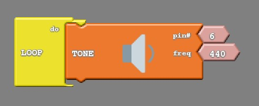

#### Frequency Table

The table below shows you all the different notes that you can play with your Barnabas-Bot.  Can you find what note your code is playing?  It’s A4!

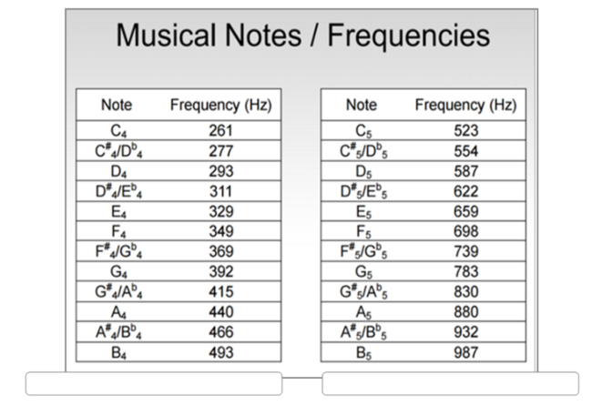

#### Silence Is Golden

Now that your robot is making sounds, you might be wondering how we tell it to turn off.  Well, we need the no tone block.  The no tone block silences the buzzer.  Notice again the pin # is 6.

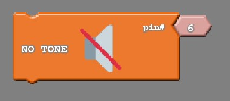

However, much like the LED, we need to be clever in how we code the buzzer so that the buzzer actually behaves the way we want it to.  Let us say that we are trying to have the buzzer make a tone for a small amount of time, then be silent for a similar amount of time. A common mistake is to just put the tone and no tone blocks into the “LOOP do” with nothing else accompanying them.  Try uploading the coding and see what you hear.  Remember to upload!

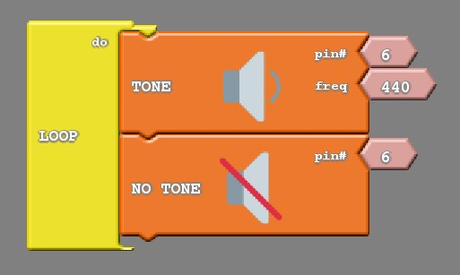

I’m not sure how I would describe the noise the above code makes, but it is definitely not what we are looking for.  What’s happening is that the code is playing A4 and then turning it off right away before you can enjoy the sound, and then repeating forever.  We have the same issue here that we had when first attempting the blinking light code.  We need to add some wait blocks to slow it down so that we can hear the note and the silence.

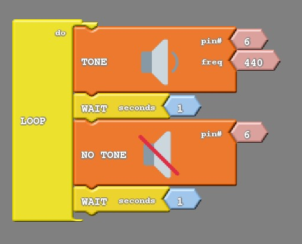

### Practice!

Try the following exercises to get the hang of playing with the buzzer

1. Play “C4” forever!

   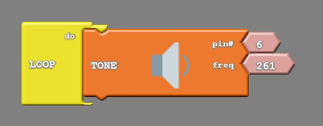

2. Play “C4” for 1 second, and rest for 1 second.  Repeat forever.

   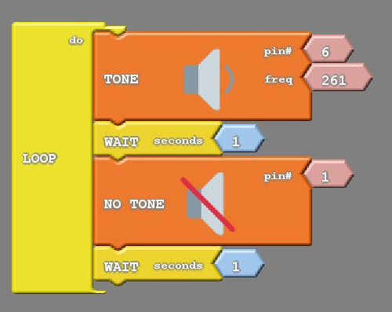

3. Play “C4” for ½ a second,, rest ½ a second.  Repeat forever.  Hint: ½ a second is the same as 0.5 seconds.

   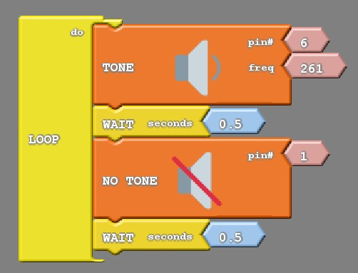

4. Make a siren sound using A4 and C4.

   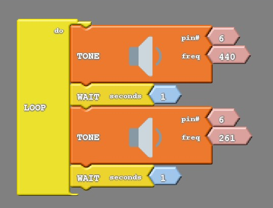

### Challenge!

Now challenge yourself to take things to the next step and have your robot play some more music!



1. Write code to do the following below.  This is the first few notes of "Hot Cross Buns!"
   - Play “B4 for 1 sec
   - Rest for 1 sec
   - Play “A4” for 1 sec
   - Rest for 1 sec
   - Play “G4” for 1 sec
   - Rest for 1 second
   - Repeat forever
2. Try playing these songs!  Watch the videos to learn the notes.  Next, create the code by matching the notes to the correct frequencies using the  [frequency table](#frequency-table).  You'll need tone blocks, no tone blocks and wait blocks!
   - [“Twinkle, Twinkle, Little Star”](https://youtu.be/p9tW3n6aO9Q?t=19)
   -  [“Happy Birthday” song](https://www.youtube.com/watch?v=5nSdseM_aYY)
   - [“Mary Had a Little Lamb”](https://youtu.be/XVU9ch06MxA?t=46)
   - [“Super Mario Brothers” Theme Song](https://youtu.be/kAHNkTYDrTU)
3. Play any song that you would like!