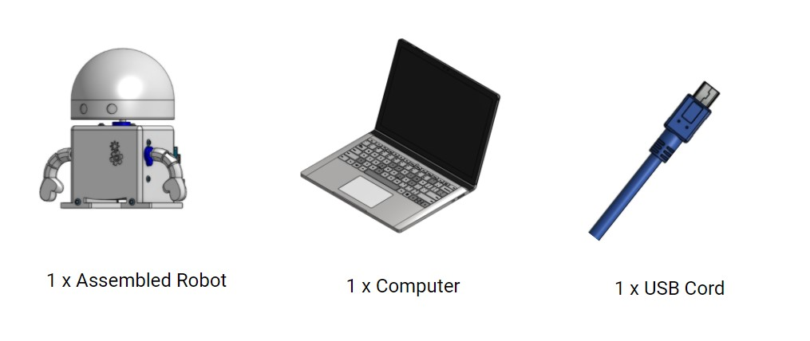
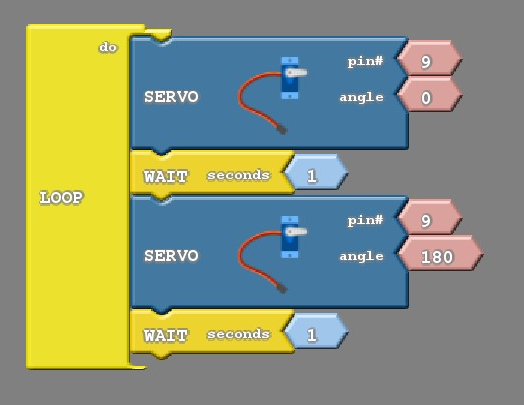

### What You'll Need

Before we get started, let’s make sure that we have all the parts.

### Servo Motor Basics

#### Range of Motion

We’ve finally arrived at the point in our project where you’ll get your robot to move!  

You may recall from assembling your robot that the Barnabas-Bot has 3 servo motors.  These motors function like joints for your robot’s arms and head to move back and forth.  While there are different types of servo motors that exist in the world, the servo motors in your robot are unique because they only have a range of motion of 180 degrees (i.e. they can only move half a circle).  

#### More On Degrees

The picture below is of a protractor, which is something that mechanical engineers use to measure degrees.  The numbers that you see go from 0 to 180, and each number represents a position.  Let's go over some examples to learn how degrees work.

Think of a windshield wiper going back and forth.  When the windshield wiper is here, it is at 0 degrees.  Notice that the arrow is point at 0.

Now the windshield wiper is at 90 degrees.

Now the windshield wiper is at 180 degrees.

Later on we'll be moving your robot arm like a windshield wiper (back and forth).  When we start putting in degrees to change the position, think back to these pictures!

#### Servo Motor Wires

Notice how each of your robot’s 3 servo motors have 3 wires attached: (1) an orange wire, (2) red wire, and (3) brown wire.  Each of these colored wires plays a specific role.

The **red** (5 Volts) and **brown** (GND) wires are dedicated to pumping electricity in and out of the motor.  If you were to connect just the red and brown, your motor would turn on, but we wouldn’t be able to tell the motor where to go. This is where the orange wire comes in.

The **orange** wire helps send a signal from the Barnabas Noggin (i.e. the brain) to the motor to tell the motor exactly where to go.  You can think of the orange wire as a nerve in our body that the brain uses to send signals to body parts to move them.

### Connecting The Servo Motor

The circuit below shows the connections that we need to make to get one motor to turn on.  Notice that the orange wire is connected to pin # 9.  Red is connected to 5V (5 volts) and brown to GND.  No resistor is needed here because the servo motor has built-in circuits to control the amount of electricity that it uses.

The Barnabas Noggin has 3-pin headers that the servo motor wires can plug into.  They are located on the top right.

Take the servo motor cable that corresponds to one of the arm motors.  You’ll need to look inside the hole on the bottom of your robot to try to find it.  Once you find it, stick it into the appropriate 3-pin header.  Make sure that the colors match up to the right labels!

### Getting Our Robot To Wave

#### The Servo Block

To control the servo motor we will need the “Servo” block, which is located under “Motors”.  The servo block expects two input values:

The first refers to the pin the motor has been placed on. In our case this is pin 9. The second is the angle.

While programming the servo motor, don’t forget to consider its physical limitations. The servo motor is capable of rotating in half a circle, 180 degrees. Because of this the angle from 0 to 180 are valid inputs for the servo block. You are welcome to try other angles, it will not damage the motor to do so but you should not expect the motor to behave itself if you do.

With all that being said, it is time to experiment!

### Practice!

1. Move your robot arm to angle 0

   

2. Move your robot arm to angle 90

   

3. Move your robot arm to angle 180

   

### Challenge!

1. Move your robot arm back and forth between 0 and 180 with 1 second in between each move.

   

2. Make your robot arm move faster

3. Move your robot arm move slower

4. Experiment with different angles!