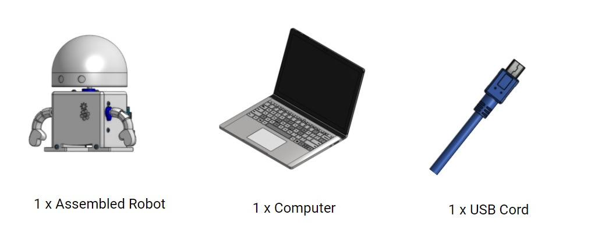
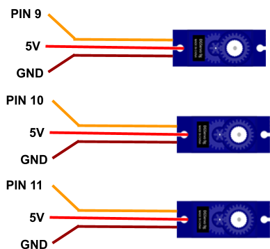
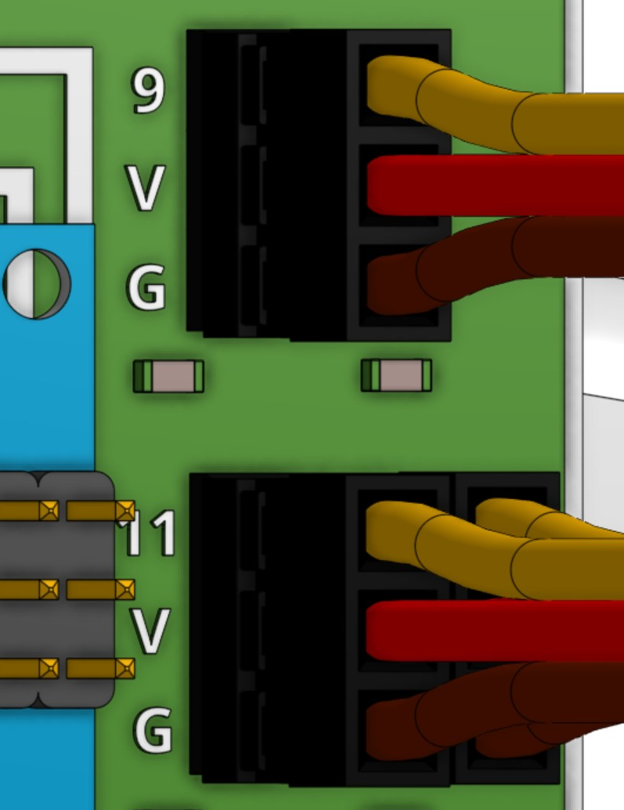
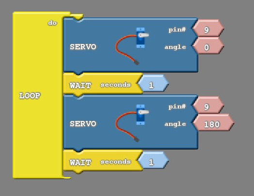
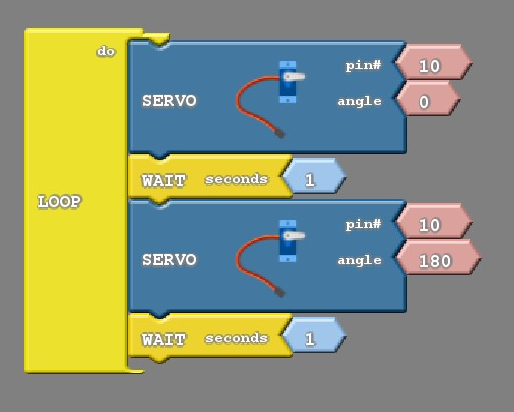
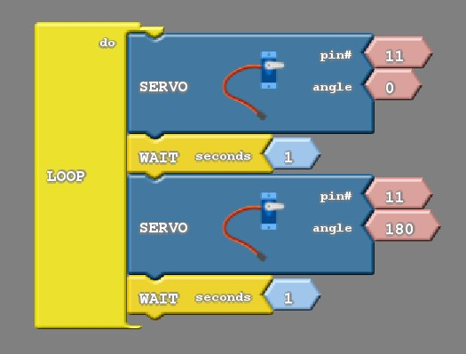
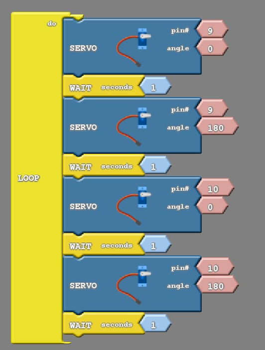
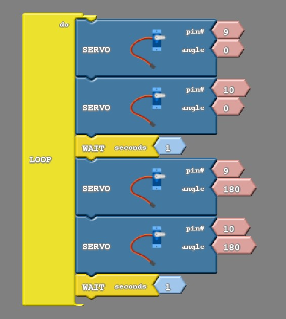

### What You'll Need

Before we get started, let’s make sure that we have all the parts.

### Wiring All Three Motors

The two remaining servo motors will be wired in the same way the first motor was. See the wiring diagram below, which includes the first motor as well.  Go ahead and make your final connections!

### Experimenting With The Motors

With all of the motors wired to the robot, we’re getting closer to getting everything moving!  First, let’s experiment with the other two motors to find which on pin 10 and which lies on pin 11 as well as find the range of motion for each of the motors. To do this, we will bring back the code from the previous lesson.

This code should make one of the arms wave back and forth.  

Change the  pin to 10 and see what happens (Remember to upload!).  Does it move the other arm or the head?  

Change the  pin to 11 and see what happens (Remember to upload!).  Does it move the other arm or the head?  

### Moving Multiple Motors

With all of the motors attached and tested it is now possible to get them all moving. We will start by creating a program that moves two motors independently.  

#### Move one motor at a time

This code below moves pin 9 back and forth and then moves pin 10 back and forth.  

Try adding the third motor (pin 11) on your own!

#### Move motors at the same time

We can also create code that moves motors at the same time.  The key to doing this is to remember that blocks within the “LOOP do” get executed very fast.  So what we can do is intentionally take out wait blocks so that certain blocks appear to happen at the same time.  Below is an example of code that does this:

The first two blocks move pin 9 to 0 degrees and then immediately move pin 10 to 0 degrees.  The second block happens so fast that it appears to happen at the same time as the first block.  

The third block causes the code to wait and rest for 1 second.

Next, the fourth and fifth blocks move both motors to 180 degrees.  

The last block causes the code to wait and rest for 1 second.

Give this code a try and see what happens.  When you’re done, challenge yourself and see if you can get all three to appear to move at exactly the same time!
