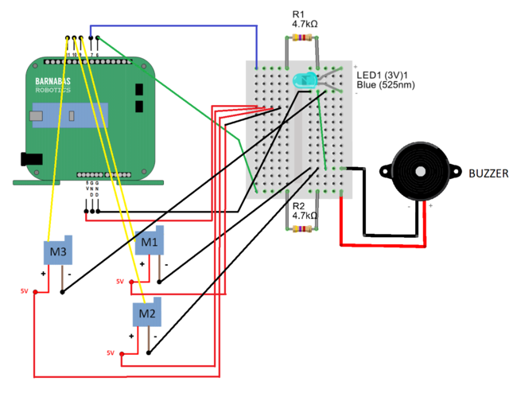
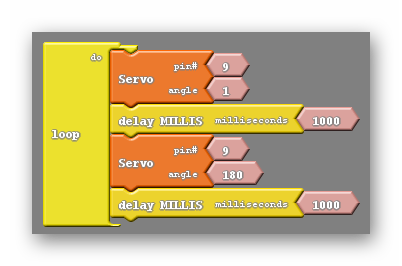
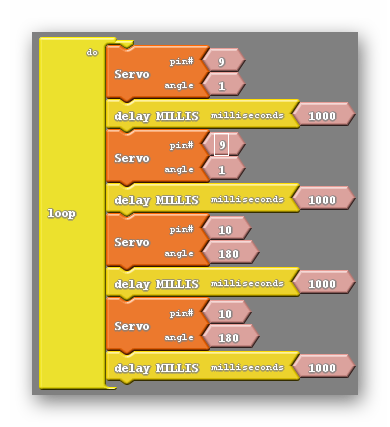
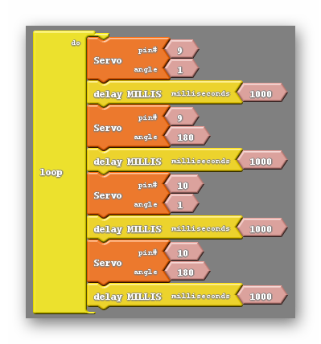
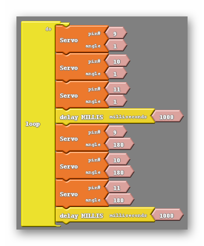

### What You'll Need

Before we get started, let’s make sure that we have all the parts.



### Step 1:  Wiring The Other Two Motors (10 min)

The two remaining servo motors will be wired in the same way the first motor was. For each motor grab a yellow, red and black jumper wire and place them in the ends of the motor wires, color coding them like before. Next the red wires (5V) should be placed on the same row of the breadboard as the red (5V) wire of our first motor, and the black wire can be placed on any row of the breadboard that is already home to a black wire. Finally the last two yellow wires must be plugged into pins 10 and 11,  like shown below:

{:class="image fit"}

### Step 2: Experimenting With The Motors (20 min)

With all of the motors wired to the robot getting everything moving is just a couple obstacles away. First I would recommend that the students experiment with the other two motors to find which on pin 10 and which lies on pin 11 as well as find the range of motion for each of the motors. To do this I want to bring back the code we ended on last week:

{:class="image "}

The students should start here and simply change the pin numbers to 10, then upload and note the behavior of their robot. Afterwards they can do the same but using pin 11 instead. It is important that both servo blocks are set on the same pin. Through this process the students will be able to map each pin, 9, 10 and 11, to one of the robots extremities. 



### Step 3: Moving Multiple Motors (30 min)

With all of the motors attached and tested it is now possible to get them all moving. We will start by creating a program that moves two motors independently. The typical error when attempting this is forgetting that each motor should have multiple commands if the goal is getting motion to repeat. A student that makes this error generally only makes a single change from the previous code, resulting in this:

{:class="image "}

In the code above you can see that both pins 9 and 10 are given commands, however each is only given one command. This will cause each motor to act only once, then rest at whatever position it was told to move to. What the students should do is add servo blocks so that both pin 9 and pin 10 have two servo blocks associated with them.

At this point there is another common pitfall for students. Many students will make the mistake of grouping the same angles with the same pin number, like shown below:

{:class="image "}

Here you can see that each block associated with pin 9 has been given the angle 1 and each block associated with pin 10 has been given the angle 180. This program behaves identically to the previous one. To get each motor moving repeatedly each motor must be given two distinctly different commands:

{:class="image "}

Of course we can extend this principle to three motors by adding pin 11 to the mix, giving it two servo blocks of its own and making sure that the angle given is different for each of them.

In addition we can create code that will move all of the motors simultaneously. The key to doing this is to remember how the LED behaved when we failed to use delay blocks. We were unable to see it blink as the two events, turning off and turning on, were so close together. We can intentionally take delay blocks out of the code and rearrange some of the servo blocks to make the action of the motors moving happen immediately after one another. So close together appear to happen at the same time. Below is an example of code that does this:

{:class="image "}

There are a few things to point out in the code above. First, I have not grouped servo blocks that are using the same pin number together. Each of the two groups of servo blocks have no repeated pin numbers. The second thing we have gone over already, each pair of blocks with the same pin numbers have different angles.

Following those two rules you can make the robot move an many different ways, including moving two motors at a time, rather than all three. Perhaps you combine these things, making the robot wave with a single hand before dancing with all of the motors.