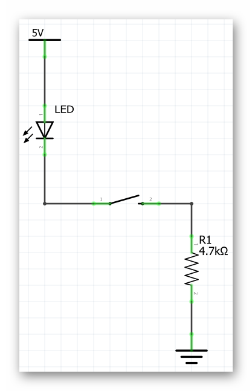
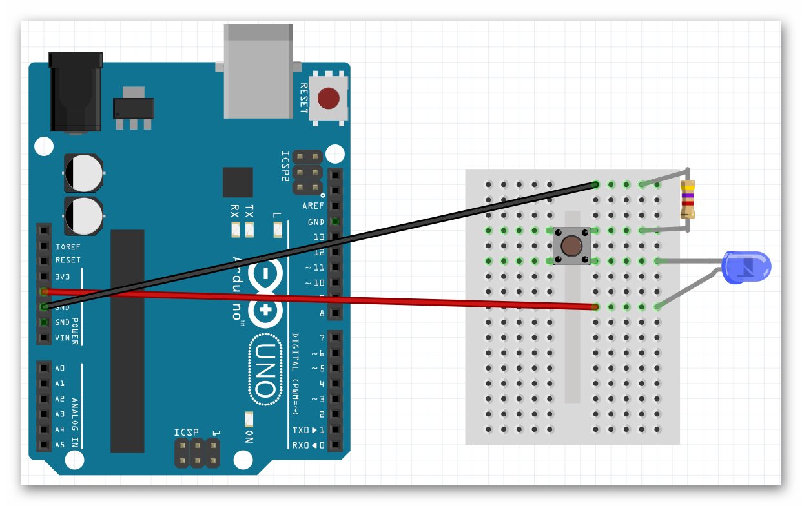
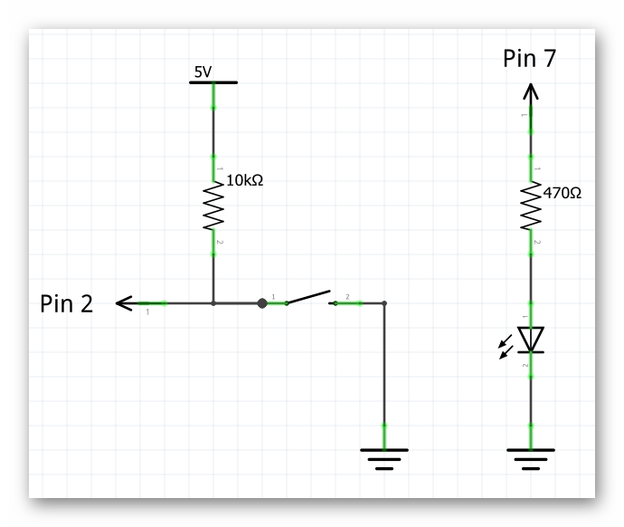
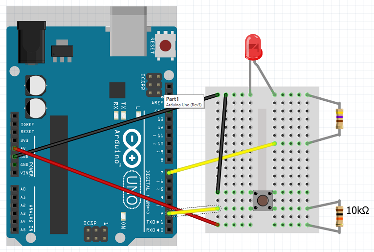

#### Review
   * Previous week  
   * Critical think based on previous question

### Step 1: First Button Circuit (15 minutes) 
In order to use your button, you need to tell your Barnabas Noggin to do something IF it is pushed.  
How do you do that?

#### Button Schematic
{:class="image "}

- Using the breadboard, wires, button and LED, build the circuit above.
- First remove all your wires from your robot.
- Next, place the button onto your bread board (see below).  Make sure to that the button is turned the right way!

{:class="image "}

- Now add the resistor and the LED.
  - HINT: Row 1 should be connected to the "-" of the LED.
  - HINT: Row 3 should be connected to GND.
- Once you are done, power up the noggin by connecting the USB.  Your LED should only turn on if you push the button down.  If it's not working correctly, double check your circuit! 
- The final circuit should look something like this;

{:class="image "}


### Step 2: Wiring the Button as Input (15 minutes) 
#### Schematic
{:class="image "}

- Now we will wire your button to pin 2 so that our Barnabas Noggin can sense when you have pushed it. 
- Build the circuit above!
- The final product should look similar to this;

{:class="image "}

### Step 3: Programming the Buton (15 minutes) 
#### Introduction to Inputs
##### as Blocks
###### Conditional Logic
We want to the light to turn ON if we press the button and turn OFF if we let go of the button.  We’ll need a new block.  See below!
{:class="image "}

The above block is used to check whether the button has been pressed and act accordingly. In the following code it is crucial to getting the behavior we are looking for;

{:class="image "}

Create this code yourself and try it out!


[Programming the Button with Ardublock](https://youtu.be/VlEWea9keUY).

##### as Text
In order to use your button, you need to tell your Barnabas Noggin to do something IF it is pushed.  How do you do that?  
Here, we will learn about a few new commands

Now we want to the light to turn ON everytime I press the button and turn OFF every time I let go of the button.  You'll need to use a new conditional function called if/else. See below;

```
void setup()
{
  pinMode( 2 , INPUT);
  pinMode( 7 , OUTPUT);

}

void loop()
{
  if (digitalRead(2) == HIGH) {
    digitalWrite(7,LOW);
  }
  else {
    digitalWrite(7,HIGH);
  }
}
```


[Programming The Button and LED with Arduino IDE](https://youtu.be/OA2PoLzCDMI)

#### Extra Challenges
Now that you know how to program a button, try the following challenges:  

1. Modify your program so that it blinks 5 times and then turns off whenever you push the button.
2. Try adding the buzzer to your circuit (pin 6) and make it buzz only if the button is pushed.
3. Try having the button blink 5 times only if you push the button twice.

{% include badge.html type='best_practice' content="notes from today's lesson 3 class. - it worked well to have the students log in to schoology and walk through all the connections together as a class - we should add the led circuit to the diagram as well - add a note about squeezing the button so that it doesn't take up 4 rows. you want it to take up 3 rows - the way the button needs to be oriented on the breadboard is tricky. this is something that we need to think about - after wiring was confirmed, it was good to have the students figure out how to copy the ardublock program to program their first sensing program - we only got to worksheet 2 in our 55 min class. The whole lesson would probably take 1.5 hrs. - it was good to go over what is now possible using the switch. I explained pseudo code and states of the circuit.. add this to the lesson plan curriculum" %}


