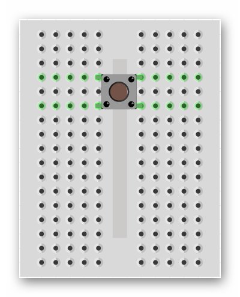
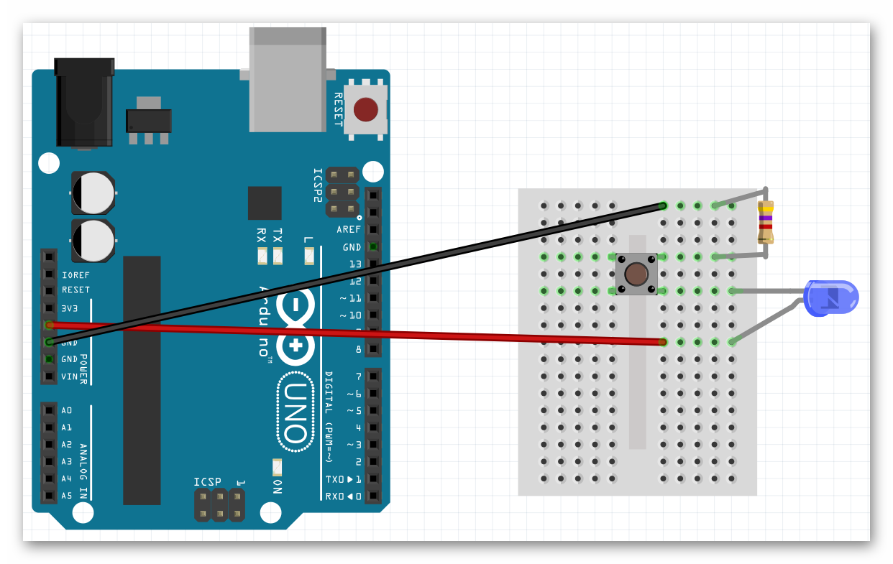
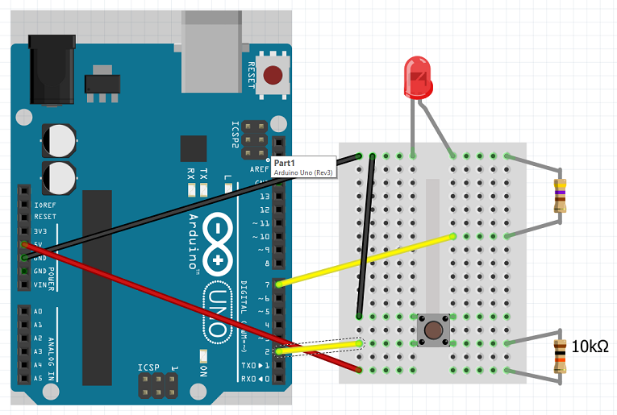
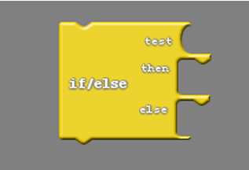

### Materials

Need materials?  [Purchase the Barnabas Racer at our e-store](https://shop.barnabasrobotics.com/collections/kits-1/products/barnabas-racer-kit).  

Classroom sets available.  Contact us at info@barnabasrobotics.com to inquire. 

### Project Overview

The Barnabas Racer is a continuation project for the [Barnabas-Bot](https://lessons.barnabasrobotics.com/bot_lessons_home/01/index.html). This robot is a car that is able to think and act on its own. You will review concepts from Barnabas Bot (circuits, coding, mechanical build) and will also be introduced to sensors!  Recommended Ages: 11+

### Giving A Robot Senses

A robot is made of four different parts [(Body, Heart, Brain, Personality)](https://lessons.barnabasrobotics.com/bot_lessons_home/01/index.html).  These parts need to work together in order for our robot to function.

Throughout the level 1 class the only type of components used were **output** components. This simply means that the LED, buzzer and motors needed to get a signal **from** the robot's brain to work. 

In this section, we'll be introduced to a new component, the button, which is fundamentally different. It is an **input** component, meaning that it will send a signal **to** the robot's brain. Inputs, also known as sensors, will help our robot interact with the world around it, starting with the button.

We're going to introduce a sense, specifically the *touch* sense so that your robot will be able to *feel* when something touches it.  We'll be using a **button** component to accomplish this.  You'll experience how the heart, brain and personality come together to make this happen.

### A Simple Button Circuit

Let's first connect our button to our brain (Barnabas Noggin) so that it turns on and off without any programming.   The schematic of the circuit that we need to build is shown below.

{:class="image "}

1. Place the button onto your bread board (see below).  Make sure to that the button is oriented the right way (the legs should be sticking out toward the sides, not the top)!

   {:class="image "}

2. Add the resistor

3. Add the LED

4. The diagram belows shows a correct circuit build.

   {:class="image "}

5. Once you are done, power up the noggin by connecting it to your computer using the USB.  Your LED should only turn on if you push the button down.  If it's not working correctly, double check your circuit! 

### Wiring the Button as Input

Now we will wire your button to pin 2 so that our Barnabas Noggin can be programmed to sense when you have pushed it. 

Build the circuit using the schematic below!

{:class="image "}

The diagram belows shows a correct circuit build.

{:class="image "}

##### Video Tutorial: Circuit Basics, Breadboarding, LED + Button Circuit Builds



### Programming the Button

#### Conditional Logic

In programming, conditional logic is used to decide a course of action depending on a condition. For example; an LED turning on if the button is pressed and turning off if the button is not pressed. Conditional logic is something we use in our everyday life without even recognizing it. If hungry, eat; if cold, wear a jacket, etc. In this section we will learn how to use conditional logic which will become the basis of how our robot makes decisions.

#### Practice

Let's write a program that turns ON the light if we press the button and turns OFF the light if we let go of the button.

{:.image .block-based}

{:.image .block-based}

{:.block-based}

```c
void setup()
{
  pinMode( 2 , INPUT);
  pinMode( 7 , OUTPUT);

}

void loop()
{
  if (digitalRead(2) == HIGH) {
    digitalWrite(7,LOW);
  }
  else {
    digitalWrite(7,HIGH);
  }
}
```
{:.text-based}

{:.text-based}

#### Challenges

Now that you know how to program a button, try the following challenges:  

1. Modify your program so that it turns OFF when you press the button and ON when you let go.

2. Modify your program so that it blinks when you press the button and just stays OFF when you let go.

   