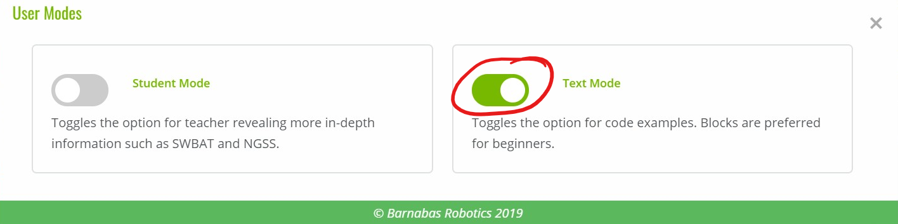

### What Is Barnabas Racer?
<p align="center" markdown = "1">

</p>

The Barnabas Racer is a continuation project for the [Barnabas-Bot](https://shop.barnabasrobotics.com/collections/kits-1/products/barnabas-bot-kit) project.  This robot is a car that is able to think and act on its own.  Builders will cover concepts from Barnabas Bot (circuits, coding, mechanical build) and will also be introduced to sensors!  Recommended Ages: 11+

### Project Materials

This project is done with robot parts that are readily available.  Parts needed include:

- 1 x Barnabas Noggin (Arduino-based controlled)
- 1 x 2WD Metal Chassis
- 1 x Ultrasonic Sensor
- 2 x Continuous Servo Motors
- 1 x Bread Board
- 1 x LED
- 1 x Buzzer
- 1 x 4-Pin Button
- 6 x Resistors
- 15 x Male to Male Jumper Wires Bundle
- 1 x 9V Arduino battery plug
- 1 x 9V battery
- 3 x Zip Ties
- 1 x Philips Head Screw Driver
- 1 x Bag of Assorted Screws and Nuts

Need materials?  [Purchase the Barnabas Racer kit at our e-store](https://shop.barnabasrobotics.com/collections/kits-1/products/barnabas-racer-kit).  Classroom sets available.  Contact us at info@barnabasrobotics.com to inquire. 

### How To Use Our Learning Portal

This learning portal portal includes written instructions as well as videos.  Here are a few things that will be helpful for you as you begin.

#### Decide On Your Coding Style

When doing the Barnabas Racer project, you will be creating code on the computer, which is what is used to control your robot.  When creating code, you can choose between *block-based* coding and text-based coding.  The main difference between the two is that block-based coding does not require very much typing while the text-based coding does.  

Typically, we recommend block-based coding for ages 9-11 and text-based coding for ages 12 and up.  In our classes, we start younger students with block-based and eventually graduate them to text-based coding.  

See below for examples of what block-based code looks like versus text-based code.

<p align="center" markdown = "1">
    Block-Based Code
</p>

<p align="center" markdown = "1">

</p>

<p align="center" markdown = "1">
    Text-Based Code
</p>

```c
void setup()
{
  pinMode( 2 , INPUT);
  pinMode( 7 , OUTPUT);

}

void loop()
{
  if (digitalRead(2) == HIGH) {
    digitalWrite(7,LOW);
  }
  else {
    digitalWrite(7,HIGH);
  }
}
```

If you're having trouble deciding which one, I recommend starting with blocks and you can always transition to text-based in the middle of the project.  

#### Set Your Coding Style

Once, you've decided on your coding style, you need to make sure to set it on the learning portal so that you are able to view the correct content.  

##### 1. Click on the gear icon on the top right


##### 2. Click on the toggle button to switch modes





### Extra Resources

Some lessons include extra resources (videos, documents, etc).  Scroll to the bottom of the page to find them.


### Move On Or Go Back

After you finish a lesson, scroll to the bottom of the back and click "Next Lesson" to go to the next lesson.  You can also go back to the previous lesson by clicking on "Prev Lesson".


