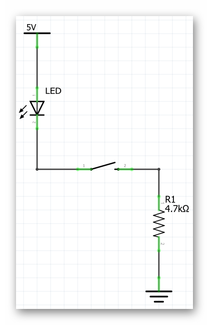

### Materials

Need materials?  [Purchase the Barnabas Racer at our e-store](https://shop.barnabasrobotics.com/collections/kits-1/products/barnabas-racer-kit).  

Classroom sets available.  Contact us at info@barnabasrobotics.com to inquire. 

### Step 1: First Button Circuit (15 minutes) 

In order to use your button, you need to tell your Barnabas Noggin to do something IF it is pushed.  
How do you do that?

#### Button Schematic
{:class="image "}

- Using the breadboard, wires, button and LED, build the circuit above.
- First remove all your wires from your robot.
- Next, place the button onto your bread board (see below).  Make sure to that the button is turned the right way!

{:class="image "}

- Now add the resistor and the LED.
  - HINT: Row 1 should be connected to the "-" of the LED.
  - HINT: Row 3 should be connected to GND.
- Once you are done, power up the noggin by connecting the USB.  Your LED should only turn on if you push the button down.  If it's not working correctly, double check your circuit! 
- The final circuit should look something like this;

{:class="image "}


### Step 2: Wiring the Button as Input (15 minutes) 
#### Schematic
{:class="image "}

- Now we will wire your button to pin 2 so that our Barnabas Noggin can sense when you have pushed it. 
- Build the circuit above!
- The final product should look similar to this;

{:class="image "}

### Step 3: Programming the Buton (15 minutes) 

#### Introduction to Inputs
Throughout the level 1 class the only type of components used were output components. This simply means that the LED, buzzer and motors needed to get a signal *from* the robot's brain to work. The button is fundamentally different. It is an input component, meaning that it will send a signal *to* the robot's brain. Inputs, also known as sensors, will help our robot interact with the world around it, starting with the button.

##### Conditional Logic
In programming, conditional logic is used to decide a course of action depending on a condition. For example; an LED turning on if the button is pressed and turning off if the button is not pressed. Conditional logic is something we use in our everyday life without even recognizing it. If hungry, eat; if cold, wear a jacket, etc. In this section we will learn how to use conditional logic which will become the basis of how our robot makes decisions.

We want to the light to turn ON if we press the button and turn OFF if we let go of the button. This is our condition.

{:.image .block-based}

Testing our condition allows the to check whether the button has been pressed and act accordingly.  
In the following code it is crucial to getting the behavior we are looking for;

{:.image .block-based}

{:.block-based}
[Programming the Button with Ardublock](https://youtu.be/VlEWea9keUY){:.block-based}

{:.text-based}
Now we want to the light to turn ON everytime I press the button and turn OFF every time I let go of the button.  You'll need to use a new conditional function called if/else. See below;

```c
void setup()
{
  pinMode( 2 , INPUT);
  pinMode( 7 , OUTPUT);

}

void loop()
{
  if (digitalRead(2) == HIGH) {
    digitalWrite(7,LOW);
  }
  else {
    digitalWrite(7,HIGH);
  }
}
```
{:.text-based}

{:.text-based}
[Programming The Button and LED with Arduino IDE](https://youtu.be/OA2PoLzCDMI){:.text-based}

#### Extra Challenges
Now that you know how to program a button, try the following challenges:  

1. Modify your program so that it blinks 5 times and then turns off whenever you push the button.
2. Try adding the buzzer to your circuit (pin 6) and make it buzz only if the button is pushed.
3. Try having the button blink 5 times only if you push the button twice.
