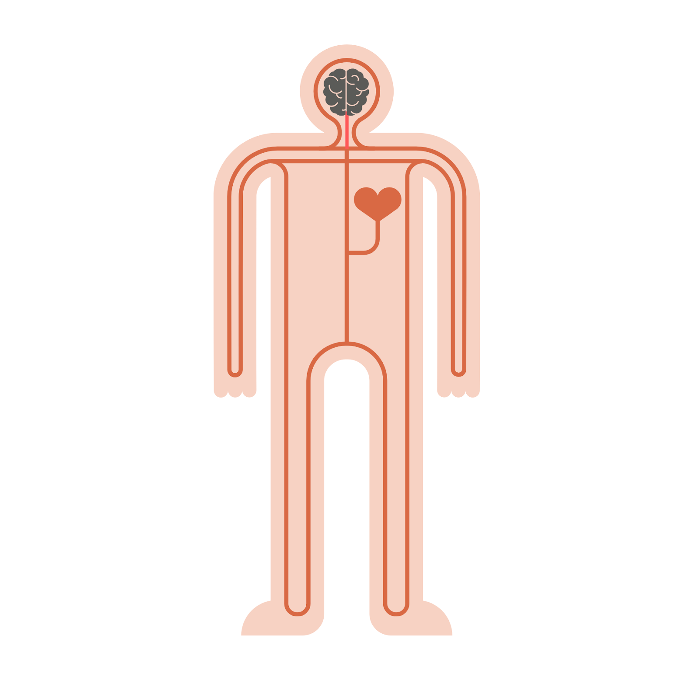
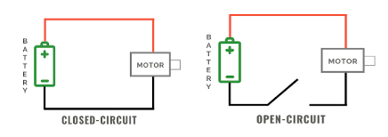
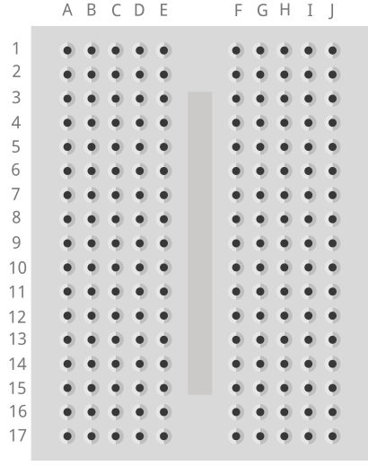
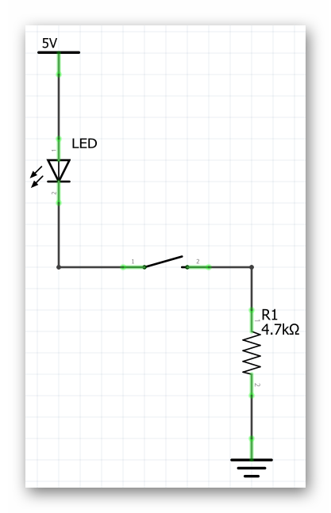

### What You'll Need

Before we start, make sure that you have everything that you need for this lesson.

- 1 x Barnabas Noggin
- 1 x 9V Battery
- 1 x 9V Battery Holder
- 1 x LED
- 1 x Breadboard
- 1 x Pin-to-Pin Wires
- 1 x 4.7 kOhm Resistor
- 1 x 4-Pin Button

### Overview

In this lesson we will cover the basics of engineering.  Topics include:

1. Circuits (Closed Circuit, Short Circuit, Open Circuit)
2. Resistors
3. Breadboarding
4. Buttons

### Tutorial Video



### The Path Of Electricity

Now that your robot has power, let’s look at some basics of how electricity flows throughout your robot.  We’ll need to learn what a circuit is. A circuit can simply be defined as a pathway for electricity to flow.

#### Heart = Power source Blood = Electricity

Just as humans cannot live without a heart pumping blood to the brain and body parts, robots cannot turn on without a power source to supply electricity to its brain and other robot parts. 

#### Electricity Needs a Complete Loop to Travel

In our bodies, blood pumps out of the heart, into our body parts, and then loops back into the heart. This series of loops for blood to travel is called the human circulation system. The loops in our human body must be complete and unbroken. If there is a broken loop, then blood can’t reach the rest of our organs, and we wouldn’t be able to live.  

Electricity in robots works in a very similar way. For electricity to travel throughout your robot’s body, there needs to be a complete and unbroken loop for electricity to flow.  When the pathway of electricity creates a complete loop without any breaks, this is called a closed circuit.  A closed circuit in a robot allows it to power on. 

If a circuit does not create a complete loop or if the loop is broken, then electricity cannot flow.  This is called an open circuit because there is an opening in the circuit.  An open circuit in a robot will power the robot off or make it inoperable. 

During a closed-circuit, two things determine how your circuit behaves.  *Voltage* is the amount of power in your power source.  The higher the voltage, the faster the electricity moves.  The lower the voltage, the slower the electricity moves.

*Current* is the actual electricity moving through the circuit.  The higher the current, the higher the electricity.  The lower the current, the lower the electricity.

#### Vocabulary

- **Closed-circuit**: A closed-circuit is when there is a complete loop in your electrical system. In this case electricity can flow.
- **Open-circuit**: An open-circuit is when the loop is broken. In this case electricity cannot flow. The robot cannot live if we have an open circuit, much like how we cannot live if blood is not circulating through our bodies.
- **Current**: The flow of electricity in the circuit
- **Voltage**: Voltage is what creates current, or the flow of electricity through a circuit. A larger voltage will cause a faster flow of electricity through a circuit.

### The Breadboard

A breadboard helps us connect our wires (analogous to blood vessels) together.  We can connect our wires to the holes in the breadboard to make secure connections without needing to tie the wires together.  This is useful especially when we need to change the connections often, which is common as engineers figure out how to best make their ideas happen. 

{:class="image "}

In a breadboard, all the holes on each row of 5 are connected to each other.  This means that any two wires placed into the same row will be connected to each other.   Remember this as we'll be using this later to build circuits!

### Building A Circuit Using Our Breadboard

We are now going to use the Barnabas Noggin to create a circuit. With the Noggin we will be powering the circuit with 5 volts. 

We do have to note that our LED is rated at 3 volts, which means that if we give it more than 3 volts, it can burn out.  We need to add something to slow down the flow of electricity, which is why we add in a resistor.

{:class="image "}

Follow the wiring diagram below.  Plug the 9V battery into the jack on the Noggin and your LED should light up!  Note: The longer leg of the LED is + and the short leg of the LED is -.

{:class="image fit"}

#### Vocabulary

   * **Barnabas Noggin**: The brain of our soon to be robot! The Barnabas Noggin houses the brain of the Barnabas bot. It also contains a large amount of internal circuitry, making it somewhat related to the robot’s heart as well. We will often treat the Noggin as a power source, as it can give us 5V, a voltage we are comfortable with.
   * **Resistance**: The difficulty of passing an electric current through an object. If an object is very difficult to pass current through, it has a high resistance.









### Giving A Robot Senses

A robot is made of four different parts [(Body, Heart, Brain, Personality)](https://lessons.barnabasrobotics.com/bot_lessons_home/01/index.html).  These parts need to work together in order for our robot to function.

Throughout the level 1 class the only type of components used were **output** components. This simply means that the LED, buzzer and motors needed to get a signal **from** the robot's brain to work. 

In this section, we'll be introduced to a new component, the button, which is fundamentally different. It is an **input** component, meaning that it will send a signal **to** the robot's brain. Inputs, also known as sensors, will help our robot interact with the world around it, starting with the button.

We're going to introduce a sense, specifically the *touch* sense so that your robot will be able to *feel* when something touches it.  We'll be using a **button** component to accomplish this.  You'll experience how the heart, brain and personality come together to make this happen.

### A Simple Button Circuit

Let's now connect our button to our brain (Barnabas Noggin) so that it turns on and off without any programming.   The schematic of the circuit that we need to build is shown below.

Once you are done, power up the Barnabas Noggin.  Your LED should only turn on if you push the button down.  If it's not working correctly, double check your circuit!

### Bonus Activity: Going Further With Resistance

You may have noticed the two different types of resistor that we have are differentiated based on the colors of their bands. As it turns out we can tell the exact strength of a resistor based on the color of those bands.

{:class="image fit"}

Let’s walk through this chart together. In the Numeric Value column we see that each color is given a number value associated with it. These numbers are only applied to the first two colored bands on a resistor. Those two numbers are combined into one 2 digit number. For example our 4,700 Ohm resistor has the colors yellow and violet as it’s first two color bands, in that order. From this we know that resistor’s value must start with the number 47, which we know it does. The third band on the resistor is the multiplier. We take the number denoted by the color of that band (in this case 100-red) and multiply that number and the 2 digit number from earlier together (47x100), giving us 4,700 Ohms. 

The fourth band on a resistor is what’s called it’s tolerance. Tolerance is the error that one can expect in the resistor. For example, a gold tolerance band on our 4,700 Ohm resistor tells us that it may not be exactly 4,700 Ohms, but we can expect it to be within 5% of that. So the resistor could be as small as 4,465 Ohms or as big as 4,935 Ohms. The last column in the table above is labelled Temperature Coefficient. We don’t need to worry about what that means, as it is only used in resistors with five bands or more.



### Bonus Activity: Going Even Further With Resistance

With knowledge of Ohm’s law, we can calculate the current going through the circuit when either resistor is used. Ohm’s law (V=IR) can be rewritten as I=V/R \\(\frac{\Delta{V}}{R}\\). Both the voltage and the resistance are known to us so we can calculate current in both cases.

   * I=5/470 -> I=0.01 Amps (Amperes are the unit used to measure current)
   * I=5/4700 -> I=0.001 Amps

{% include badge.html type="tidbit" content="Not all resistors are 'Ohmic' resistors, as in ones that follow Ohm's laws. An Ohmic resistor always has the same resistance, where as a non Ohmic resistor has a fluctuating resistance based on some parameter. For example if you were to measure the resistance of a light bulb while it is off, you would measure a fairly low resistance. But if you turned the lightbulb on, the resistance would skyrocket due to how much hotter the lightbulb became. If non Ohmic resistors are used in simple circuits such as this one, some interesting effects can be created." %}

