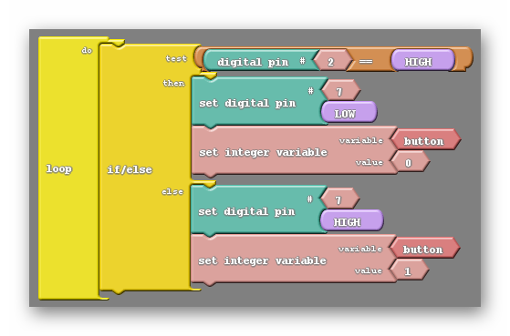
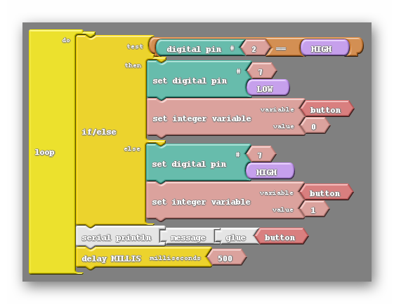
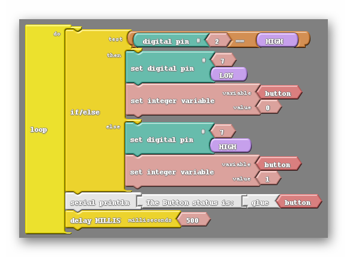

### Put The Input Value Into A Variable
A variable is like a bucket that stores information.  A variable has a name, which is the name of the bucket, and it also has a value, which is the stuff that is inside the bucket.

The program below creates a variable named "button", and it sets it the value "1" if the button is pushed, and "0" if the button is not pushed.

Study the program below to make sure that you understand how it works.

{:.image .block-based}

```c
int button = 0 ;

void setup()
{
  pinMode( 2 , INPUT);
  pinMode( 7 , OUTPUT);
}

void loop()
{
  if (digitalRead(2) == HIGH)
  {
    digitalWrite( 7 , LOW );
    button = 0;
  }
  else
  {
    digitalWrite( 7 , HIGH );
    button = 1;
  }
}
```
{:.text-based}

### Display The Variable On The Serial Monitor

Now we will display our variable to the screen.  We do this by using `serial println`.

{:.image .block-based}

```c
int button = 0 ;

void setup()
{
  pinMode( 2 , INPUT);
  pinMode( 7 , OUTPUT);
  Serial.begin(9600);  
}

void loop()
{
  if (digitalRead(2) == HIGH)
  {
    digitalWrite( 7 , LOW );
    button = 0;
  }
  else
  {
    digitalWrite( 7 , HIGH );
    button = 1;
  }
  Serial.print("The button is: ");
  Serial.print(button);
  Serial.println();
  delay(500);
}
```
{:.text-based}

Once you upload the code, click on "Serial Monitor" to see your data displayed!

### Customize Your Message
Modify the message so that it says "the button status is: _____". 

{:.image .block-based }

{:.block-based}

### Challenges
Now that you know how to store input values and display them, try the following challenges!
1. Display your robot's name on the screen
2. Display on the screen whether the light is on or off.  Display "YES" for on and "NO" for off.  If programmed correctly, the message should change whenever you push the button.
3. Create a program so that your Arduino can display the total number of times the button has been pressed.  It should keep counting higher each time you press the button.