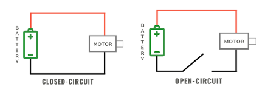

### Tutorial Video



### Review Instructions

Study the instructions below before you assemble the car chassis.

Study the instructions below before you assemble the car chassis.

### Install Servo Motors

Attach the servo motors with the nuts and bolts.  Be sure to have the bolts insert from the outside.

 

### Install Caster Wheel

Attach the castor with the wider and shorter bolts in the front section of the plate.

### Install Motor Wheels

Finally, add the wheels to the servo motors with the pin tipped screws.

### Place the Hardware
Using your zip ties, tie your hardware down onto the car.  Use the double stick foam tape on the back of the bread board to stick it onto the car chassis.  Attach the Noggin to the top side of chassis with zip ties. Be sure to leave the barrel jack accessible.  Using the sticky backside of the breadboard, place the breadboard firmly in the front edge of the chassis.

### Place The Battery

Place the 9 Volt battery on the underside of the chassis with double stick foam.

