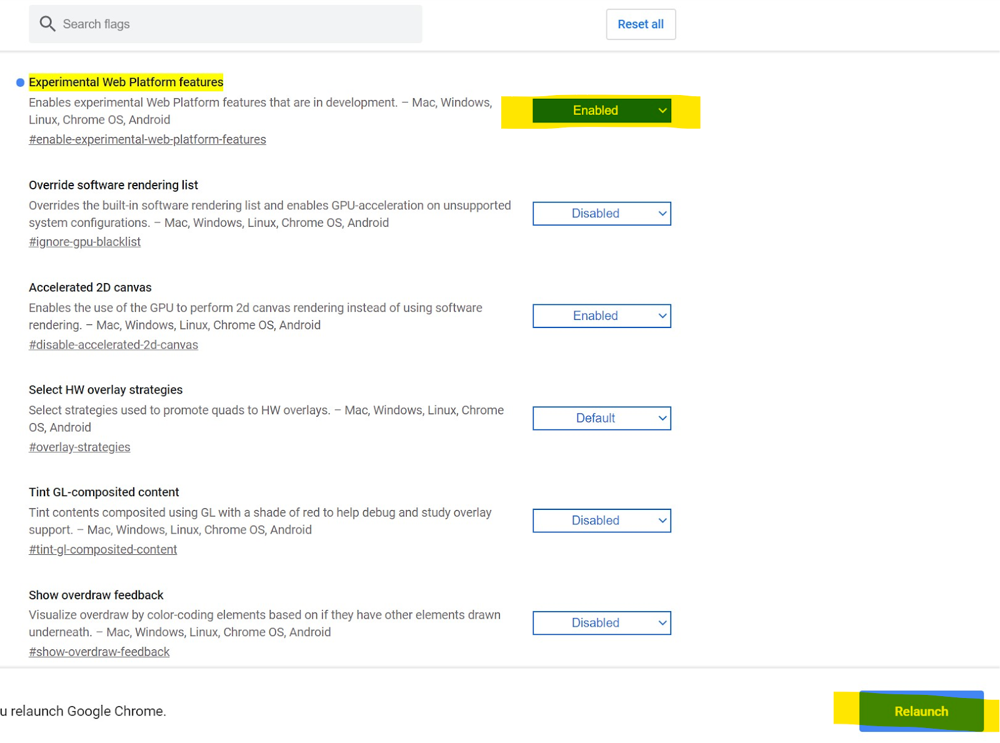
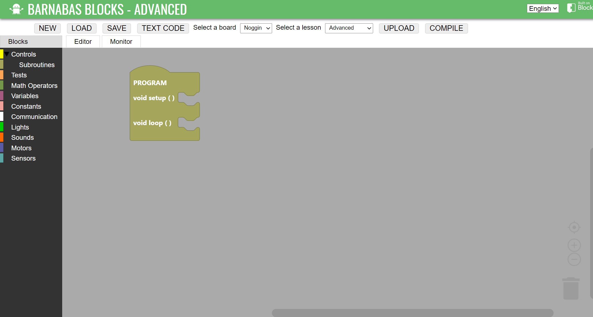
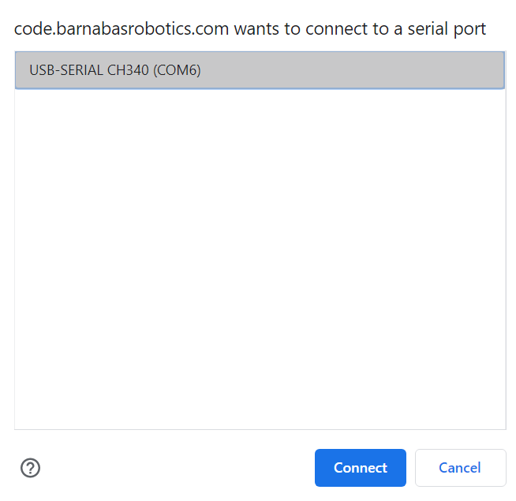

### What You'll Need

Before we get started, let’s make sure that we have all the parts.

### Overview

In this lesson, we’ll be learning about the tool that software engineers need to do their job and also how to set up that tool on your computer.

### IDE - The Tool For Software Engineers

To start, we need to set up your computer with an integrated development environment (IDE).  An IDE is just like any tool that allows someone to do their job.  For example, a chef needs a knife.  A car mechanic needs a wrench.  A software engineer needs their IDE.  An IDE allows a software engineer to:

1. Write code
2. Prepare the code to be sent out

There are IDEs to make video games, apps for your smartphone, websites and lots more.  The IDE that we will be using is designed to allow us to write code for our robot and to prepare that code to be sent out to our robot’s brain (Barnabas Noggin).

### What Type of Computer Do You Have?

Each type of computer has their own version of the IDE, so your first task is to figure out which type of computer you have: Chromebook, Macbook or Windows PC.  Click on your computer type below to jump to the right instructions so that you can setup your IDE.

- [Chromebook](#chromebook-ide-setup)
- [Macbook](#macbook-ide-setup)
- [Windows PC](#windows-pc-ide-setup)

***

### Chromebook IDE Setup

For Chromebooks, your IDE will be a website called Barnabas Blocks.  Follow the instructions below to get it working.  

Before starting:

- [ ] Make sure that your Chromebook is powered on and charged (or charging)
- [ ] Make sure that your Chromebook has access to the internet

#### Enable Experimental Web Platform features

Your Chromebook has special secret features that we need to enable so that it will be able to communicate with our Barnabas Noggin.  Follow these steps to enable this cool feature.

#### 1. Open your Google Chrome browser

#### 2. Copy and paste this text into your address bar.  

<cmd>chrome://flags/#enable-experimental-web-platform-features</cmd>

#### 3. Select “Enabled” on the “Experimental Web Platform features”

#### 4. Click “Relaunch”

#### 5. Visit The IDE

Your Chromebook is now ready to access your IDE.  That was easy, right?  Type the link below (or copy and paste) into your address bar to check it out!

<cmd><a style="color:white" href="https://code.barnabasrobotics.com">https://code.barnabasrobotics.com</a></cmd>

#### 6. Upload Code

1. Connect your Barnabas Noggin (Green board) to your Chromebook using a USB cable.  A red light should turn on on your Barnabas Noggin.

2. Set "Select a board" to "Noggin

3. Set "Select a lesson" to "Advanced"

4. Drag an empty yellow program loop into your workspace

   

5. Click "Upload"

   

6. Select the COM port and click "Connect"

***

### Macbook IDE Setup

For Macbooks, your IDE is called Ardublock.  We’re going to need to download something called a package file (**.pkg**) from the internet and then run the **.pkg** so that it can install the IDE onto your Macbook.  

Before starting:

- [ ] Make sure that your Macbook is powered on and charged (or charging)
- [ ] Make sure that your Macbook has access to the internet

#### 1. Download And Install

[Download the .pkg file](https://www.barnabasrobotics.com/wp-content/uploads/2020/06/Barnabas-Robotics-Installer-1.0.5.zip) and run it.  If you have trouble, visit our [detailed instructions page](https://docs.google.com/document/d/1tsMGBy15fQZ3zAlQ6SgKNf2kBoIs2Iwzoe5aNDDQ-aQ/edit).  

#### 2. Upload Code

Learn how to connect your Noggin to your computer and upload code by watching this video.



### Windows PC IDE Setup

For Windows PCs, your IDE is called **Ardublock**.  We’re going to need to download something called an executable file (.exe) from the internet and then run the .exe so that it can install the IDE onto your Windows PC.  

Before starting:

- [ ] Make sure that your Windows PC is powered on and charged (or charging)
- [ ] Make sure that your Windows PC has access to the internet

#### 1. Download And Install

[Download the windows installer and run it.](https://www.barnabasrobotics.com/barnabas-driver-installer-1-0-5/)



#### 2. Upload Code

Learn how to connect your Noggin to your computer and upload code by watching this video.


