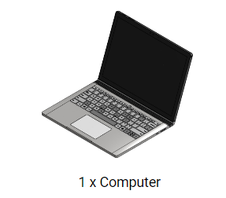
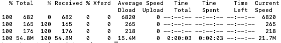

### Continuous Servo Motor Control

{:.text-based}

#### Throttle

A throttle is an instrument used in some kinds of motorized vehicles, such as boats, to control speed. These throttles behave in a particular way; the position of the throttle is what dictates the speed and direction of the motor. For example, a throttle may begin in a position which has the motor stopped. When the throttle is pushed forward from that position the motor begins to move forward. The farther forward the throttle is pushed, the faster the motor moves in that direction. If, instead, I pull the throttle backwards, the motor will begin moving backwards, with it picking up speed as I pull the throttle back further and further. 

As it turns out, our continuous servo motors behave very similarly.


We can give our motors a command including an angle. Our continuous servo motors understand that angle as moving a throttle back and forth. You can see by the picture above that 90 degrees represents the middle position of the throttle, which would have the motor stopped. An angle larger than 90 will begin moving the motor in one direction, with the speed increasing as the angle approaches 180. Likewise, an angle less than 90 moves the motor in the opposite direction, with the speed increasing as you approach 1.

#### How Continuous Servos Work

Continuous servos are similar to the servos that we used from Barnabas-Bot, except that they move like wheels, rather than just from 0 degrees to 180 degrees.  You will be using the same "Servo" block that you used from your Barnabas-Bot project.  See below for a table that explains what happens when you input different angle values.

| Angle |     Direction      | Speed |
| :---- | :----------------: | ----: |
| 0     |     Clock-wise     |  Full |
| 90    |        None        |  Zero |
| 180   | Counter Clock-wise |  Full |

##### 

### Wire Your Continuous Servo Motors



### 

{:class="image "}

Keep in mind that the servo motors can also be attached via the servo pin headers on the Barnabas Noggin. Doing so will ensure, however, that that motor function will be greatly diminished while the noggin is only powered by USB.

### Coding Motors To Move

#### Move Forward

The code below should move your car forward.  Notice that it seems like the motor should be moving in opposite directions.  Look at how your car is constructed and see if you can see why the car moves forward even though the motors are moving in opposite directions.

{:.image .block-based}

```c
#include <Servo.h>

Servo servo_pin_11;
Servo servo_pin_10;

void setup()
{
  servo_pin_11.attach(11);
  servo_pin_10.attach(10);
}

void loop()
{
  servo_pin_11.write( 1 );
  servo_pin_10.write( 180 );
}
```
{:.text-based}

Well, if we look at the robot from underneath, we can see that the two motors are oriented differently, with on pointing out in one direction and the other pointing out in the opposite direction. You can tell this because the sticker is visible on one of them but not on the other. because of this, an angle that would cause a motor to move in one direction will cause the motor on the other side to move in the opposite direction, although at the same speed.


#### Stop Your Motors
The code below will move your car forward for 1 second, stop and then loop forever.

{:.image .block-based}

```c
#include <Servo.h>

Servo servo_pin_11;
Servo servo_pin_10;

void setup()
{
  servo_pin_11.attach(11);
  servo_pin_10.attach(10);
}

void loop()
{
  servo_pin_11.write( 1 );
  servo_pin_10.write( 180 );
  delay( 1000 );
  servo_pin_11.write( 90 );
  servo_pin_10.write( 90 );
  delay( 1000 );
}
```
{:.text-based}

Because there is a button attached to our robot we can create a far more convenient code. We can use the button to trigger movement of the car. In other words have the car be stopped until the button is pressed;

{:.image .block-based}


```c
#include <Servo.h>

Servo servo_pin_11;
Servo servo_pin_10;

void setup()
{
  servo_pin_11.attach(11);
  servo_pin_10.attach(10);
  While (digitalRead(2)==HIGH){
    servo_pin_11.write(90);
    servo_pin_10.write(90);
  }
  delay(500);
}

void loop()
{
  servo_pin_11.write( 1 );
  servo_pin_10.write( 180 );
}
```
{:.text-based}

### Calibration


{:.block-based}

{:.text-based}