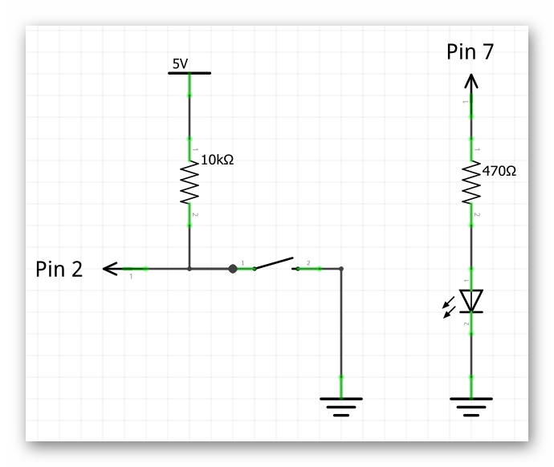
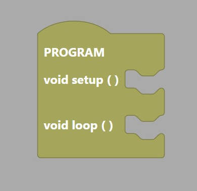

### What You'll Need

Before we get started, let's make sure that we have all the parts.

- 1 x Barnabas Noggin
- 1 x 10 kOhm Resistor
- 1 x 470 Ohm Resistor
- 1 x 4-pin Button
- 1 x USB Cable
- 1 x Computer

### Overview

In this lesson we will wire our button and light directly to our brain (Barnabas Noggin) so that we can practice putting code into our brain sense the button and turn the light and and off.  We will cover:

- How code works in a robot
- Conditional blocks in computer code
- Wiring a button and LED 

<div markdown="1">
###Tutorial Video


</div>


### Getting To Know Your Robot’s Brain

Just like the human brain, your robot’s brain has hundreds of wire pathways that are connected together to help your robot store information and make decisions. Each of these wire pathways in your robot is a circuit. As we learned in the previous lesson, a circuit is just another way of describing a pathway for electricity to flow.  Your robot’s brain is called the Barnabas Noggin.  In this lesson, you’ll not only be connecting your LED and button to your brain, but you’ll be learning how to control the LED through code!

### Connecting Your Brain To Your Computer

Plug your Barnabas Noggin into your computer using the USB cable.  The red light on your Barnabas Noggin should turn on.

### Connecting Your LED And Button To Your Brain

Next, we need to connect the LED and button to the Barnabas Noggin.  Previously, the LED would turn on and off without any code.  This time we want to connect it in a way so that the button sends a signal to the Barnabas Noggin, and then the Barnabas Noggin processes code to turn the LED on or off.  In order to do this we need to connect the LED and button to a special place, called a **pin**.

A **pin** on the Barnabas Noggin is a power source that can be turned off and on depending on its computer code.

#### Build The Button Circuit

Study the circuit below.  Notice that the button is connected to pin 2 and the LED is connected to pin 7.



Go ahead and remove everything from your breadboard and wire the circuit based on the diagram below.  A few things to note:

- Use a red wire for the 5V connection
- Use a black wire for the GND connection
- A second black wire connected two rows together, causing both rows to become connected to GND.  
- A 470 Ohm resistor (yellow, purple, brown, gold) is connected to the LED
- A 10 kOhm resistor (brown, black, orange, gold) is connected to the button
- Use yellow wires for the pin connections


{:.block-based}

### Introduction To Coding

It’s now time to start coding.  To do this, we first need to create instructions to send to your robot’s brain to tell it to turn the LED on. The process of creating instructions for your robot is called **computer programming** or software engineering.  The actual set of instructions that we create is called **computer code**.

#### What is Computer Code?

Let’s go back to our human brain analogy.  A human brain without any information stored in it wouldn’t be able to accomplish any of the functions that we do every day (e.g. walking, running and talking).  Likewise, a computer needs to have information in it to make a robot function.  As humans, we learn instructions so that we can accomplish tasks like washing our hands or making a sandwich.  We learn these tasks by reading, listening or observation.  Computers learn by receiving computer code, written by humans.

#### How Computer Code Works

These instructions will be followed by the computer in the order that they are written.  When the computer gets to the end of the list of instructions, it goes back to the beginning of the list of instructions and starts over.

#### Sending Computer Code to the Noggin

After you’ve created your computer code, you’ll need to send the code to the Barnabas Noggin so that it can actually be stored in the brain.  This process is called uploading.  

#### Open Your IDE

It's time to start coding!  Go ahead and open your IDE



<div markdown="1">

### Setup And Loop

In our code, we're going to have to main functions - setup() and loop().  The code inside setup runs only one time when your robot's brain turns on.  The code inside loop() will run after the setup code runs and then continue to run that code until the robot is turned off or runs out of battery.
    

```c
void setup() {
    //- the code in here runs one time upon power up
}

void loop() {
    //- after the setup code runs once, the code in here runs forever in a loop
}
```


</div>{:.text-based}

<div markdown="1">

### The Loop

In your IDE, your code will be made up of a series of blocks that snap together like puzzle pieces.  




Note: On code.barnabasrobotics.com, the "LOOP do:" is inside a "Program block" (see above).

The first block to introduce is called the “LOOP do.”  The “LOOP do” will house all of the other blocks used in your code.  It is like the outside cover of a book, which houses all of its pages.   The computer reads the pages (i.e. code blocks) within the “LOOP do” block from the beginning to the end.  When it gets to the end, it starts back at the beginning and begins again.  This process repeats forever as long as your Noggin has power.

Note: You can only have one “LOOP do” in your code.

### How to Add a Block

Let’s add a “LOOP do” block to our code!

1. Find the colored button on the left side of your screen labeled “Control,”
2. After you click on the yellow “Control” button, you’ll see a menu of yellow blocks open up.  Click (and hold down) on the “LOOP do” block and drag it into the large area to the right of the colored buttons.  When it is in the large area, release the click.

### How to Delete a Block

There may be times when you’ll need to delete blocks of code. For example, if we have multiple “LOOP do” blocks in our code (remember your code can only have one “LOOP do” to work), we need to get rid of the extras.

Let’s practice by deleting the “LOOP do” block from our code.

1. Click (and hold down) on the “LOOP do” block and drag it over to the tabs on the left side of the window.
2. Release the click and the “LOOP do” block should disappear.

Now that we know how to delete a block that we don’t want, let’s go ahead and bring in a “LOOP do” block again so that we can continue building our code.

</div>

### Programming the Button

{:.block-based}

#### Conditional Logic

In programming, conditional logic is used to decide a course of action depending on a condition.  Conditional logic is something we use in our everyday life without even recognizing it. Examples are:

- **If** I'm hungry, I eat.  **Else**, I don't eat.
- **If** I'm cold, I wear a jacket.  **Else**, I don't wear a jacket.

You likely make hundreds of conditional logic decisions a day.  Your robot can be programmed to make decision in this same fashion.  The condition that we will program in the lesson is:

- **If** the button is pressed, then turn the LED on, **Else**, turn the LED off 

See below for what if/else code looks like:

{:.image .block-based}

```c
if ( ) {
    //- do something
}
else {
    //- do something else
}
```
{:.text-based}

#### Practice

Now that we know the basics of conditional logic, let's write a program that turns ON the light if we press the button and turns OFF the light if we let go of the button.  A few notes:

<div markdown = "1">
- The button is connected to pin 2.  When you press it, it pulls pin 2 to 0V (or ground), which is the same as LOW.  When you don't press it, pin 2 is naturally pulled to 5V, which is the same as HIGH.
- The LED is connected to pin 7 and is controlled by the "set digital pin" block.  To turn the LED on, set the pin to HIGH.  To turn the LED off, set the pin to LOW.
- The blocks are color coded, so if you have trouble finding these blocks, look under the corresponding color on the left side of your IDE.

</div>{:.block-based}


<div markdown = "1">

- The button is connected to pin 2.  When you press it, it pulls pin 2 to 0V (or ground), which is the same as LOW.  When you don't press it, pin 2 is naturally pulled to 5V, which is the same as HIGH.
- The LED is connected to pin 7 and is controlled by the "digitalWrite" command.  To turn the LED on, set the pin to HIGH.  To turn the LED off, set the pin to LOW.
- Pin 2 (the button control pin) is setup as an input using the "pinMode" command.
- Pin 7 (the LED control pin) is setup as an output using the "pinMode" command.

</div>{:.text-based}


{:.image .block-based}

```c
void setup()
{
  pinMode( 2 , INPUT);
  pinMode( 7 , OUTPUT);

}

void loop()
{
  if (digitalRead(2) == HIGH) {
    digitalWrite(7,LOW);
  }
  else {
    digitalWrite(7,HIGH);
  }
}
```
{:.text-based}

#### Our First Upload

We are now ready to upload our code to our robot.  Before doing so, let’s check a few things.

- [ ] Confirm power.  Make sure that the USB cable is connecting your Noggin to your computer.  A red light on your noggin should be on.
- [ ] Set your Board and Port.
- [ ] Click upload.



After you successfully upload, try out your code to see if it works!

#### Challenges

Now that you know how to program a button, try the following challenges:  

1. Modify your program so that it turns OFF when you press the button and ON when you let go.

2. Modify your program so that it blinks when you press the button and just stays OFF when you let go.

   