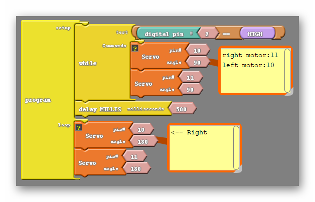

### Review

Let's recall the code that ultimately got our robot moving forward;

{:.image .block-based}

Getting each motor to move depends on geving it a non 90 degree angle. An angle further from 90 will cause the motor to move faster, and choosing a number on the other side of 90 will cause the motor to change directions. As we learned in the last lesson the two motors are flipped, so that one motor must be given the "opposite" angle to move in the same direction as each other.

```c
#include <Servo.h>

Servo servo_pin_11;
Servo servo_pin_10;

void setup()
{
  servo_pin_11.attach(11);
  servo_pin_10.attach(10);
  
  while (digitalWrite(2)==HIGH)
  {
    servo_pin_11.write( 90 );
    servo_pin_10.write( 90 );
  }
}

void loop()
{
  servo_pin_11.write( 1 );
  servo_pin_10.write( 180 );
}
```
{:.text-based}


### Step 1: Let's Move Backwards!

Drawing from the knowledge we gained to make the racer move forward, we should easily be able to make it move backwards as well. Simply remember that a number on the other side of 90 will make a motor move in the opposite direction:

{:.image .block-based}

```c
#include <Servo.h>

Servo servo_pin_11;
Servo servo_pin_10;

void setup()
{
  servo_pin_11.attach(11);
  servo_pin_10.attach(10);

while (digitalWrite(2)==HIGH){
    servo_pin_11.write( 90 );
    servo_pin_10.write( 90 );
  }
}

void loop()
{
  servo_pin_11.write( 180 );
  servo_pin_10.write( 1 );
}
```
{:.text-based}

That's great! We now know how to put our robots into reverse. 

### Step 2: Can We Make Our Car Turn?

Now let's say that from here we instead want to turn in one direction, how do we do that? Thinking about the direction we want to turn our motors if I wanted to turn left I would have the right motor continue moving forward but change the direction of the left motor. I could do likewise with the right motor if I wanted to turn right instead. The code to do either is below;

{:.image .block-based}

{:.image .block-based}

```c
#include <Servo.h>

Servo servo_pin_11;
Servo servo_pin_10;

void setup()
{
  servo_pin_11.attach(11);
  servo_pin_10.attach(10);

  while (digitalWrite(2)==HIGH){
    servo_pin_11.write( 90 );
    servo_pin_10.write( 90 );
  }
}

void loop()
{
  servo_pin_11.write( 1 ); //both being 1 will turn the robot left
  servo_pin_10.write( 1 ); //both being 180 will turn the robot right
}
```
{:.text-based}
