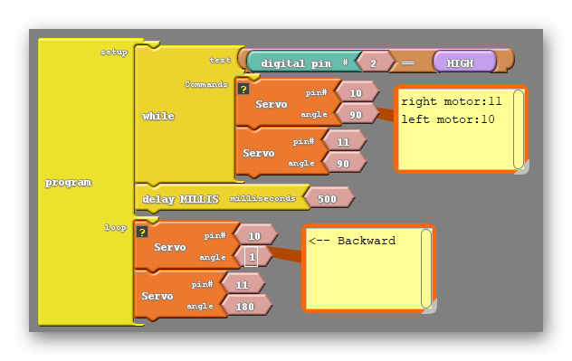

### Overview

In this section we will explore how continuous servo motors are controlled.  Topics covered include:

- How to wire your servo motors to your Barnabas Noggin
- How to program your servo motors to to turn on, stop and spin both directions
- How to trigger motion using your button
- How to change the speed of your servo motors

<div markdown="1">

### Full Video Tutorial

{:.text-based}

</div>{:.text-based}

### Continuous Servo Motor Control

#### Throttle

A throttle is an instrument used in some kinds of motorized vehicles, such as boats, to control speed. These throttles behave in a particular way; the position of the throttle is what dictates the speed and direction of the motor. For example, a throttle may begin in a position which has the motor stopped. When the throttle is pushed forward from that position the motor begins to move forward. The farther forward the throttle is pushed, the faster the motor moves in that direction. If, instead, I pull the throttle backwards, the motor will begin moving backwards, with it picking up speed as I pull the throttle back further and further. 

As it turns out, our continuous servo motors behave very similarly.


We can give our motors a command including an angle. Our continuous servo motors understand that angle as moving a throttle back and forth. You can see by the picture above that 90 degrees represents the middle position of the throttle, which would have the motor stopped. An angle larger than 90 will begin moving the motor in one direction, with the speed increasing as the angle approaches 180. Likewise, an angle less than 90 moves the motor in the opposite direction, with the speed increasing as you approach 1.

#### How Continuous Servos Work

Continuous servos are similar to the servos that we used from Barnabas-Bot, except that they move like wheels, rather than just from 0 degrees to 180 degrees.  You will be using the same "Servo" block that you used from your Barnabas-Bot project.  See below for a table that explains what happens when you input different angle values.

| Angle |     Direction      | Speed |
| :---- | :----------------: | ----: |
| 0     |     Clock-wise     |  Full |
| 90    |        None        |  Zero |
| 180   | Counter Clock-wise |  Full |

{:.block-based}

### Wire Your Continuous Servo Motors

<div markdown="1">
Let's go ahead and wire our servo motors! Instructions can be found in the full tutorial video above.

</div>{:.text-based}

<div markdown="1">
Let's go ahead and wire our servo motors!  Follow the wiring diagram below.

{:class="image "}



</div>{:.block-based}


### Coding Your Motors To Move

#### Move Forward

The code below should move your car forward.  Notice that it seems like the motor should be moving in opposite directions.  Look at how your car is constructed and see if you can see why the car moves forward even though the motors are moving in opposite directions.

{:.image .block-based}

```c
#include <Servo.h>

Servo servo_pin_11;
Servo servo_pin_10;

void setup()
{
  servo_pin_11.attach(11);
  servo_pin_10.attach(10);
}

void loop()
{
  servo_pin_11.write( 1 );
  servo_pin_10.write( 180 );
}
```
{:.text-based}

#### Stop Your Motors
The code below will move both motors for 1 second, stop and then loop forever.

{:.image .block-based}

```c
#include <Servo.h>

Servo servo_pin_11;
Servo servo_pin_10;

void setup()
{
  servo_pin_11.attach(11);
  servo_pin_10.attach(10);
}

void loop()
{
  servo_pin_11.write( 1 );
  servo_pin_10.write( 180 );
  delay( 1000 );
  servo_pin_11.write( 90 );
  servo_pin_10.write( 90 );
  delay( 1000 );
}
```
{:.text-based}

Because there is a button attached to our robot we can create a far more convenient code. We can use the button to trigger movement of the car. In other words have the car be stopped until the button is pressed;

{:.image .block-based}


```c
#include <Servo.h>

Servo servo_pin_11;
Servo servo_pin_10;

void setup()
{
  servo_pin_11.attach(11);
  servo_pin_10.attach(10);
  While (digitalRead(2)==HIGH){
    servo_pin_11.write(90);
    servo_pin_10.write(90);
  }
  delay(500);
}

void loop()
{
  servo_pin_11.write( 1 );
  servo_pin_10.write( 180 );
}
```
{:.text-based}

### Adding Your Button

To make things a bit more convenient for us when we start testing with a moving car, we're going to add a bit of code so that you car doesn't begin its program until you press your button.  

In order to accomplish this, we're going to need to use something called a while loop.  The while loop is like an if/else block.  How it works is: 

"Do what ever is inside the loop WHILE this thing is true"

So what we're going to do is tell it to do nothing WHILE the button is not pressed, and then jump out of the while loop once the button is pressed.  

{:.block-based}

#### Move Forward When You Press The Button

{:.image .block-based}


```c
#include <Servo.h>

Servo servo_pin_11;
Servo servo_pin_10;

void setup()
{
  servo_pin_11.attach(11);
  servo_pin_10.attach(10);
  
  while (digitalWrite(2)==HIGH)
  {
    servo_pin_11.write( 90 );
    servo_pin_10.write( 90 );
  }
}

void loop()
{
  servo_pin_11.write( 1 );
  servo_pin_10.write( 180 );
}
```
{:.text-based}

#### Practice #1: Move Backwards When You Press The Button

{:.image .block-based}

```c
#include <Servo.h>

Servo servo_pin_11;
Servo servo_pin_10;

void setup()
{
  servo_pin_11.attach(11);
  servo_pin_10.attach(10);

while (digitalWrite(2)==HIGH){
    servo_pin_11.write( 90 );
    servo_pin_10.write( 90 );
  }
}

void loop()
{
  servo_pin_11.write( 180 );
  servo_pin_10.write( 1 );
}
```
{:.text-based}

### Speed Control

You can change the speed of your motor by using different angle values.  See the table below.  This will come in handy later when you are trying to fine tune your wheel speeds.  For example, you may be trying to drive straight, but one wheel is going faster than the other.  You can speed one wheel up or slow one wheel down using these angles.


| Angle  | Direction         | Speed   |
| ------ | ----------------- | ------- |
| 0      | Clockwise         | Full    |
| 1-89   | Clockwise         | Partial |
| 90     | None              | Zero    |
| 91-179 | Counter Clockwise | Partial |
| 180    | Counter Clockwise | Full    |

#### Speed Challenges

1. Program your wheels to move at half speed.
2. Program your wheels to move as slowly as possible.

### Calibration



Motor calibration steps include:

1. Programming the motor to the stop position (90 degrees) 
2. Check to see if the motor stops moving.  If so, no calibration is needed.
3. If the motor is not stopped, turn the screw under the motor until the motor stops moving.


{:.block-based}
