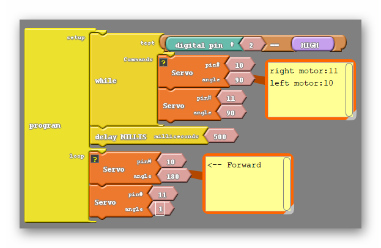
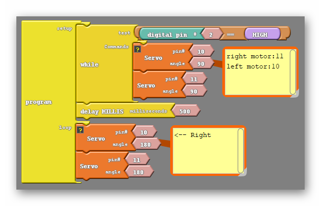
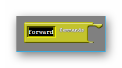
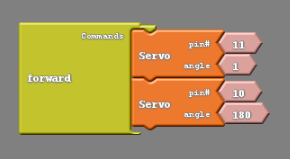
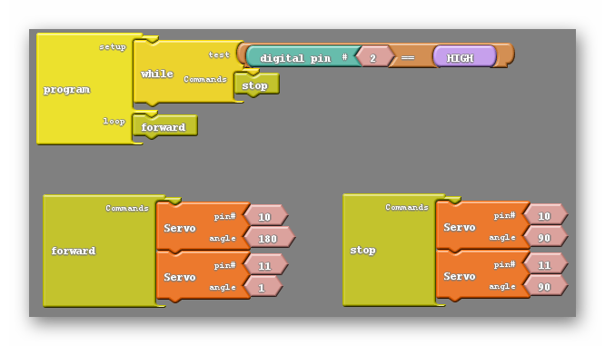
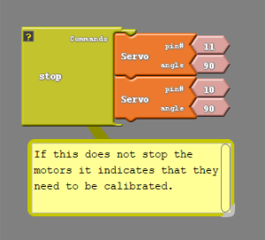
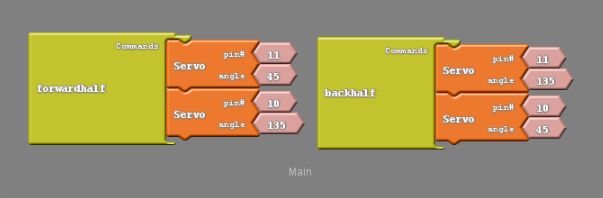

### Overview

In this section we will be programming our racer to move forwards, backwards and turn.  We'll also be learning how to streamline our code with something called subroutines.

### Review

Let's recall the code that ultimately got our robot moving forward;

{:.image .block-based}

Getting each motor to move depends on giving it a non 90 degree angle. An angle further from 90 will cause the motor to move faster, and choosing a number on the other side of 90 will cause the motor to change directions. As we learned in the last lesson the two motors are flipped, so that one motor must be given the "opposite" angle to move in the same direction as each other.

```c
#include <Servo.h>

Servo servo_pin_11;
Servo servo_pin_10;

void setup()
{
  servo_pin_11.attach(11);
  servo_pin_10.attach(10);
  
  while (digitalWrite(2)==HIGH)
  {
    servo_pin_11.write( 90 );
    servo_pin_10.write( 90 );
  }
}

void loop()
{
  servo_pin_11.write( 1 );
  servo_pin_10.write( 180 );
}
```
{:.text-based}


### Let's Move Backwards!

Drawing from the knowledge we gained to make the racer move forward, we should easily be able to make it move backwards as well. Simply remember that a number on the other side of 90 will make a motor move in the opposite direction:

{:.image .block-based}

```c
#include <Servo.h>

Servo servo_pin_11;
Servo servo_pin_10;

void setup()
{
  servo_pin_11.attach(11);
  servo_pin_10.attach(10);

while (digitalWrite(2)==HIGH){
    servo_pin_11.write( 90 );
    servo_pin_10.write( 90 );
  }
}

void loop()
{
  servo_pin_11.write( 180 );
  servo_pin_10.write( 1 );
}
```
{:.text-based}

### Make Our Racer Turn

{:.block-based}

{:.text-based}

Now let's say that from here we instead want to turn in one direction, how do we do that? Thinking about the direction we want to turn our motors if I wanted to turn left I would have the right motor continue moving forward but change the direction of the left motor. I could do likewise with the right motor if I wanted to turn right instead. The code to do either is below;

{:.image .block-based}

{:.image .block-based}

```c
#include <Servo.h>

Servo servo_pin_11;
Servo servo_pin_10;

void setup()
{
  servo_pin_11.attach(11);
  servo_pin_10.attach(10);

  while (digitalWrite(2)==HIGH){
    servo_pin_11.write( 90 );
    servo_pin_10.write( 90 );
  }
}

void loop()
{
  servo_pin_11.write( 1 ); //both being 1 will turn the robot left
  servo_pin_10.write( 1 ); //both being 180 will turn the robot right
}
```
{:.text-based}

#### Beginning To Turn...
You should find that changing the amount of time one wheel turns either shortens or lengthens the time the robot spends turning and therefore changes how far the robot turns.  Take some time to experiment!

Just remember that it will be impossible to see how long a turn lasts for if the turn is the only command being given. Instead, the robot will just turn continuously and appear to spin in place. Instead, have code that will move either forward or backward for some amount of time before turning, like so:

{:.image .block-based}

```c
#include <Servo.h>

Servo servo_pin_11;
Servo servo_pin_10;

void setup()
{
  servo_pin_11.attach(11);
  servo_pin_10.attach(10);

  while (digitalWrite(2)==HIGH){
    servo_pin_11.write( 90 );
    servo_pin_10.write( 90 );
  }
}

void loop()
{
  servo_pin_11.write(1);
  servo_pin_10.write(180);
  delay(500);
  servo_pin_11.write( 1 ); //both being 1 will turn the robot left
  servo_pin_10.write( 1 ); //both being 180 will turn the robot right
  delay(500);
}
```
{:.text-based}

### Challenge

1. Change the delay values of this code and see how the robot reacts. 
2. Move the robot forwards and backwards in the same program.

**Note**: Remember that you want to make a portion of your code at the end of any movement that brings your robot to a stop before having it move again. Without this it will be difficult to determine how far the robot is turning in a single command, as it will appear to turn continuously.

### Subroutines

{:.block-based}

Up to this point we have been issuing commands to our robot in a painstaking way. To move the robot forward we need to give orders to two different pins and then specify a time that they continue obeying that order. It would be nice if we could instead give only one order to our robot, like move forward, and have it understand what we mean. 

Think of when you're told to take out the trash.  Your parents don't tell you: 

1. Open the trash can, then take the trashbag out
2. Tie it
3. Go outside and put it in the bin
4. Come inside and put another trashbag in the can
5. Then close the lid

Instead, they just tell you to "take the trash out".  The reason is because at some point you were already taught all the necessary steps required to accomplish the task.  Our robot can do this same thing where we make it understand one command as a longer list of orders.

We are going to achieve this by using **subroutines**. 

<div markdown="1">

### Create And Call A Subroutine    

Notice in the code below that we first declare and define a subroutine called “forward()”.  We must do this before we call it in the “loop()” function.  In the loop() function, we call the subroutine by writing "forward()".


```c
#include <Servo.h>

Servo servo_pin_11;
Servo servo_pin_10;


void forward(){
  servo_pin_11.write( 1 );
  servo_pin_10.write( 180 );
}

void stop(){
  servo_pin_11.write(90);
  servo_pin_10.write(90;
}

void setup()
{
  servo_pin_11.attach(11);
  servo_pin_10.attach(10);

  While (digitalRead(2)==HIGH){
    stop();
  }
}

void loop()
{
  forward();
}
```
</div>{:.text-based}
    

<div markdown="1">


### Create A Subroutine

The two subroutine blocks are found at the bottom of the control tab as shown below.

{:.image .fit}

One of these, the subroutine commands block, is the block we use to teach our robot to do a certain list of orders under a single named command. The other block simply says subroutine, which we'll call the subroutine run block. When this block is placed into our **Loop Do**, it will run the list of commands we created earlier. Using the subroutine blocks is different than using the other blocks we have utilized this far. Because of this we'll walk through our first subroutine in great detail.

The first subroutine we are going to make will move our robot forward, something we have done twice already. We will start by dragging a Loop Do into the coding environment (unless one is already there) and also dragging a subroutine commands block into the environment as well. Unlike all the other blocks in Ardublock, we are not going to attach the subroutine commands block to the Loop Do.

{:.image .fit .block-based}

The subroutine commands block is strange for another reason. We can change what it is called in the same way we can change number values in our other blocks, by left clicking on the word subroutine you open a text box that you can type in. I'm going to erase the word subroutine and replace it with forward.

{:.image .block-based}

I'm just doing this so that in the future, when we have more than one subroutine, giving my robot the command I want will be easy. The only thing I'll need to remember to go forward is the word forward. Now we need to input the list of orders that the robot will do whenever we say forward. We'll just use the code from the last section;

{:.image .block-based}

### Call A Subroutine

Now we only need to put a subroutine run block inside of our Loop Do and rename it forward as well;

{:.image .block-based}

Rather than the simple code above, you could add your newfound knowledge of subroutines to the code we've created which utilizes the button;

{:.image .block-based}

</div>{:.block-based}

### How Do Subroutines Help Me?

You're probably thinking 'What was the point of all this? This was more work than before!' Well for now it seems that way, but before we're done with this class our robot is going to be navigating through very complicated paths, and we will need to give our robot several commands. At that point this process becomes extremely worthwhile. The way I put it is that we do a lot of work up front so that the rest our code is easier to write.

### Practice

Create the following subroutines

| Name          | Action                                          |
| ------------- | ----------------------------------------------- |
| *stop*        | Stops all motors                                |
| *rstop*       | Stops the right motor only                      |
| *lstop*       | Stops the left motor only                       |
| *left*        | Moves the left motor forward only               |
| *lback*       | Move the left motor backward only               |
| *right*       | Moves the right motor forward only              |
| *rback*       | Moves the right motor backward only             |
| *forward*     | Moves both the left and right motor forward.    |
| *back*        | Moves both the left and right motor backwards.  |
| *blink*       | Blinks the LED light at whatever speed you want |
| *forwardhalf* | Move forward at half speed.                     |
| *backhalf*    | Move backwards at half speed.                   |

{:.image .block-based}
{:.image .block-based}
{:.image .block-based}
{:.image .block-based}

### Challenge

1. Write a program that moves the car forward for 1 second, stops for 1 second, goes backwards for 1 seconds and stops for 1 second using your subroutines.
2. Retry your turning challenges from the previous lesson by using your subroutines.
3. Create a subroutine that tells your robot to turn left 90 degrees.
4. Create a subroutine that tells your robot to turn right 90 degrees.
5. Make up a programming complex programming challenge and use your new subroutines to achieve your goal!