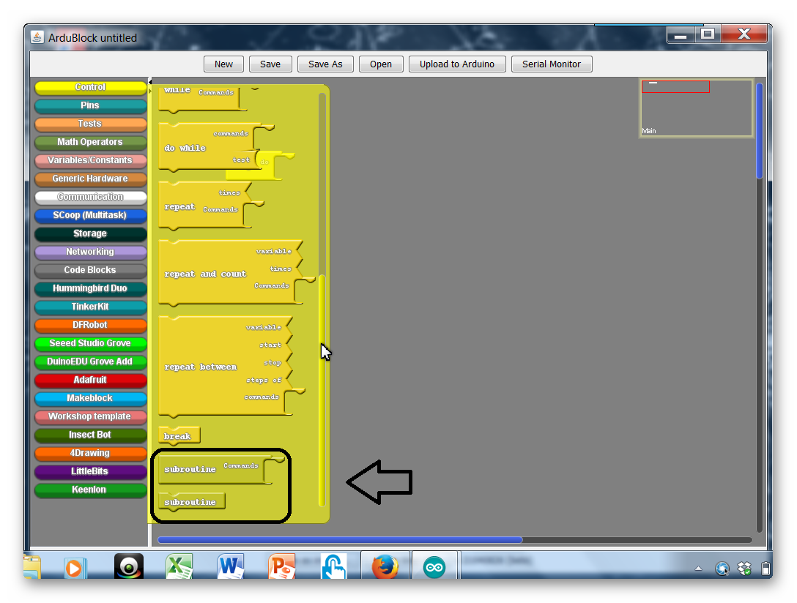

### Overview

In this section we will be programming our racer to move forwards, backwards, turn and start motion when you press a button.  We'll also be learning how to streamline our code with something called subroutines.

<div markdown="1">

### Full Video Tutorial



</div>{:.text-based}

### What Is A Subroutine?

Up to this point we have been issuing commands to our robot in a painstaking way. To move the robot forward we need to give orders to two motors and then specify a time that they continue obeying that order. It would be nice if we could instead give only one order to our robot, like move forward, and have it understand what we mean. 

Think of when you're told to take out the trash.  Your parents don't tell you: 

1. Open the trash can, then take the trashbag out
2. Tie it
3. Go outside and put it in the bin
4. Come inside and put another trashbag in the can
5. Then close the lid

Instead, they just tell you to "take the trash out".  The reason is because at some point you were already taught all the necessary steps required to accomplish the task.  Our robot can do this same thing where we make it understand one command as a longer list of orders.

We are going to achieve this by using **subroutines**. 

### Creating A Subroutine

To create a subroutine is to create a little sub-program within your code.  Take a look at the code below where we create a subroutine that moves the car forward.  Notice that the name of the subroutine matches what it does.  This way it is easy to keep track what our subroutines do.

{:.image .fit .block-based}

{:.image .fit .block-based}

{:.image .block-based}

{:.image .block-based}


```c
void forward()
{
  servo_pin_11.write( 1 );
  servo_pin_10.write( 180 );
}
```
{:.text-based}

### Calling A Subroutine

To call a subroutine, simple use the name of the subroutine in your main loop.  Try uploading the code to see if your robot moves forward.  If it doesn't, you'll need to modify the code.  Remember if one of the wheels is spinning the wrong way, you just need to flip the angle (0 to 180 or 180 to 0).

{:.image .block-based}


```c
#include <Servo.h>

Servo servo_pin_11;
Servo servo_pin_10;

void forward(){
  servo_pin_11.write( 1 );
  servo_pin_10.write( 180 );    
}

void setup()
{
  servo_pin_11.attach(11);
  servo_pin_10.attach(10);
}

void loop()
{
  forward();
}
```
{:.text-based}

<div markdown = "1">
Notice in the code below that we first declare and define a subroutine called “forward()”.  We must do this before we call it in the “loop()” function.  In the loop() function, we call the subroutine by writing "forward()".
</div>{:.text-based}
#### Practice #1: Make more subroutines

Create the following subroutines and test them inside your main loop to make sure that they work.

| Name          | Action                                          |
| ------------- | ----------------------------------------------- |
| *stop*        | Stops all motors                                |
| *rstop*       | Stops the right motor only                      |
| *lstop*       | Stops the left motor only                       |
| *left*        | Moves the left motor forward only               |
| *lback*       | Move the left motor backward only               |
| *right*       | Moves the right motor forward only              |
| *rback*       | Moves the right motor backward only             |
| *forward*     | Moves both the left and right motor forward.    |
| *back*        | Moves both the left and right motor backwards.  |
| *blink*       | Blinks the LED light at whatever speed you want |
| *forwardhalf* | Move forward at half speed.                     |
| *backhalf*    | Move backwards at half speed.                   |

{:.image .block-based}
{:.image .block-based}
{:.image .block-based}
{:.image .block-based}

### Make Our Racer Turn

{:.block-based}

#### Turning Left Or Right

Now let's say that from here we instead want to turn in one direction, how do we do that? Thinking about the direction we want to turn our motors if I wanted to turn left I would have the right motor continue moving forward but change the direction of the left motor. 

{:.image .block-based}

```c
#include <Servo.h>

Servo servo_pin_11;
Servo servo_pin_10;

void setup()
{
  servo_pin_11.attach(11);
  servo_pin_10.attach(10);

  while (digitalWrite(2)==HIGH){
    servo_pin_11.write( 90 );
    servo_pin_10.write( 90 );
  }
}

void loop()
{
  servo_pin_11.write( 1 ); //both being 1 will turn the robot left
  servo_pin_10.write( 1 ); 
}
```
{:.text-based}

We could do likewise with the right motor if I wanted to turn right instead. 

{:.image .block-based}


```c
#include <Servo.h>

Servo servo_pin_11;
Servo servo_pin_10;

void setup()
{
  servo_pin_11.attach(11);
  servo_pin_10.attach(10);

  while (digitalWrite(2)==HIGH){
    servo_pin_11.write( 90 );
    servo_pin_10.write( 90 );
  }
}

void loop()
{
  servo_pin_11.write( 180 ); 
  servo_pin_10.write( 180 ); //both being 180 will turn the robot right
}
```
{:.text-based}

#### Go Straight Then Turn

To better see what is going on in your turn code, create code that first moves your car straight (either forward or backward) and then have it turn.  

See the code below.  The last delay controls how much the car turns before it stops again.  Take some time to experiment!

{:.image .block-based}

```c
#include <Servo.h>

Servo servo_pin_11;
Servo servo_pin_10;

void setup()
{
  servo_pin_11.attach(11);
  servo_pin_10.attach(10);

  while (digitalWrite(2)==HIGH){
    servo_pin_11.write( 90 );
    servo_pin_10.write( 90 );
  }
}

void loop()
{
  servo_pin_11.write(1);
  servo_pin_10.write(180);
  delay(500);
  servo_pin_11.write( 1 ); //both being 1 will turn the robot left
  servo_pin_10.write( 1 ); //both being 180 will turn the robot right
  delay(500);
}
```
{:.text-based}

#### Challenge #1: Adjust The Turn Amount

Change the delay inside the subroutines to adjust how much it turns.

#### Challenge #2: Create Right Angle Turns

Change the delay inside the subroutines so that the left and right turns create exactly 90 degree turns.

#### Challenge #3: Adjust The Turn Direction

Change the low/high values to change the direction of the turn so that it turns backwards instead of forwards.


