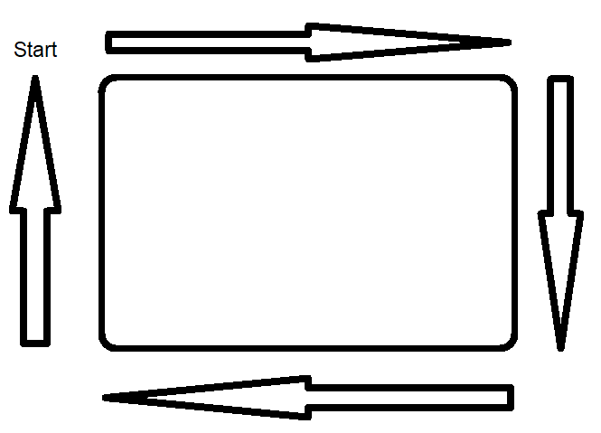

### Overview

In this lesson you'll be challenged to program your robot through a series of challenges

### There And Back Challenge

Now that we have built a library of subroutines we can take what we have learned to perform a simple task. This lesson will allow the students to become more familiar with the material taught in the last few weeks and give them an objective to work towards. The 'obstacle course' they will be navigating is very simple, they will get more complicated in coming weeks. This week we will simply navigate around a cone (or similar obstacle) as shown below.

Some things to keep in mind during this lesson:

- The delay in your forward subroutine probably will not move the robot forward the exact distance needed. You will either need to adjust that delay or use the forward subroutine multiple times.
- The turn will likely need to be two separate 90 degree turns. 

### Box Challenge

 Have your robot travel around the box until it reaches its starting location. 

#### Things to consider
- Like the other challenges the appropriate delays for forward and turn will take experimentation to find.
- There are multiple ways to complete this challenge. For example, you can closely follow the outside of the box and make sharp turns, or you can create a large arcing circle around the box that doesn’t come remotely close to it.

{:.block-based}

### Alternative Surface Challenge

Challenge your Barnabas Racer to travel on a path that crosses different types of surfaces.  

{:.block-based}

### Letters Challenge

Now that we can go to a goal and come back, let's take it up a notch.  See if your car can travel along the ground to create the following letters below.  

- Draw the letters A, E, F and D on a piece of paper and see if your car can drive along it.  
- See the red arrows for the path that your car should travel.

#### Some things to keep in mind:

- The delay in your forward subroutine probably will not move the robot forward the exact distance needed. You will either need to adjust that delay or use the forward subroutine multiple times.
- How would you make your car move in an arc to draw the "D"? Hint: It has something to do with adjusting the motor speeds.

### Choose Your Own Adventure

Challenge yourself to design your own course and program your Barnabas Racer to get through it!

|                                                            |                                                            |
| ---------------------------------------------------------- | ---------------------------------------------------------- |
| {:.block-based} | {:.block-based} |

