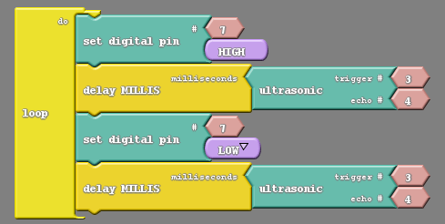
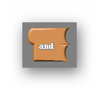

### Overview

In this section you will be learning how to add an ultrasonic sensor to your Barnabas Racer, which will allow it to see objects in front of it!

### Tutorial Video(s)

{:.text-based}

{:.block-based}

{:.block-based}

{:.block-based}

{:.block-based}

### The Hardware


Our sonar sensor is going to give our robot the ability to sense the world around it. What we have been working with up to this point, our LEDs, motors, buzzers, etc. have been what we call outputs. This means that the component is meant to function by sending an electrical signal to the component from the robot's brain. The sonar sensor however, is what's known as an input. This means that our robot will receive a signal from the component rather than sending one to to it. I like to say that an output component listens and an input component talks. 

Almost looks like it's staring at you, huh? The sensor board notably has two wide eyed speakers among its notable parts. On its backside it has a lot of parts you may be familiar with: resistors, capacitors, ICs and the like. Fortunately we don't need to go into detail about those parts to operate this sensor. The only thing we need to worry about are those speakers and the four pins extruding from the bottom of the board.

Those four pins are labeled Vcc, Trig, Echo and GND. The pin labeled GND, unsurprisingly must be connected to the GND pin on our Uno board, and I recommend doing this rst, as connecting the Vcc pin beforehand can have unexpected side effects on the sonar sensor.
Speaking of, you may be wondering what the Vcc pin is. Well, for reasons I will not explain here the Vcc pin is the voltage pin of the sensor, meaning that it will be connected to 5V through our Uno board. 

That leaves only the Trig and Echo pins to explain, but before I do that I would like to make a confession. Earlier I told you that the sonar sensor is an input component and explicitly told you that meant it would only talk to the Uno board, not listen. It turns out that the sonar sensor needs to both talk and listen, or send and receive signals, in order to function. So if it does both is it a input or output component? or some type of hybrid? Well, we still like to think of it as an input component because it's main job is talking, we think the information it sends back to us is more important than the signals we give to it. 

Knowing this let's get back to our two remaining pins. The Trig pin is the output pin, it is going to listen for signals we give it. with this in mind we will need to connect it to one of the programmable pins on the Uno board. That pin will later be programmed as an output. The Echo pin is the input pin, and we will be listening for the signals it gives us. The Echo pin will be connected to another programmable pin on the Uno board which will later be programmed as an input.

### The Science


So for now, we know all we need to know about the hardware and are ready to dive into the physics of this sensor works. First of all, I'd like to go over how the sonar sensor sends and receives signals. Below is a diagram of how our sonar system works.

We are utilizing a very handy bit of physics knowledge to use our sensors; The speed of sound in air is always about the same, 340 meters/second. For those of you who are mathematically inclined the distance something has travelled is equal to the speed it is travelling multiplied by the time it has been travelling; Distance = speed x time. Because we are fully aware of the speed of the sound wave we are creating we can alter that equation; Distance = 340m/s x time. From that equation we know that the only way the distance of the object changes is if the time is has been travelling changes.  
In addition the sound wave needs to travel to the object, bounce off of the object, then travel back to the sensor. So the distance that the sound wave travels is actually twice the distance between the sensor and the object. For that reason the equation describing the distance read by the sensor is as follows;

_2 x Distance = 340m/s x time_ {:class="text-center "}

This is the equation we must consider in our code for the sensor to behave appropriately. If you are using Ardublock the math is inside the ultrasonic block already.



### Wiring The Ultrasonic Sensor
#### Placing Your Hardware
Before wiring your sensor, you'll want to place your sensor onto your breadboard.  See the picture below.  Notice that the pins are aligned in a way that they are each on different rows.  This is important because each pin needs to go to a different signal.  You also want to make sure that your sensor is facing outward on the front.  If you need to reposition your breadboard to do so, go ahead and do that.

##### FRONT VIEW


##### TOP VIEW


##### Ultrasonic Sensor Wiring Diagram


### Coding the Ultrasonic Sensor
#### Our First Steps With The Sensor
#### Reading the Distance
We’ll start with the ultrasonic sensor by showing that it can actually do what I am claiming it does, measure the distance to an object. This will take a new block to accomplish.

{:.image .block-based}

This is the ultrasonic block, which simply gives us the number associated with the distance from an object. We need to somehow take the number it provides and get the robot to communicate that number to us. Luckily for us there is an entire tab in Ardublock called communication. In communication is a block called serial println. Using that block as well as the ultrasonic block we can make a very simple code.

{:.image .block-based}

Notice the pin numbers used in the ultrasonic block. They match the wiring diagram used to place the sensor.
After uploading this code go to the Ardublock window and click on the button that says `Serial Monitor`;

{:.image .block-based}

After pressing this button a window should pop up that begins to display numbers (note that the robot needs to be connected to the computer for these numbers to appear).You should be able to see those numbers change as you point your robot towards different object, or wave your hand in front of it.

#### Max Distance
Notice that your ultrasonic can only sense up to a certain range. Beyond that range the number that is returned to the computer becomes 0. 

As an activity, take your robot and computer in hand and walk up to a nearby wall. Point your robot at the wall and slowly start to walk backwards. Try and find the maximum range of your sensor by seeing what the biggest number it displays before reaching 0 is. Also see if you can figure out what units the numbers represent.

#### Reading the Distance Visually
There are other ways of reading the value for distance. Ways that do not involve leaving the robot attached to the computer. After all, what use is this sensor if if it only works while tethered to a computer. How about we use the LED in tandem with the ultrasonic sensor to notify us of the distance. The simplest code that allows us to do that is the following;

{:.image .block-based}

The above code is just a simple blink code with the added wrinkle of having the distance measured by the sensor dictate the length of the blink. After uploading this code you can power the robot via a 9V battery and experiment with the bot. You should see the light blink faster or slower depending on the distance between the robot and the nearest object.

#### Challenge
Can you, instead of the code above, create code that will blink at specific time intervals for specific distance intervals. For example, the LED will blink at 80ms intervals if the distance is less than 20cm, it will blink at 160ms intervals if the distance is between 20cm and 40cm, and so on.

To do this you will need to make use of the if block (possibly needing several of them);

{:.image .block-based}

As well as the _and_ block;

{:.image .block-based}

The _and_ block allows you to have two conditions rather than just one, and asks if both are true;

{:.image .block-based}

```c
// connect pin 3 to the trigger pin
// connect pin 4 to the echoPin

// variable to store the distance (cm)
int distance = 0 ;

// function for ultrasonic 
int ultrasonic(int trigPin, int echoPin)
{
    long duration;

    // setup trigger and echo pins
    pinMode(trigPin, OUTPUT);
  	pinMode(echoPin, INPUT);

 	// send out trigger signal
  	digitalWrite(trigPin, LOW);
    delayMicroseconds(2);
  	digitalWrite(trigPin, HIGH);
  	delayMicroseconds(20);
  	digitalWrite(trigPin, LOW);

	// wait for a pulse on the echo pin
  	duration = pulseIn(echoPin, HIGH);
  
	// take the pulse and scale it to cm
    duration = duration / 59;

    // if duration is less than two or greater than 300, something is wrong.  Return an error.
  	if ((duration < 2) || (duration > 300)) return false;

  	return duration;
}


void setup()
{
    digitalWrite( 3, LOW );
}

void loop()
{
    distance = ultrasonic( 3, 4 ) ;
}
```
{:.text-based}
