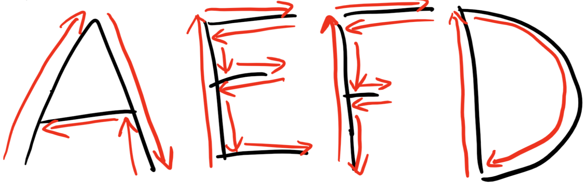

### Overview

In this lesson you'll be challenged to program your robot through a series of challenges

### Navigation Review

{:.block-based}

{:.block-based}

### There And Back Challenge

Now that we have built a library of subroutines, we can take what we have learned to perform a task. 

Let's try the "There And Back" Challenge.  See the diagram below and see if you can make your robot go to the cone and come back.

#### Some things to keep in mind during this challenge:

- You will need to adjust the delay delay on the forward subroutine to determine how long your car goes forward before it turns.
- The turns will likely need to be two separate 90 degree turns. 

### Box Challenge

{:.block-based}

 Find a box and have your robot travel around it.

#### Some things to keep in mind during this challenge:

- Like the previous challenge the appropriate delays for forward and turn will take experimentation to find.
- There are multiple ways to complete this challenge. For example, you can closely follow the outside of the box and make sharp turns, or you can create a large arcing circle around the box that doesn’t come remotely close to it.

### Alternative Surface Challenge

Challenge your Barnabas Racer to travel on a path that crosses different types of surfaces.  

{:.block-based}

### Letters Challenge

Let's take it up a notch.  See if you can program your car to travel along the ground to create the following letters below.   You could even try attaching a pen to your robot and see if it can draw the letters!

- Draw the letters A, E, F and D on a piece of paper and see if your car can drive along it.  
- See the red arrows for the path that your car should travel.

#### Some things to keep in mind during this challenge:

- How would you make your car move in an arc to draw the "D"? Hint: It has something to do with adjusting the motor speeds.

### Choose Your Own Adventure

Challenge yourself to design your own course and program your Barnabas Racer to get through it!

{:.block-based}

{:.block-based}

