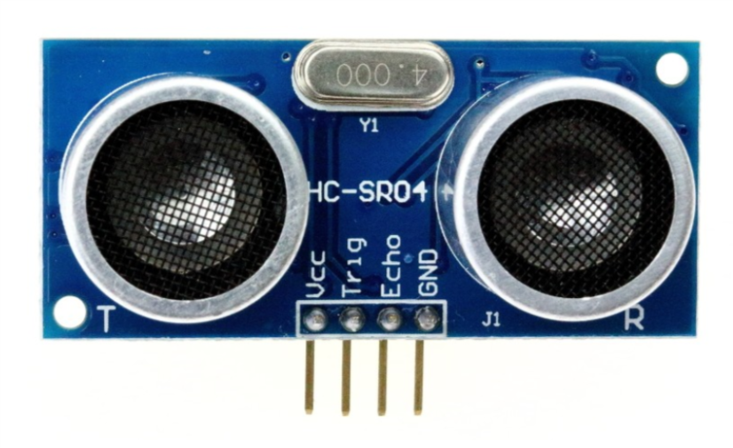
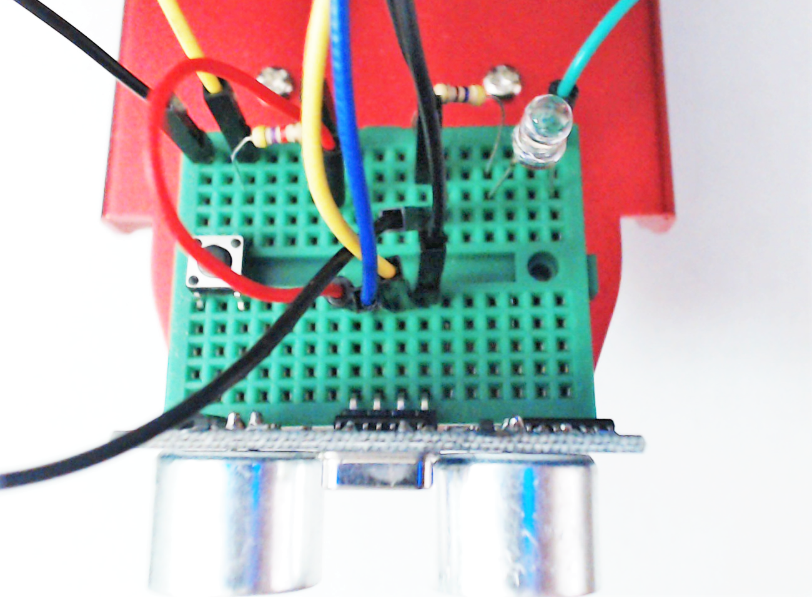
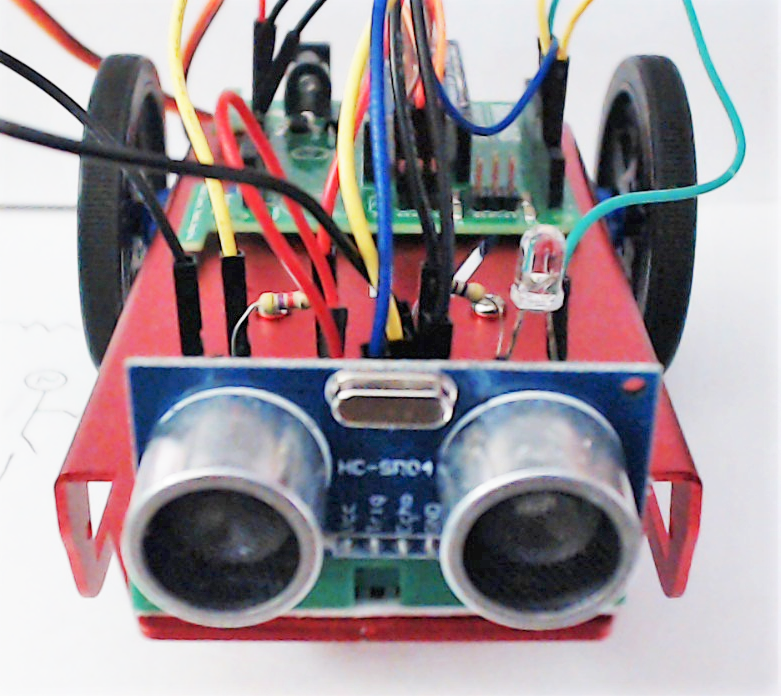
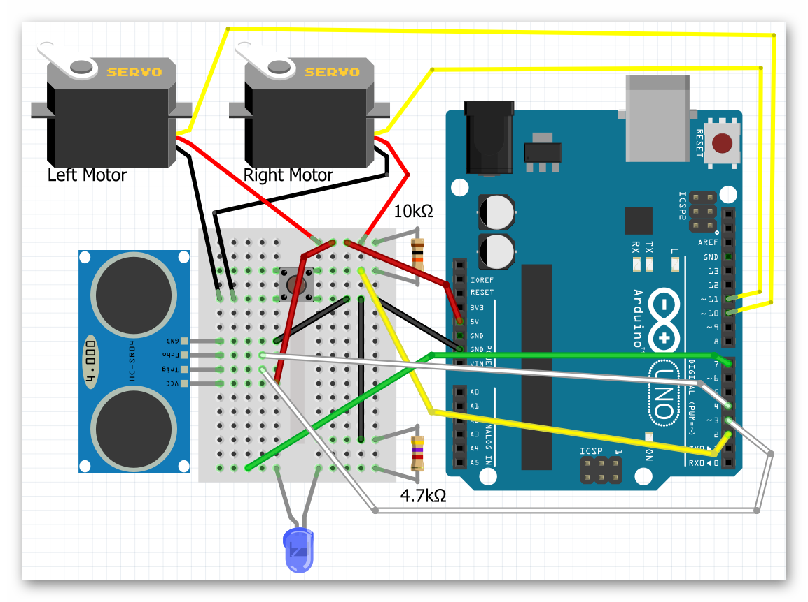
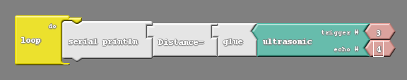
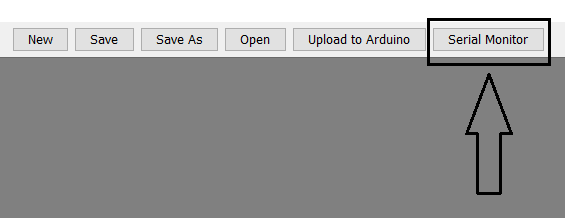
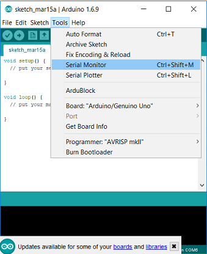
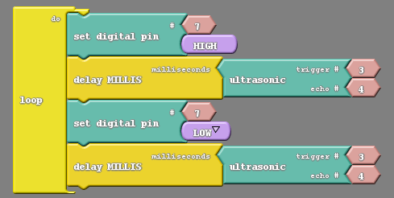

### Overview

In this section you will be learning how to add an ultrasonic sensor to your Barnabas Racer, which will allow it to see objects in front of it!

<div markdown="1">

### Full Tutorial Video



</div>{:.text-based}

### The Ultrasonic Sensor



Our ultrasonic sensor is going to give our robot the ability to sense the world around it.  It almost looks like it's staring at you, right? On the front side there are two large speaker-like objects.  On its backside it has a lot of parts (resistors, capacitors, ICs).  The only thing we need to worry about are those speaker-like objects and the four pins sticking out from the bottom of the board.

Those four pins are labeled **Vcc**, **Trig**, **Echo** and **GND**. The pin labeled GND, unsurprisingly must be connected to the GND pin on our Barnabas Noggin board.  The Vcc pin is the power pin of the sensor, so it will be connected to 5V of the Noggin.

That leaves only the Trig and Echo pins to explain. 

The Trig pin is an output pin.  It is going to be used to send sound signals out from the sensor.  This pin will be connected to the Noggin and will be programmed as an output. 

The Echo pin is an input pin.  It will be used to listen for sounds coming back to the sensor. This pin will be connected to the Noggin and will be programmed as an input. 

### Wiring The Ultrasonic Sensor
#### Placing Your Hardware

Before wiring your sensor, place your sensor onto your breadboard (see below).

Notes: 

- Each of the four pins are on its own row (i.e. they are not connected with each other)
- Make sure that none of the four pins of the ultrasonic sensor are in the same row as any other component (resistor, LED or button)
- The speakers of the ultrasonic sensor are facing out in front of the car

##### TOP VIEW



##### FRONT VIEW


##### Ultrasonic Sensor Wiring Chart

The wiring chart below shows the connections that we need to make between the ultrasonic sensor and the Barnabas Noggin.

| Ultrasonic Sensor | Barnabas Noggin | Type of Connection |
| ----------------- | --------------- | ------------------ |
| Vcc               | 5V              | Power (+)          |
| Trig              | Pin 3           | Output             |
| Echo              | Pin 4           | Input              |
| Gnd               | Gnd             | Power (-)          |

##### Ultrasonic Sensor Wiring Diagram

Follow the wiring diagram below to make the necessary electrical connections.



{:.block-based}

### Coding the Ultrasonic Sensor

#### Science


Before we start coding, we need to first understand the science of how this sensor works.  Let's first go over how the ultrasonic sensor sends and receives signals.  The diagram on the right shows how a sensor sends an outgoing sound to an object which is reflected back to the sensor when it bounces off the same object.  The sensor does some math on the time that it takes the initial sound to come back to the sensor to find out how far away the object is.  This is how animals like bats and whales use echo location to tell how far objects are.  


#### The Math 

Now that we know the science behind echo location, let's use some math to figure out a formula to calculate distance from the sound.

We're going to use a formula that gives us distance from time and speed.

<p align="center"><b>Distance = Speed x Time </b></p>

We know that the speed of sound in air is *340 meters/second*, so if we know the time, we can then solve for distance!


You might think that our math is done, but not quite yet!  If we follow the path of the sound, it needs to travel to the object, bounce off of the object, and then travel back to the sensor. 

Therefore, the distance that the sound wave travels is actually *twice* the distance between the sensor and the object. 

For that reason the equation describing the distance read by the sensor is as follows:

<p align="center"><b>2 x Distance = 340m/s x time</b></p>

This is the equation we will use in our computer code for the sensor to behave appropriately.  If you're using block-coding, you won't need to code the formula as it is built into the block for you.  However, it's still good to know what is going on behind the scenes!

#### Printing The Distance To The Screen

Our first coding challenge is to take what the ultrasonic sensor is reading and display it on our computer screen.  

<div markdown = "1">
On Ardublock, we'll need to use the ultrasonic block.   When used, this block gives us the distance (in centimeters) between the sensor and the closest object that it sees.  We need to take the number and display it using the "serial println" block.

{:.image .block-based}

In the  communication tab you'll find blocks called "serial println" and "glue".  Combine them to make this simple program.  Notice that the pin numbers settings in the ultrasonic block match the wiring diagram that we used to wire the sensor earlier.

{:.image .block-based}

{:.block-based}

</div>{:.block-based}

<div markdown = "1">

The code below includes the subroutine ultrasonic().  Read the code and see if you find the formula that we derived in the math section of the lesson.  The distance value is returned in centimeters.

```c
int trig = 3;
int echo = 4;
int led = 7;

// float so that we can handle decimals
float speedOfSoundMetersPerSec = 343;
float duration_microSeconds;
float duration_seconds;
float distance_meters;
float distance_cm;

void setup() {
  // put your setup code here, to run once:
  pinMode(trig,OUTPUT);
  pinMode(echo,INPUT);
}

float ultrasonic() {
  // reset the ultrasonic sensor
 digitalWrite(trig,LOW);
 delayMicroseconds(5);

 // send a 10 microsecond pulse out through the trigger
 digitalWrite(trig, HIGH);
 delayMicroseconds(10);
 digitalWrite(trig, LOW);

 // wait for the response and store it in duration.  It will return in microseconds.
 duration_microSeconds = pulseIn(echo,HIGH);

 // convert duration to seconds
 duration_seconds = duration_microSeconds / 1000000;

 // get distance traveled in meters.  distance = (speed * time)/2
 distance_meters = (speedOfSoundMetersPerSec * duration_seconds)/2;

 // convert to cm
 distance_cm = distance_meters*100;
 return distance_cm;
}

void loop() {
 // do nothing for now
}
```

Only two lines of code need to be added to print the distance out to the computer. First, in the void setup we need to turn on the serial monitor. Inside the setup function, insert the line:

`Serial.begin(9600);`

Next, in the loop add

`Serial.println(ultrasonic());`

The final code:

```c
int trig = 3;
int echo = 4;
int led = 7;

// float so that we can handle decimals
float speedOfSoundMetersPerSec = 343;
float duration_microSeconds;
float duration_seconds;
float distance_meters;
float distance_cm;

void setup() {
  // put your setup code here, to run once:
  pinMode(trig,OUTPUT);
  pinMode(echo,INPUT);
  Serial.begin(9600);
}

float ultrasonic() {
  // reset the ultrasonic sensor
 digitalWrite(trig,LOW);
 delayMicroseconds(5);

 // send a 10 microsecond pulse out through the trigger
 digitalWrite(trig, HIGH);
 delayMicroseconds(10);
 digitalWrite(trig, LOW);

 // wait for the response and store it in duration.  It will return in microseconds.
 duration_microSeconds = pulseIn(echo,HIGH);

 // convert duration to seconds
 duration_seconds = duration_microSeconds / 1000000;

 // get distance traveled in meters.  distance = (speed * time)/2
 distance_meters = (speedOfSoundMetersPerSec * duration_seconds)/2;

 // convert to cm
 distance_cm = distance_meters*100;
 return distance_cm;
}

void loop() {
 Serial.println(ultrasonic());
}
```

</div>{:.text-based}

Now you can upload this code and open the serial monitor. 

After uploading this code, go to the software window and click on the button that says `Serial Monitor`.  After pressing this button, a window should pop up that begins to display numbers.  Note that the Noggin needs to be connected to the computer for these numbers to appear.  

You should see numbers flying by as the robot continuously writes the distance to the serial monitor. Including a small delay after the Serial.print command would be helpful in slowing down the rate that numbers appear. The numbers shown should change as you put your hand in front of the sensor, or point the sensor at various objects.

{:.image .block-based}

{:.image .text-based}



#### Combine The LED And Ultrasonic Sensor

How about we use the LED in tandem with the ultrasonic sensor to notify us of the distance? The simplest code that allows us to do that is the following:

{:.image .block-based}

```c
int trig = 3;
int echo = 4;
int led = 7;

// float so that we can handle decimals
float speedOfSoundMetersPerSec = 343;
float duration_microSeconds;
float duration_seconds;
float distance_meters;
float distance_cm;

void setup() {
  // put your setup code here, to run once:
  pinMode(trig,OUTPUT);
  pinMode(echo,INPUT);
  pinMode(led,OUTPUT);
}

float ultrasonic() {
  // reset the ultrasonic sensor
 digitalWrite(trig,LOW);
 delayMicroseconds(5);

 // send a 10 microsecond pulse out through the trigger
 digitalWrite(trig, HIGH);
 delayMicroseconds(10);
 digitalWrite(trig, LOW);

 // wait for the response and store it in duration.  It will return in microseconds.
 duration_microSeconds = pulseIn(echo,HIGH);

 // convert duration to seconds
 duration_seconds = duration_microSeconds / 1000000;

 // get distance traveled in meters.  distance = (speed * time)/2
 distance_meters = (speedOfSoundMetersPerSec * duration_seconds)/2;

 // convert to cm
 distance_cm = distance_meters*100;

 return distance_cm;
}

void loop() {
 digitalWrite(led,HIGH);
 delay(ultrasonic());
 digitalWrite(led,LOW);
 delay(ultrasonic());
}
```
{:.text-based}

The above code blinks a light on and off with the added wrinkle of having the distance measured by the sensor control the length of the blink. 

{:.block-based}

Upload the code to test it.  After uploading this code, you can power the robot using the 9V battery and experiment with the bot. You should see the light blink faster or slower depending on the distance between the robot and the nearest object.



#### Challenges
##### Turn On When Close

Create code to turn the light on when an object is close and off when an object is far off.

<div markdown = "1">

```c
int trig = 3;
int echo = 4;
int led = 7;

// float so that we can handle decimals
float speedOfSoundMetersPerSec = 343;
float duration_microSeconds;
float duration_seconds;
float distance_meters;
float distance_cm;

void setup() {
  // put your setup code here, to run once:

  pinMode(trig,OUTPUT);
  pinMode(echo,INPUT);
  pinMode(led,OUTPUT);

  Serial.begin(9600);
}

float ultrasonic() {
  // reset the ultrasonic sensor
 digitalWrite(trig,LOW);
 delayMicroseconds(5);

 // send a 10 microsecond pulse out through the trigger
 digitalWrite(trig, HIGH);
 delayMicroseconds(10);
 digitalWrite(trig, LOW);

 // wait for the response and store it in duration.  It will return in microseconds.
 duration_microSeconds = pulseIn(echo,HIGH);

 // convert duration to seconds
 duration_seconds = duration_microSeconds / 1000000;

 // get distance traveled in meters.  distance = (speed * time)/2
 distance_meters = (speedOfSoundMetersPerSec * duration_seconds)/2;

 // convert to cm
 distance_cm = distance_meters*100;

 return distance_cm;
}

void loop() {
 Serial.println(ultrasonic());

 if (ultrasonic() < 5) {
  //do something
  digitalWrite(led,HIGH);
 }
 else {
  //do something else
  digitalWrite(led,LOW);
 }

}
```
</div>{:.text-based}

##### Blinking With Intervals

Create code to blink the light at specific time intervals for specific distance intervals. For example, make the LED blink at 80ms intervals if the distance is less than 20cm, 160ms intervals if the distance is between 20cm and 40cm, and so on.  

<div markdown = "1">

Hint: To do this you will need to make use of **if** and **and**.  The **and** block allows you to have two conditions rather than just one, and asks if both are true.

{:.image .block-based}

{:.image .block-based}

{:.image .block-based}

</div>{:.block-based}