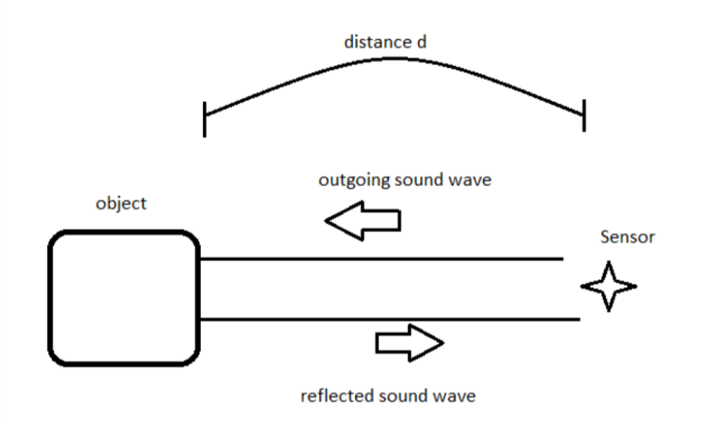
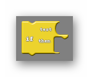
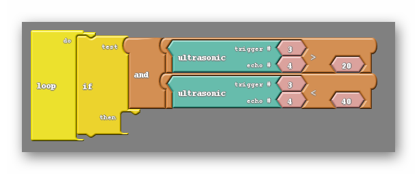

### Overview

In this section you will be learning how to add an ultrasonic sensor to your Barnabas Racer, which will allow it to see objects in front of it!

<div markdown="1">

### Tutorial Video



</div>{:.text-based}

### The Ultrasonic Sensor


Our ultrasonic sensor is going to give our robot the ability to sense the world around it.  Almost looks like it's staring at you, huh? On the front side there are two large speaker-like objects.  On its backside it has a lot of parts (resistors, capacitors, ICs). Fortunately we don't need to go into detail about those parts to operate this sensor. The only thing we need to worry about are those speaker-like objects and the four pins sticking out from the bottom of the board.

Those four pins are labeled **Vcc**, **Trig**, **Echo** and **GND**. The pin labeled GND, unsurprisingly must be connected to the GND pin on our Barnabas Noggin board.  The Vcc pin is the power pin of the sensor, meaning that it will be connected to 5V of the Noggin.

That leaves only the Trig and Echo pins to explain. 

The Trig pin is an output pin.  It is going to be used to send sound signals out from the sensor.  This pin will be connected to the Noggin and will be programmed as an output. 

The Echo pin is an input pin.  It will be used to listen for sounds coming back to the sensor. This pin will be connected to the Noggin and will be programmed as an input. 

### Wiring The Ultrasonic Sensor
{:.block-based}

#### Placing Your Hardware

Before wiring your sensor, you'll want to place your sensor onto your breadboard.  See the picture below.  Notice that the pins are aligned in a way that they are each on different rows.  This is important because each pin needs to go to a different signal.  You also want to make sure that your sensor is facing outward on the front.  If you need to reposition your breadboard to do so, go ahead and do that.

##### TOP VIEW


##### FRONT VIEW


##### Ultrasonic Sensor Wiring Diagram

Go ahead and wire your ultrasonic sensor based on the wiring diagram below. 


### Coding the Ultrasonic Sensor

#### The Science

Before we start coding, we need to first understand the physics of how this sensor works.  Let's first go over how the sonar sensor sends and receives signals. On the right is a diagram of how our sonar system works.



We will be utilizing a very handy bit of physics knowledge in order to figure out how this works - the speed of sound.


The speed of sound in air is always about the same, 340 meters/second. For those of you who are mathematically inclined, the distance something has travelled is equal to the speed it is travelling multiplied by the time it has been travelling.

<p align="center">Distance = Speed x Time </p>

Because we are fully aware of the speed of the sound wave we are creating we can alter that equation; Distance = 340m/s x time. From that equation we know that the only way the distance of the object changes is if the time is has been travelling changes.  
In addition the sound wave needs to travel to the object, bounce off of the object, then travel back to the sensor. So the distance that the sound wave travels is actually twice the distance between the sensor and the object. For that reason the equation describing the distance read by the sensor is as follows:

<p align="center">2 x Distance = 340m/s x time</p>

This is the equation we will use in our computer code for the sensor to behave appropriately. Note: If you are using Ardublock the math is inside the ultrasonic block already.

#### Reading the Distance

Our first coding challenge is to take what the ultrasonic sensor is reading and display it on our computer screen.  

<div markdown = "1">

{:.block-based}

On Ardublock, we'll need to use the ultrasonic block.   When used, this block gives us the distance (in centimeters) between the sensor and the closest object that it sees.  We need to take the number and display it using the serial println function.

{:.image .block-based}

In the  communication tab you'll find a block called serial println and glue.  Combine them to make this simple program.  Notice that pin numbers settings in the ultrasonic block match the wiring diagram that we used to wire the sensor earlier.

{:.image .block-based}

</div>{:.block-based}


<div markdown = "1">

The code below includes the subroutine ultrasonic().  Read the code and see if you can find where the speed of sound is used to calculate the distance in centimeters.

```c
int trig = 3;
int echo = 4;
int led = 7;

// float so that we can handle decimals
float speedOfSoundMetersPerSec = 343;
float duration_microSeconds;
float duration_seconds;
float distance_meters;
float distance_cm;

void setup() {
  // put your setup code here, to run once:
  pinMode(trig,OUTPUT);
  pinMode(echo,INPUT);
}

float ultrasonic() {
  // reset the ultrasonic sensor
 digitalWrite(trig,LOW);
 delayMicroseconds(5);

 // send a 10 microsecond pulse out through the trigger
 digitalWrite(trig, HIGH);
 delayMicroseconds(10);
 digitalWrite(trig, LOW);

 // wait for the response and store it in duration.  It will return in microseconds.
 duration_microSeconds = pulseIn(echo,HIGH);

 // convert duration to seconds
 duration_seconds = duration_microSeconds / 1000000;

 // get distance traveled in meters.  distance = (speed * time)/2
 distance_meters = (speedOfSoundMetersPerSec * duration_seconds)/2;

 // convert to cm
 distance_cm = distance_meters*100;
 return distance_cm;
}

void loop() {
 // do nothing for now
}
```

Only two lines of code need to be added to print the distance out to the computer. First, in the void setup we need to ‘turn on’ the serial monitor, making sure that information can be written to it. Inside the void setup insert the line;

`Serial.begin(9600);`

Next, in the loop add

`Serial.println(ultrasonic());`

The final code:

```c
int trig = 3;
int echo = 4;
int led = 7;

// float so that we can handle decimals
float speedOfSoundMetersPerSec = 343;
float duration_microSeconds;
float duration_seconds;
float distance_meters;
float distance_cm;

void setup() {
  // put your setup code here, to run once:
  pinMode(trig,OUTPUT);
  pinMode(echo,INPUT);
  Serial.begin(9600);
}

float ultrasonic() {
  // reset the ultrasonic sensor
 digitalWrite(trig,LOW);
 delayMicroseconds(5);

 // send a 10 microsecond pulse out through the trigger
 digitalWrite(trig, HIGH);
 delayMicroseconds(10);
 digitalWrite(trig, LOW);

 // wait for the response and store it in duration.  It will return in microseconds.
 duration_microSeconds = pulseIn(echo,HIGH);

 // convert duration to seconds
 duration_seconds = duration_microSeconds / 1000000;

 // get distance traveled in meters.  distance = (speed * time)/2
 distance_meters = (speedOfSoundMetersPerSec * duration_seconds)/2;

 // convert to cm
 distance_cm = distance_meters*100;
 return distance_cm;
}

void loop() {
 Serial.println(ultrasonic());
}
```

</div>{:.text-based}

Now you can upload this code and open the serial monitor. You should see numbers flying by as the robot continuously writes the distance to the serial monitor. Perhaps including a delay block after the Serial.print command would be helpful in slowing down the rate that numbers appear. The numbers shown should change as you put your hand in front of the sensor, or point the sensor at various objects.

After uploading this code, go to the software window and click on the button that says `Serial Monitor`.  After pressing this button, a window should pop up that begins to display numbers.  Note that the Noggin needs to be connected to the computer for these numbers to appear.  

You should be able to see those numbers change as you point your robot towards different objects, or move your hand back and forth in front of it.


{:.image .block-based}

{:.image .text-based}



#### Combine The LED And Ultrasonic Sensor

{:.block-based}

There are other ways of reading the value for distance. that we can explore.  How about we use the LED in tandem with the ultrasonic sensor to notify us of the distance? The simplest code that allows us to do that is the following:

{:.image .block-based}

The above code blinks a light on and off with the added wrinkle of having the distance measured by the sensor control the length of the blink. After uploading this code, you can power the robot using the 9V battery and experiment with the bot. You should see the light blink faster or slower depending on the distance between the robot and the nearest object.



#### Challenges
##### Turn On When Close

Create code to turn the light on when an object is close and off when an object is far off.

<div markdown = "1">


```c
int trig = 3;
int echo = 4;
int led = 7;

// float so that we can handle decimals
float speedOfSoundMetersPerSec = 343;
float duration_microSeconds;
float duration_seconds;
float distance_meters;
float distance_cm;

void setup() {
  // put your setup code here, to run once:

  pinMode(trig,OUTPUT);
  pinMode(echo,INPUT);
  pinMode(led,OUTPUT);

  Serial.begin(9600);
}

float ultrasonic() {
  // reset the ultrasonic sensor
 digitalWrite(trig,LOW);
 delayMicroseconds(5);

 // send a 10 microsecond pulse out through the trigger
 digitalWrite(trig, HIGH);
 delayMicroseconds(10);
 digitalWrite(trig, LOW);

 // wait for the response and store it in duration.  It will return in microseconds.
 duration_microSeconds = pulseIn(echo,HIGH);

 // convert duration to seconds
 duration_seconds = duration_microSeconds / 1000000;

 // get distance traveled in meters.  distance = (speed * time)/2
 distance_meters = (speedOfSoundMetersPerSec * duration_seconds)/2;

 // convert to cm
 distance_cm = distance_meters*100;

 return distance_cm;
}

void loop() {
 Serial.println(ultrasonic());

 if (ultrasonic() < 5) {
  //do something
  digitalWrite(led,HIGH);
 }
 else {
  //do something else
  digitalWrite(led,LOW);
 }

}
```

</div>{:.text-based}

##### Blinking With Intervals

Create code to blink the light at specific time intervals for specific distance intervals. For example, make the LED blink at 80ms intervals if the distance is less than 20cm, 160ms intervals if the distance is between 20cm and 40cm, and so on.  

<div markdown = "1">

Hint: To do this you will need to make use of **if** and **and**.  The **and** block allows you to have two conditions rather than just one, and asks if both are true.

{:.image .block-based}

{:.image .block-based}

{:.image .block-based}

</div>{:.block-based}