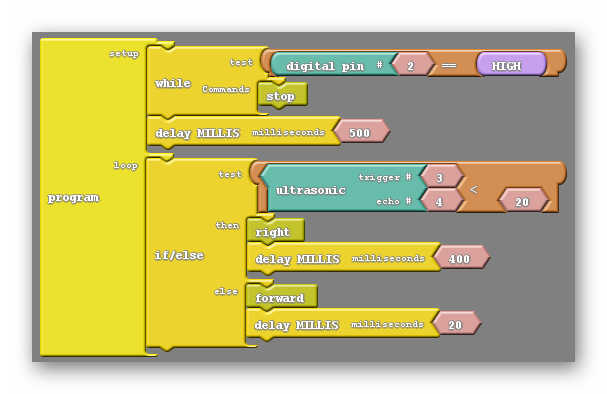

### Overview

In this section we'll combine everything to program our car to move and avoid objects

### Full Tutorial Video

{:.text-based}

{:.text-based}

### Our Previous Tools

With both the motors and the ultrasonic sensor working properly, we have all the tools we need to create an autonomous program that can avoid obstacles.  All that is left of us to do is effectively marry the motion of the robot to its ability to sense objects.  To help us create the avoidance code we are going to use a few of the tools we have constructed thus far. 

### Stop Before We Crash

Let's program that car to stop before we hit a wall.  We'll use what we have learned about the ultrasonic sensor to program our robot to do this.  

{:.block-based}

### Turn Before We Crash

Let's program our car to not only stop before we hit a wall, but also turn to avoid it!

Let's program the robot to turn right if it sees an object less than 20 cm away, else move forward.   See the code below.

{:.image .block-based}

Note: The 400 ms delay after the right subroutine determines how long it will turn right for before moving on to the next section of code.  

{:.block-based}

### Adding Delays 

Let's add some delays into our code to increase our performance.

1. Adding a 500 ms delay after the while loop will give us time to remove our hand from the robot after pressing it.  This is to help prevent us from accidently bumping the robot off its course.
2. Adding a 20 ms delay after the forward subroutine adds a little time for the code to rest before it loops back to the ultrasonic part of the code.  Without the rest, the ultrasonic sensor may malfunction from time to time by getting overloaded by requests.

{:.image .block-based}

### Improving Our Ultrasonic Sensor's Performance 

As your robot's battery gets drained, it's a known issue that the ultrasonic sensor will begin responding with 0 even when there is something in front of it.  We can actually take care of this through code by ignoring 0 values.  The AND block helps us do this.

{:.image .block-based}

Note: In the code above, the robot will turn right ONLY if the ultrasonic sensor sees a value that is less than 20 AND it's not 0.  

{:.block-based}

#### Bonus Activity (Turn Randomly)

{:.block-based}

{:.text-based}

