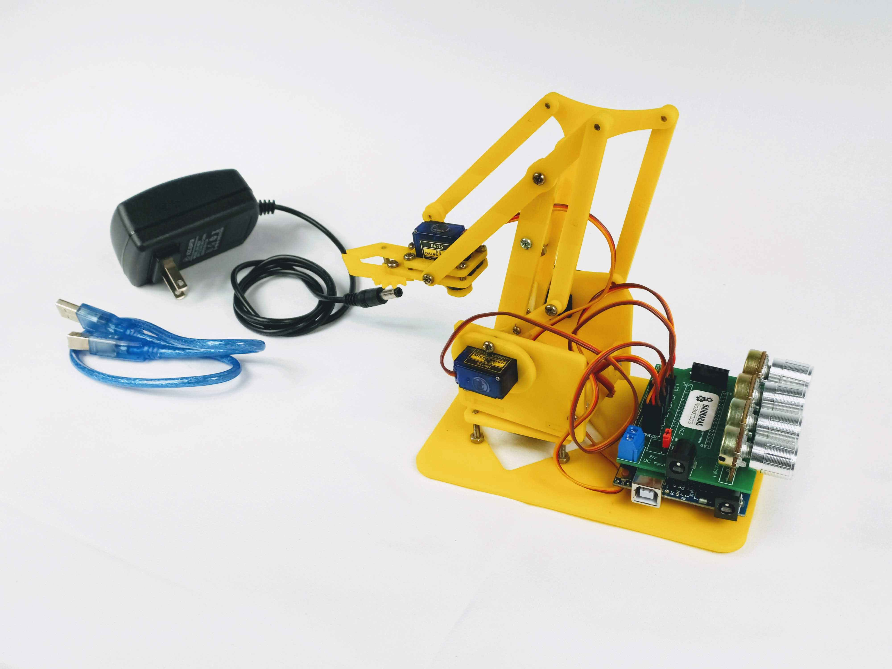

### Project Overview

In this project you will build and code a robot arm!

### Materials

Need materials?  [Purchase the Barnabas Robot Arm at our e-store](https://shop.barnabasrobotics.com/collections/classroom-robotics-kits/products/barnabas-arduino-compatible-robot-arm-kit-with-joystick-control-ages-11).  

Classroom sets available.  Contact us at info@barnabasrobotics.com to inquire. 

### Demo Video



### Lesson Overview

In this lesson we will assemble the mechanical parts of our robot arm

### Arm Assembly (Acrylic Model)

#### [Follow PDF guide](https://www.barnabasrobotics.com/wp-content/uploads/2021/02/Barnabas-Robot-Arm-Assembly-Instructions.pdf)

### Arm Assembly (Wood Model)

#### 1. Assemble Base

#### 2. Build Base Motor Assembly

#### 3. Attach Base Motor To Base

#### 4. Attach Base Motor Plate

#### 5. Build Left (Lift) Motor Assembly

#### 6. Build Right (Extend) Motor Assembly

#### 7. Build Main Arm Support

#### 8. Assemble Main Body

#### 9. Attach Main Arm

#### 10. Attach Secondary Arm

Attach secondary arm using:

- 5 x M3x6 Screws
- 2 x M3x10 Screws
- 1 x Nylon Lock Nut
- 7 x Wood Pieces

Do not overtighten.  Make sure that the parts can freely move very easily.  If they are too tight, the motors will not be able to move the arm.

|                            Side 1                            |                            Side 2                            |
| :----------------------------------------------------------: | :----------------------------------------------------------: |
|  |  |

Use the supplied wrench to tighten the lock nut.  Do not overtighten.

#### 11. Build Claw Motor Assembly

Build claw motor assembly using:

- 1 x Servo Motor
- 4 x Wood Pieces
- 4 x M3x10 Screws

|                            Side 1                            |                            Side 2                            |
| :----------------------------------------------------------: | :----------------------------------------------------------: |
|  |  |

#### 12. Attach Pinchers

Build left pincher assembly using:

- 1 x M3x12 Screw
- 3 x Wood Pieces

This pincher will be driven by the claw drive gear.

Attach left pincher using:

- 1 x M3x12 Screw
- 1 x Wood piece

You'll need to be careful to slide the wood piece in between the left pincher assembly like a sandwich and then align the holes so that the screw can go through all of the pieces.

|                           Top View                           |                         Bottom View                          |
| :----------------------------------------------------------: | :----------------------------------------------------------: |
|  |  |

Attach right pincher using:

- 1 x M3x10 Screw
- 1 x Wood Piece

When inserting the right pincher, align the gears so that the claw can open and close all the way.  

Don't tighten the screw all the way.  Be careful to make sure that the screw does not protrude past the wood surface (see below in the red circle)  If it does, the claw will get stuck when the drive motor tries to move it.

|                           Top View                           |              Make sure screw does not protrude!              |
| :----------------------------------------------------------: | :----------------------------------------------------------: |
|  |  |

#### 13. Build Claw Drive Gear Assembly

Assemble claw drive gear using:

- 2 x M3x6 Screws
- 1 x Servo Horn
- 1 x Servo Screw
- 2 x Wood Pieces

|                           Top View                           |                         Bottom View                          |
| :----------------------------------------------------------: | :----------------------------------------------------------: |
|  |  |

#### 14. Attach Claw Drive Gear Assembly

Attach claw drive gear to servo using:

- 1 x Servo Screw

Note that the servo motor can only move 180 degrees.  Make sure that the claw can open and close (see positions below) before tightening the screw.

|                       Closed Alignment                       |                        Open Alignment                        |
| :----------------------------------------------------------: | :----------------------------------------------------------: |
|  |  |

#### 15. Attach Claw Assembly

Attach claw to the arm using:

- 1 x M3x6 Screw (top)
- 2 x M3x12 Screws (sides)

Be sure to use wood washers on the sides.  Do no overtighten.

|                          Top Screw                           |                       Side Screws (2x)                       |
| :----------------------------------------------------------: | :----------------------------------------------------------: |
|  |  |

