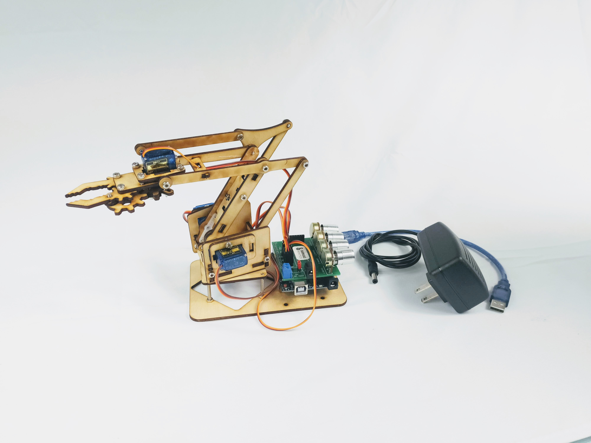
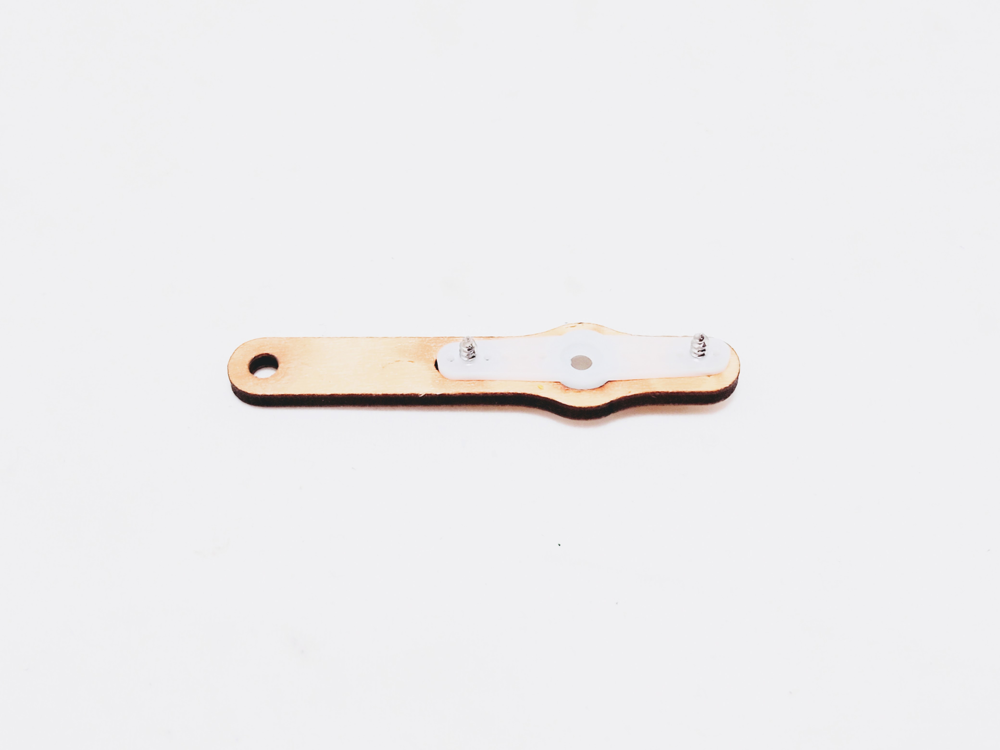
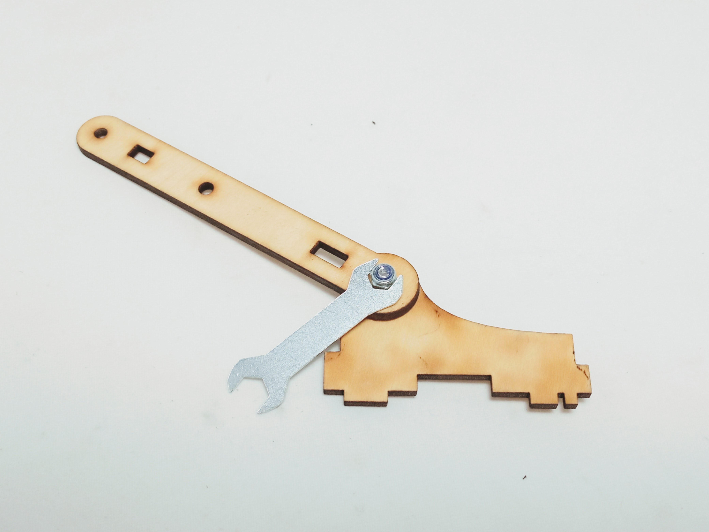
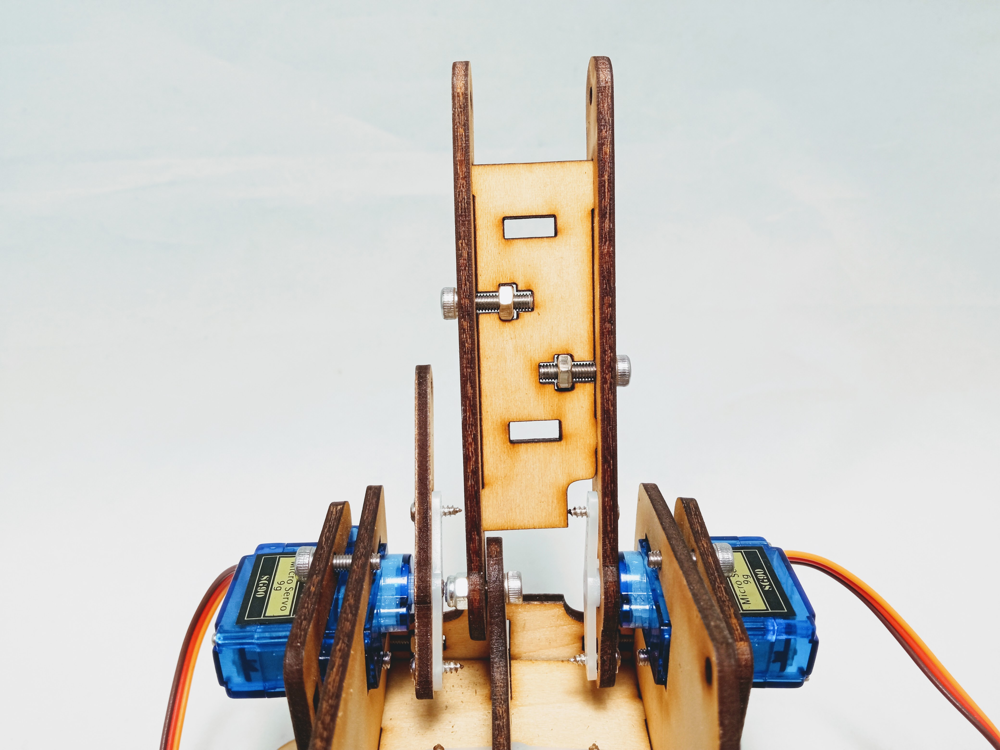

### Project Overview

In this project you will build and code a robot arm!

|                       Acrylic Version                        |                         Wood Version                         |
| :----------------------------------------------------------: | :----------------------------------------------------------: |
|  |  |

### Materials

Need materials?  [Purchase the Barnabas Robot Arm at our e-store](https://shop.barnabasrobotics.com/collections/classroom-robotics-kits/products/barnabas-arduino-compatible-robot-arm-kit-with-joystick-control-ages-11).  

Classroom sets available.  Contact us at info@barnabasrobotics.com to inquire. 

### Demo Video



### Lesson Overview

In this lesson we will assemble the mechanical parts of our robot arm

### Arm Assembly (Acrylic Model)

#### [Follow PDF guide](https://www.barnabasrobotics.com/wp-content/uploads/2021/02/Barnabas-Robot-Arm-Assembly-Instructions.pdf)

### Arm Assembly (Wood Model)

#### 1. Build Base Motor Assembly

Assemble the base motor assembly using:

- 1 x Servo Motor
- 2 x M3x10 Screws
- 2 x Wood Pieces

|                           Top View                           |                         Bottom View                          |
| :----------------------------------------------------------: | :----------------------------------------------------------: |
|  |  |

#### 2. Assemble Platform Screws

Assemble platform screws using the following:

- 4 x M3x30 Screws
- 4 x Nuts (Regular)

Notice that nuts are not tightened all the way.  We will tighten them in the next step when we attach the base motor assembly.

#### 3. Attach Base Motor To Platform

Align the base motor assembly to the platform screws so that they are perfectly matched.  

IMPORTANT: if you try to do this step without aligning the screws, you may damage the base motor assembly.  You may need to rotate the base motor platform several times until you get the right orientation.  When aligned correctly, ALL screws are perfectly straight.

Once aligned, screw the screws into the base motor platform and tighten the nuts.  The screw will self-tap into the base motor assembly wood.

|                          Side View                           |                           Top View                           |
| :----------------------------------------------------------: | :----------------------------------------------------------: |
|  |  |

#### 4. Build Main Body Bottom Plate

Assemble main body bottom plate using:

- 1 x Servo Horn
- 2 x Servo Screws
- 1 x Wood Piece

|                           Top View                           |                         Bottom View                          |
| :----------------------------------------------------------: | :----------------------------------------------------------: |
|  |  |

#### 5. Build Left (Lift) Motor Assembly

Assemble left (lift) motor mount using:

- 1 x Servo Motor
- 2 x M3x10 Screws
- 2 x Wood Pieces

|                           Top View                           |                         Bottom View                          |
| :----------------------------------------------------------: | :----------------------------------------------------------: |
|  |  |

Assemble small servo arm using:

- 2 x Servo Screws
- 1 x Servo Horn
- 1 x Wood Piece

|                           Top View                           |                         Bottom View                          |
| :----------------------------------------------------------: | :----------------------------------------------------------: |
|  |  |

Attach small servo arm using:

- 1 x Servo Screw

Note that the servo motor can only move 180 degrees.  Make sure that the arm can turn fully between the two positions shown below before fastening the screw.

|                          Position 1                          |                          Position 2                          |
| :----------------------------------------------------------: | :----------------------------------------------------------: |
|  |  |

#### 6. Build Right (Extend) Motor Assembly

Assemble right (extend) motor mount using:

- 1 x Servo Motor
- 2 x M3x10 Screws
- 2 x Wood Pieces

|                           Top View                           |                         Bottom View                          |
| :----------------------------------------------------------: | :----------------------------------------------------------: |
|  |  |

Assemble large servo arm using:

- 2 x Servo Screws
- 1 x Servo Horn
- 1 x Wood Piece

|                           Top View                           |                         Bottom View                          |
| :----------------------------------------------------------: | :----------------------------------------------------------: |
|  |  |

Attach large servo arm using:

- 1 x Servo Screw

Note that the servo motor can only move 180 degrees.  Make sure that the arm can turn fully between the two positions shown below before fastening the screw.

|                          Position 1                          |                          Position 2                          |
| :----------------------------------------------------------: | :----------------------------------------------------------: |
|  |  |

#### 7. Build Main Arm Support

Assemble main arm support using:

- 1 x M3x10 Screw
- 1 x M3 Nut (Nylon Lock)
- 2 x Wood Pieces

Use supplied wrench to hold the lock nut while you tighten the screw.  Do not overtighten.  Make sure that the joint can move easily.

|                           Top View                           |                         Bottom View                          |
| :----------------------------------------------------------: | :----------------------------------------------------------: |
|  |  |

#### 8. Assemble Main Body

Assemble main body using:

- Left (Lift) Motor Assembly
- Right (Extend) Motor Assembly
- Main Body Bottom Plate
- Main Arm Support
- 2 x Wood Pieces (Joiners)
- 4 x M3x12 Screws
- 4 x M3 Nuts (Regular)

Use the two joiners to join all the assemblies together.  

To do this, put all the sides together like a 3-D jigsaw puzzle.  After that, you can fasten the joints by sliding nuts into the appropriate slots and screwing in the M3x12 screws.  As the screws tighten, they will fasten the joints.  

Note: It may be easier to join two pieces together at a time rather than all of them at the same time.

|                          Front View                          |                          Side View                           |
| :----------------------------------------------------------: | :----------------------------------------------------------: |
|  |  |

|                          Front View                          |                          Back View                           |
| :----------------------------------------------------------: | :----------------------------------------------------------: |
|  |  |

#### 9. Attach Main Body To Motor

Attach main body using to base servo motor using:

- 1 x Servo Screw

Note that the servo motor can only move 180 degrees.  Make sure that the body can turn fully between the two positions shown below before fastening the screw.

|                      Confirm Position 1                      |                      Confirm Position 2                      |
| :----------------------------------------------------------: | :----------------------------------------------------------: |
|  |  |

|                           Screw In                           |                           Finished                           |
| :----------------------------------------------------------: | :----------------------------------------------------------: |
|  |  |

#### 10. Attach Main Arm

Attach main arm using:

- 2 x M3x12 Screws
- 2 x M3 Nuts (Regular)
- 1 x Wood Piece

#### 11. Attach Secondary Arm

Attach secondary arm using:

- 5 x M3x6 Screws
- 2 x M3x10 Screws
- 1 x M3 Nut (Nylon Lock)
- 7 x Wood Pieces

Do not overtighten.  Make sure that the parts can freely move very easily.  If they are too tight, the motors will not be able to move the arm.

|                            Side 1                            |                            Side 2                            |
| :----------------------------------------------------------: | :----------------------------------------------------------: |
|  |  |

Use the supplied wrench to tighten the lock nut.  Do not overtighten.

#### 12. Build Claw Motor Assembly

Build claw motor assembly using:

- 1 x Servo Motor
- 4 x Wood Pieces
- 4 x M3x10 Screws

|                            Side 1                            |                            Side 2                            |
| :----------------------------------------------------------: | :----------------------------------------------------------: |
|  |  |

#### 13. Attach Pinchers

Build left pincher assembly using:

- 1 x M3x12 Screw
- 3 x Wood Pieces

This pincher will be driven by the claw drive gear.

Attach left pincher using:

- 1 x M3x12 Screw
- 1 x Wood piece

You'll need to be careful to slide the wood piece in between the left pincher assembly like a sandwich and then align the holes so that the screw can go through all of the pieces.

|                           Top View                           |                         Bottom View                          |
| :----------------------------------------------------------: | :----------------------------------------------------------: |
|  |  |

Attach right pincher using:

- 1 x M3x10 Screw
- 1 x Wood Piece

When inserting the right pincher, align the gears so that the claw can open and close all the way.  

Don't tighten the screw all the way.  Be careful to make sure that the screw does not protrude past the wood surface (see below in the red circle)  If it does, the claw will get stuck when the drive motor tries to move it.

|                           Top View                           |              Make sure screw does not protrude!              |
| :----------------------------------------------------------: | :----------------------------------------------------------: |
|  |  |

#### 14. Build Claw Drive Gear Assembly

Assemble claw drive gear using:

- 2 x M3x6 Screws
- 1 x Servo Horn
- 1 x Servo Screw
- 2 x Wood Pieces

|                           Top View                           |                         Bottom View                          |
| :----------------------------------------------------------: | :----------------------------------------------------------: |
|  |  |

#### 15. Attach Claw Drive Gear Assembly

Attach claw drive gear to servo using:

- 1 x Servo Screw

Note that the servo motor can only move 180 degrees.  Make sure that the claw can open and close (see positions below) before tightening the screw.

|                       Closed Alignment                       |                        Open Alignment                        |
| :----------------------------------------------------------: | :----------------------------------------------------------: |
|  |  |

#### 16. Attach Claw Assembly

Attach claw to the arm using:

- 1 x M3x6 Screw (top)
- 2 x M3x12 Screws (sides)

Be sure to use wood washers on the sides.  Do no overtighten.

|                          Top Screw                           |                       Side Screws (2x)                       |
| :----------------------------------------------------------: | :----------------------------------------------------------: |
|  |  |

