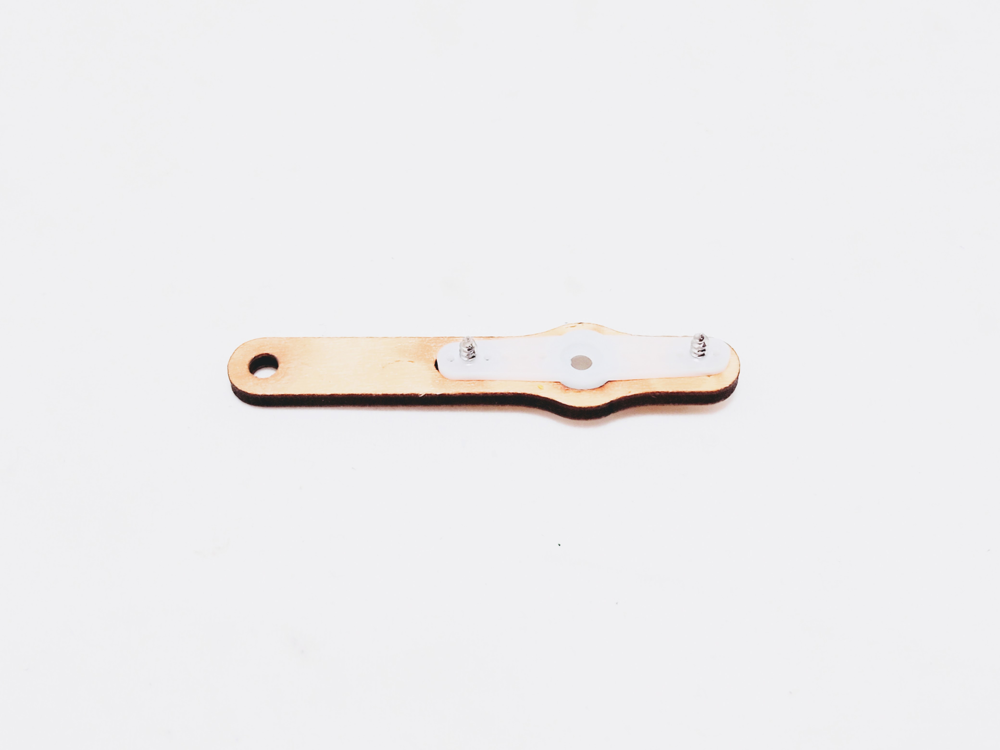
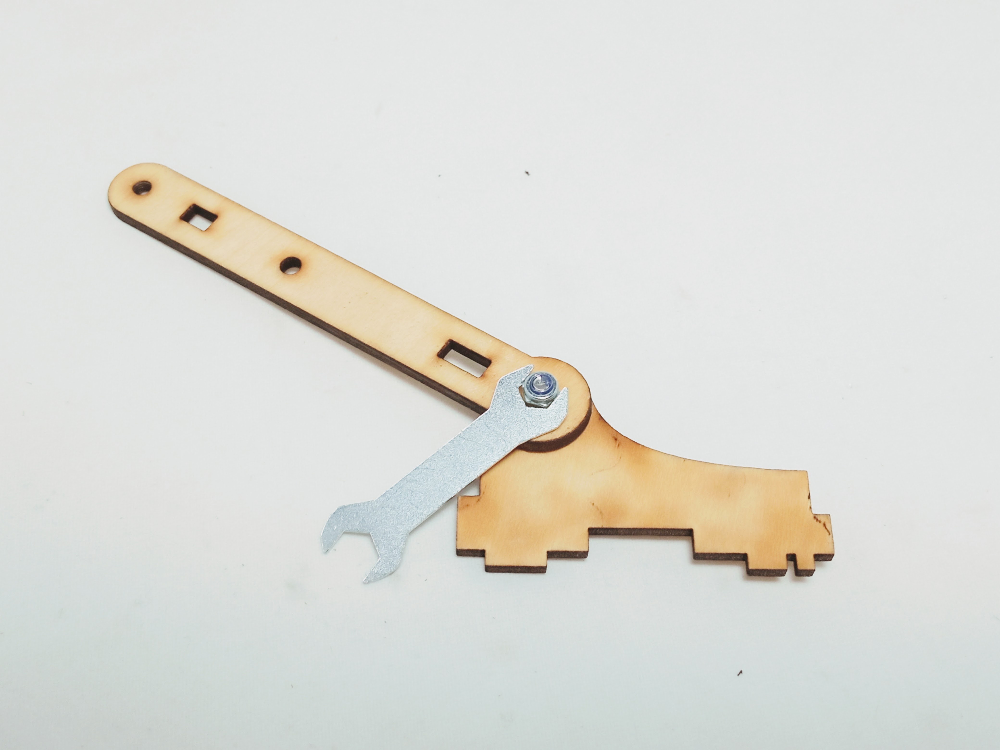

## Materials

Need materials?  [Purchase the Barnabas Robot Arm at our e-store](https://shop.barnabasrobotics.com/collections/classroom-robotics-kits/products/barnabas-arduino-compatible-robot-arm-kit-with-joystick-control-ages-11).  

Classroom sets available.  Contact us at info@barnabasrobotics.com to inquire. 

## Lesson Overview

In this lesson we will assemble the rotating base / turret

### Tutorial Video



### Instructions

### STEP 1. Build Main Body Bottom Plate

Assemble main body bottom plate using:

- 1 x Servo Horn
- 2 x Servo Screws
- 1 x Wood Piece

|                           Top View                           |                         Bottom View                          |
| :----------------------------------------------------------: | :----------------------------------------------------------: |
|  |  |

### STEP 2. Build Left (Lift) Motor Assembly

Assemble left (lift) motor mount using:

- 1 x Servo Motor
- 2 x M3x10 Screws
- 2 x Wood Pieces

|                           Top View                           |                         Bottom View                          |
| :----------------------------------------------------------: | :----------------------------------------------------------: |
|  |  |

Assemble small servo arm using:

- 2 x Servo Screws
- 1 x Servo Horn
- 1 x Wood Piece

|                           Top View                           |                         Bottom View                          |
| :----------------------------------------------------------: | :----------------------------------------------------------: |
|  |  |

Attach small servo arm using:

- 1 x Servo Screw

*IMPORTANT:* Note that the servo motor can only move 180 degrees.  Make sure that the arm can turn fully between the two positions shown below before fastening the screw.  You may need to take the servo coupling off of the servo motor shaft and reposition it a few times to get it right.

|                          Position 1                          |                          Position 2                          |
| :----------------------------------------------------------: | :----------------------------------------------------------: |
|  |  |

### STEP 3. Build Right (Extend) Motor Assembly

Assemble right (extend) motor mount using:

- 1 x Servo Motor
- 2 x M3x10 Screws
- 2 x Wood Pieces

|                           Top View                           |                         Bottom View                          |
| :----------------------------------------------------------: | :----------------------------------------------------------: |
|  |  |

Assemble large servo arm using:

- 2 x Servo Screws
- 1 x Servo Horn
- 1 x Wood Piece

|                           Top View                           |                         Bottom View                          |
| :----------------------------------------------------------: | :----------------------------------------------------------: |
|  |  |

Attach large servo arm using:

- 1 x Servo Screw

*IMPORTANT:* Note that the servo motor can only move 180 degrees.  Make sure that the arm can turn fully between the two positions shown below before fastening the screw.  You may need to take the servo coupling off of the servo motor shaft and reposition it a few times to get it right.

|                          Position 1                          |                          Position 2                          |
| :----------------------------------------------------------: | :----------------------------------------------------------: |
|  |  |

### STEP 4. Build Main Arm Support

Assemble main arm support using:

- 1 x M3x10 Screw
- 1 x M3 Nut (Nylon Lock)
- 2 x Wood Pieces

Use the supplied wrench to hold the lock nut while you tighten the screw.  

*IMPORTANT:* Do not overtighten.  Make sure that the joint can move easily.  If it is too tight, your motors will not be able to move the joint during robot arm operation.

|                           Top View                           |                         Bottom View                          |
| :----------------------------------------------------------: | :----------------------------------------------------------: |
|  |  |

### STEP 5. Assemble Main Body

Assemble main body using:

- 1 x Left (Lift) Motor Assembly
- 1 x Right (Extend) Motor Assembly
- 1 x Main Body Bottom Plate
- 1 x Main Arm Support
- 2 x Wood Pieces (Joiners)
- 4 x M3x12 Screws
- 4 x M3 Nuts (Regular)

Use the two joiners to join all the assemblies together.  

To do this, put all the sides together like a 3-D jigsaw puzzle.  After that you can fasten the joints by sliding nuts into the appropriate slots and screwing in the M3x12 screws.  As the screws tighten, they will fasten the joints.  

Note: It may be easier to join two pieces together at a time rather than all of them at the same time.

|                          Front View                          |                          Side View                           |
| :----------------------------------------------------------: | :----------------------------------------------------------: |
|  |  |

|                          Front View                          |                          Back View                           |
| :----------------------------------------------------------: | :----------------------------------------------------------: |
|  |  |

### STEP 6. Attach Main Body To Motor

Attach main body using to base servo motor using:

- 1 x Servo Screw

*IMPORTANT:* Note that the servo motor can only move 180 degrees.  Make sure that the arm can turn fully between the two positions shown below before fastening the screw.  You may need to take the servo coupling off of the servo motor shaft and reposition it a few times to get it right.

|                          Position 1                          |                          Position 2                          |
| :----------------------------------------------------------: | :----------------------------------------------------------: |
|  |  |

|                           Screw In                           |                           Finished                           |
| :----------------------------------------------------------: | :----------------------------------------------------------: |
|  |  |
