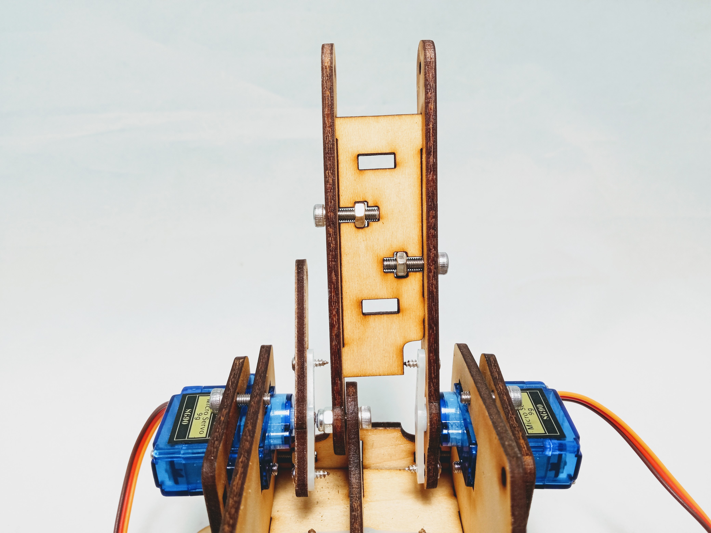

## Materials

Need materials?  [Purchase the Barnabas Robot Arm at our e-store](https://shop.barnabasrobotics.com/collections/classroom-robotics-kits/products/barnabas-arduino-compatible-robot-arm-kit-with-joystick-control-ages-11).  

Classroom sets available.  Contact us at info@barnabasrobotics.com to inquire. 

## Lesson Overview

In this lesson we will assemble the main robot arm

## Arm Assembly

### Tutorial Video



### Instructions

### STEP 1. Attach Main Arm

Attach main arm using:

- 2 x M3x12 Screws
- 2 x M3 Nuts (Regular)
- 1 x Wood Piece

### STEP 2. Attach Secondary Arm

Attach secondary arm using:

- 5 x M3x6 Screws
- 2 x M3x10 Screws
- 1 x M3 Nut (Nylon Lock)
- 7 x Wood Pieces

*IMPORTANT:* Do not overtighten.  Make sure that the joint can move easily.  If it is too tight, your motors will not be able to move the joint during robot arm operation.

|                            Side 1                            |                            Side 2                            |
| :----------------------------------------------------------: | :----------------------------------------------------------: |
|  |  |

Use the supplied wrench to tighten the lock nut.  Do not overtighten.

