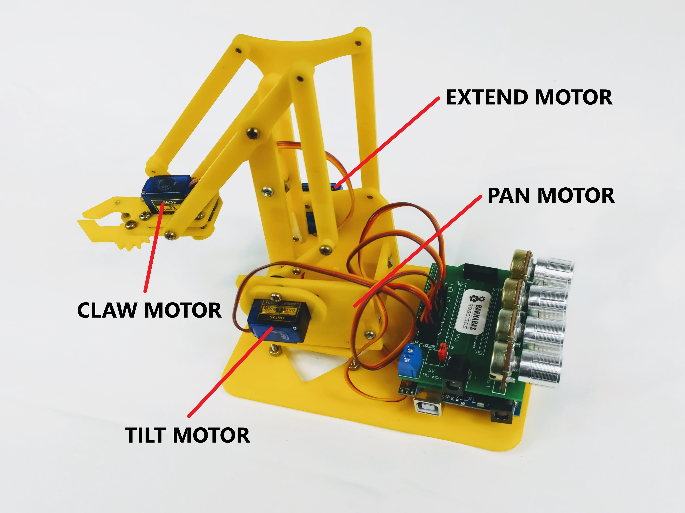
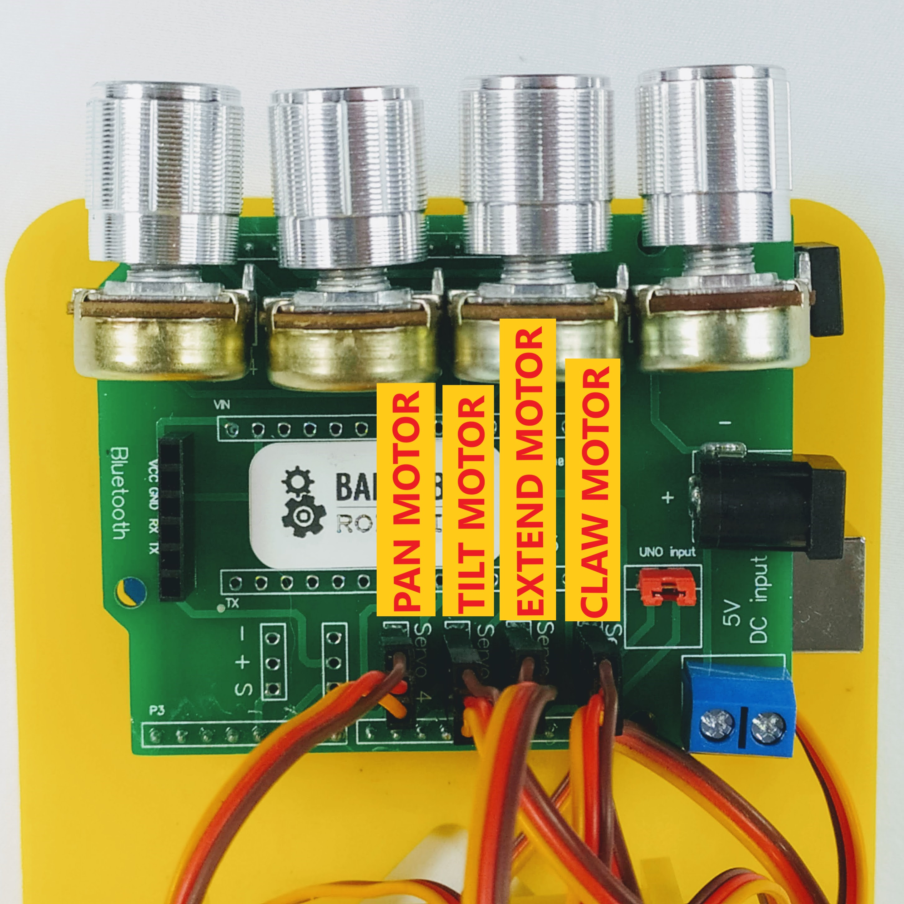

### Lesson Overview

In this lesson we'll put your hardware together and connect the motors to it.

### Introducing The Hardware

The hardware consists of two parts: 

- Arduino Uno-Compatible board - This board will be on the bottom, and will be programmed by your computer
- Daughter Board - This board fits on top of the Arduino Uno-Compatible board and allows you to add the ability to control your robot arm using knobs.  Think of it as an expansion pack.

### Mount The Arduino Uno-Compatible Board

First let's mount the Arduino compatible board to the robot arm.

Attach 4 x spacers to the bottom of the board using 4 x screws.  The screws will go through the bottom of the board.

|                          Side View                           |                           Top View                           |
| :----------------------------------------------------------: | :----------------------------------------------------------: |
|  |  |

Next, mount the Arduino-Compatible board to the spacers using 4 x screws.  The spacers should match the mounting holes on the board exactly.  If they do not, double check the holes that you used for your spacers.

### Attach The Daughter Board

Take the daughter board and stick it on top of the Arduino Uno-Compatible board.  It should look like the picture below once completed.  Make sure to match up the pins.  They should align exactly.

### Wire The Motors

Now let's wire the motors.  Be careful to match up the correct motor to the correct pins.  Also take care to make sure the wire colors match the photo below.

|                         Motor Names                          |                   Motor Cable Connections                    |
| :----------------------------------------------------------: | :----------------------------------------------------------: |
|  |  |

