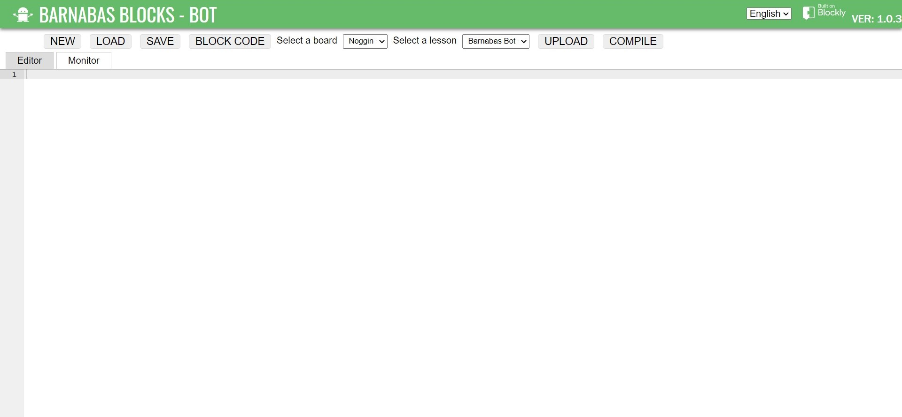
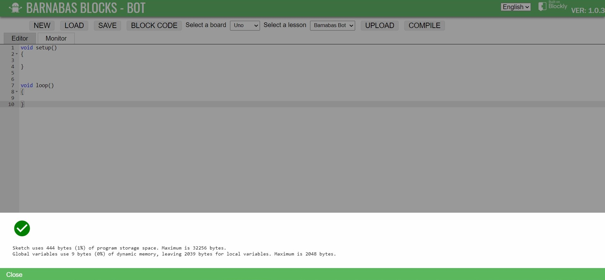

### What You'll Need

Before we get started, let’s make sure that we have all the parts.


### Overview

In this section we'll be setting up your computer for coding. 

### Barnabas Web Coding

We have an online coding platform that allows you to program your Arduino-based robot controller without installing new software.  Our online site runs on Google Chrome or Microsoft Edge browsers, so you'll need to install either one on your PC or Mac if you don't have it already.  Chromebooks come with Chrome browser built-in.  

### Browser Setup

#### 1. Open your Google Chrome browser

#### 2. Copy and paste this text into your address bar.  

Note: This step may not be necessary for newer versions of Chrome/Edge.

<p style="text-align:center"><cmd>chrome://flags/#enable-experimental-web-platform-features</cmd></p>

#### 3. Select “Enabled” on the “Experimental Web Platform features”

Note: This step may not be necessary for newer versions of Chrome/Edge.


#### 4. Click “Relaunch”

Note: This step may not be necessary for newer versions of Chrome/Edge.

#### 5. Visit The Coding Site

Your computer is now ready to access your IDE.  That was easy, right?  Type the link below (or copy and paste) into your address bar to check it out!

<p style="text-align:center"><cmd><a style="color:white" target="_blank" href="https://code.barnabasrobotics.com">https://code.barnabasrobotics.com</a></cmd></p>

#### 6. Upload Code

1. Connect your Arduino Uno-Compatible board to your computer using a USB cable.  A  light should turn on on your board.

2. Click on "TEXT CODE" to enable text-based coding

   

   

3. Set "Select a board" to "Uno"

4. Copy and paste sample initial code below

   ```c
   //- code that runs on boot up (only once)
   void setup()
   {
   
   }
   
   //- code that runs in a loop forever (after setup())
   void loop()
   {
   
   }
   ```

5. Click "Upload"

6. Select the COM port and click "Connect"

   

   

   **Troubleshooting:** If you don't see any device show up, try installing the USB driver and trying again.  After installing the USB driver, you may need to unplug and re-plug the board and also refresh the website.

   - [Windows USB Driver](https://cdn.sparkfun.com/assets/learn_tutorials/8/4/4/CH341SER.EXE)

   - [Mac USB Driver](https://github.com/adrianmihalko/ch340g-ch34g-ch34x-mac-os-x-driver/raw/master/CH34x_Install_V1.5.pkg)

   

7. If you see a green check mark message, you have successfully uploaded! If you get an error, check your connections and try again. 

   

### Stuck? Need Help?

If you need technical support, feel free to contact us at support@barnabasrobotics.com!