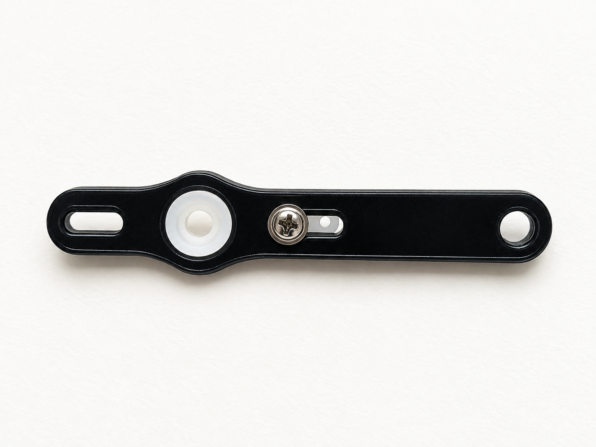
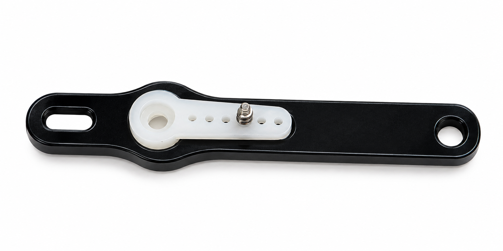

## Materials

Need materials?  [Purchase the Barnabas Robot Arm at our e-store](https://shop.barnabasrobotics.com/collections/classroom-robotics-kits/products/barnabas-arduino-compatible-robot-arm-kit-with-joystick-control-ages-11).  

Classroom sets available.  Contact us at info@barnabasrobotics.com to inquire. 

## Lesson Overview

In this lesson, you will assemble the claw drive linkage and connect it to the servo and claw gears. This linkage transfers the servo's movement to the claw mechanism, allowing the claw to open and close.

## Instructions

### Build the Claw Drive Linkage

You will need:

- 2 x M3x6 Screws
- 1 x Servo Horn
- 1 x Servo Screw
- 1 x Long Linkage Arm
- 1 x Short Linkage Arm
- 1 x Circular Washer

### STEP 1. Attach the Servo Horn to the Long Linkage Arm

Position the servo horn on the long acrylic linkage arm as shown. Insert the servo screw through the linkage arm and into the servo horn.

Use the photos below to check both the top and bottom of your finished assembly.

|  |  |
| ------------------------------------------------------------ | ------------------------------------------------------------ |

### STEP 2. Attach the Long Linkage Arm to the Servo

Press the servo horn onto the servo shaft as shown. Make sure the long linkage arm is positioned in the same direction as the photo.

### STEP 3. Attach the Short Linkage Arm

Attach the short acrylic linkage arm to the long linkage arm using an M3x6 screw.

Position the two arms as shown so the linkage can move freely toward the upper claw gear. **Notice that this screw is inserted from the top side.**

### STEP 4. Connect the Linkage to the Claw Gear

Place the circular washer between the short linkage arm and the upper claw gear. Then attach the linkage to the claw gear using an M3x6 screw.

Tighten the screw until the parts are secure, but **do not overtighten**. The linkage must be able to pivot freely as the claw opens and closes.

### STEP 5. Check the Finished Claw Mechanism

Compare your finished assembly with the photo below.

Gently move the linkage by hand. Check that the linkage pivots freely, both claw gears rotate together, and the two claw jaws open and close smoothly.

If the mechanism feels stuck or difficult to move, check that the screws are not overtightened and that the linkage arms and washer are positioned correctly.

