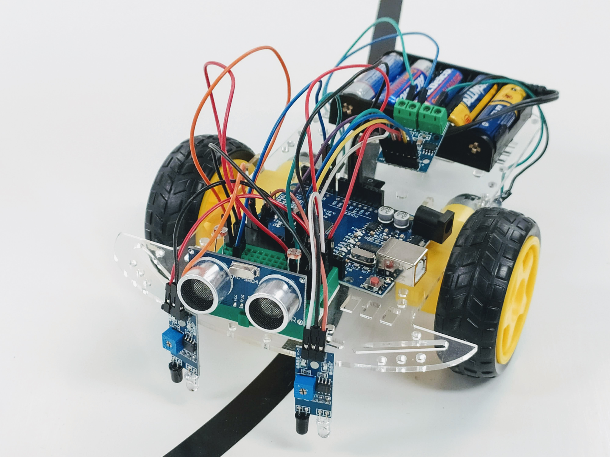
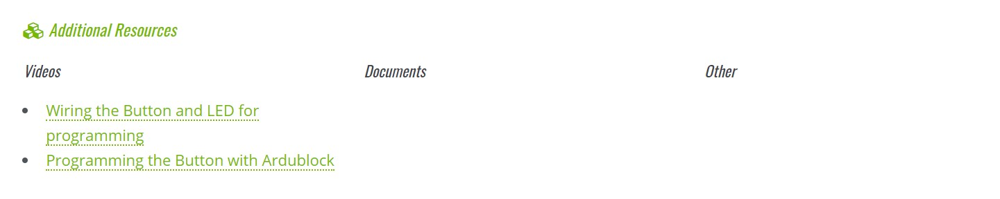

### What Is Barnabas Rover?




The Barnabas Rover is robot car that is able to think and act on its own.  Builders will cover concepts such as circuits, coding, mechanics and sensors.  Recommended ages: 11+

### Project Materials

This project is done with robot parts that are readily available.  Parts needed include:

- 1 x 2WD Chassis 
- 2 x DC Geared Motors (pre-wired and strengthened with hot glue)
- 1 x LS9110S DC Driver
- 1 x Arduino-Compatible Uno
- 1 x USB Cable
- 1 x 7.5V Battery Holder for Arduino
- 12 x Male to Female Arduino Wires
- 5 x Male to Male Arduino Wires
- 1 x Mini Breadboard
- 4 x Resistors (470 Ohm, 4.7 kOhm)
- 1 x LED
- 1 x 4-Pin Button
- 2 x IR Sensor Modules
- 2 x Light Sensors (Photoresistors)
- 1 x Ultrasonic Sensor
- 1 x 3mm Screwdriver
- 5 x Double-Stick Foam

Need materials?  [Purchase the Barnabas Rover kit at our e-store](https://shop.barnabasrobotics.com/products/barnabas-rover-kit).  Classroom sets available.  Contact us at info@barnabasrobotics.com to inquire. 

### How To Use Our Learning Portal

This learning portal portal includes written instructions as well as videos.  Here are a few things that will be helpful for you as you begin.

####  Coding Style

A big part of the Barnabas Rover project includes creating code on the computer, which will be used to control your robot.  When creating code, you will be using *text-based* coding.  

*Text-based* coding requires that every command in the code to be typed out explicitly.  The commands need to be spelled correctly and are case-sensitive (capitals and lower-case matters!).  This style is the popular method used within the software industry.  

Typically, we recommend block-based coding for ages 8-11 and text-based coding for ages 12 and up.  In our classes, we start younger students (ages 8-11) with block-based and eventually graduate them to text-based coding as they gain experience.

See below for examples of text-based code.

```c
void setup()
{
  pinMode( 2 , INPUT);
  pinMode( 7 , OUTPUT);

}

void loop()
{
  if (digitalRead(2) == HIGH) {
    digitalWrite(7,LOW);
  }
  else {
    digitalWrite(7,HIGH);
  }
}
```
### Extra Resources

Some lessons include extra resources (videos, documents, etc.).  Scroll to the bottom of the page to find them.



### Navigate Between Lessons

After you finish a lesson, scroll to the bottom of the page and click "Next Lesson" to go to the next lesson.  

You can also go back to the previous lesson by clicking on "Prev Lesson".


