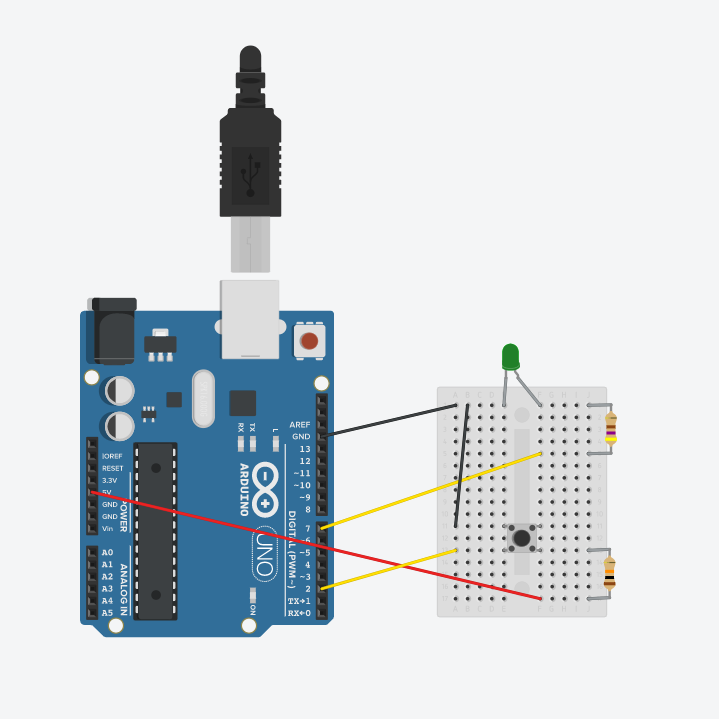
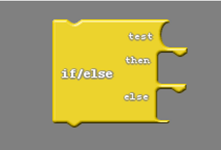

### What You'll Need

Before we get started, let's make sure that we have all the parts.

- 1 x Arduino Uno Compatible Board
- 1 x 10 kOhm Resistor
- 1 x 470 Ohm Resistor
- 1 x 4-pin Button
- 1 x USB Cable
- 1 x Computer

{:.text-based}

### Wiring the Button as Input

{:.block-based}

Now we will wire your button to pin 2 so that our Arduino Uno Compatible Board can be programmed to sense when you have pushed it. 

Build the circuit using the schematic below!


The diagram below shows a correct circuit build.



### Programming the Button

{:.block-based}

#### Computer Setup

As we begin computer coding, we'll have to first setup our software.  



#### Conditional Logic

In programming, conditional logic is used to decide a course of action depending on a condition. For example; an LED turning on if the button is pressed and turning off if the button is not pressed. Conditional logic is something we use in our everyday life without even recognizing it. If hungry, eat; if cold, wear a jacket, etc. In this section we will learn how to use conditional logic which will become the basis of how our robot makes decisions.

#### Practice

Let's write a program that turns ON the light if we press the button and turns OFF the light if we let go of the button.

{:.image .block-based}

{:.image .block-based}


```c
void setup()
{
  pinMode( 2 , INPUT);
  pinMode( 7 , OUTPUT);

}

void loop()
{
  if (digitalRead(2) == HIGH) {
    digitalWrite(7,LOW);
  }
  else {
    digitalWrite(7,HIGH);
  }
}
```
{:.text-based}

#### Challenges

Now that you know how to program a button, try the following challenges:  

1. Modify your program so that it turns OFF when you press the button and ON when you let go.

2. Modify your program so that it blinks when you press the button and just stays OFF when you let go.

   