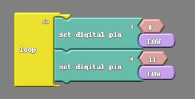
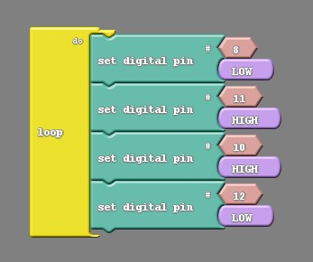
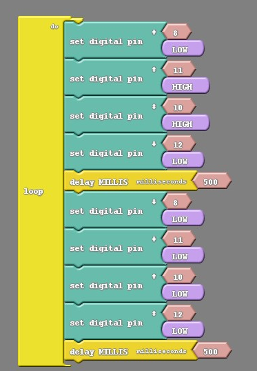

### Overview

In this section we will explore how DC motors are controlled.  Topics covered include:

- How to wire your servo motors to your Arduino Uno Compatible board
- How to program your DC motors to to turn on, stop and spin both directions
- How to change the speed of your DC motors

### DC Motor Control


### Wire Your DC Motors

### Coding Your Motors To Move

#### Move Forward

The code below should move your car forward.  

{:.image .block-based}

```c
#include <Servo.h>

Servo servo_pin_11;
Servo servo_pin_10;

void setup()
{
  servo_pin_11.attach(11);
  servo_pin_10.attach(10);
}

void loop()
{
  servo_pin_11.write( 1 );
  servo_pin_10.write( 180 );
}
```
{:.text-based}

#### Stop Your Motors
The code below will move both motors for 1 second, stop and then loop forever.

{:.image .block-based}

```c
#include <Servo.h>

Servo servo_pin_11;
Servo servo_pin_10;

void setup()
{
  servo_pin_11.attach(11);
  servo_pin_10.attach(10);
}

void loop()
{
  servo_pin_11.write( 1 );
  servo_pin_10.write( 180 );
  delay( 1000 );
  servo_pin_11.write( 90 );
  servo_pin_10.write( 90 );
  delay( 1000 );
}
```
{:.text-based}

Because there is a button attached to our robot we can create a far more convenient code. We can use the button to trigger movement of the car. In other words have the car be stopped until the button is pressed;

{:.image .block-based}


```c
#include <Servo.h>

Servo servo_pin_11;
Servo servo_pin_10;

void setup()
{
  servo_pin_11.attach(11);
  servo_pin_10.attach(10);
  While (digitalRead(2)==HIGH){
    servo_pin_11.write(90);
    servo_pin_10.write(90);
  }
  delay(500);
}

void loop()
{
  servo_pin_11.write( 1 );
  servo_pin_10.write( 180 );
}
```
{:.text-based}

### Speed Control

You can change the speed of your motor by using different angle values.  See the table below.  This will come in handy later one when you are trying fine tune your wheel movements.

