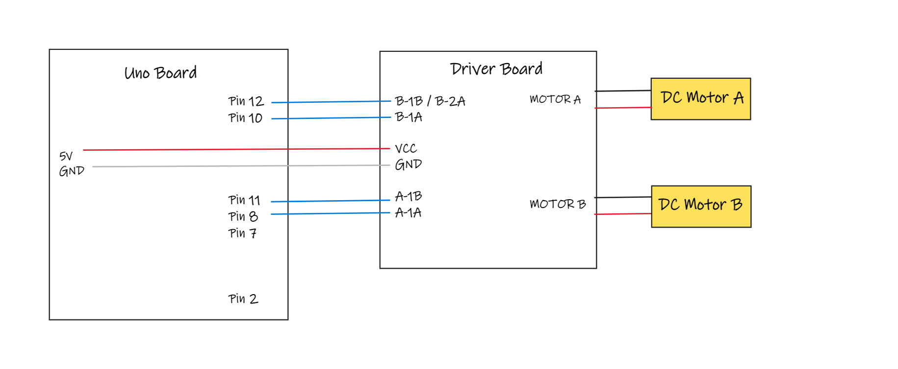
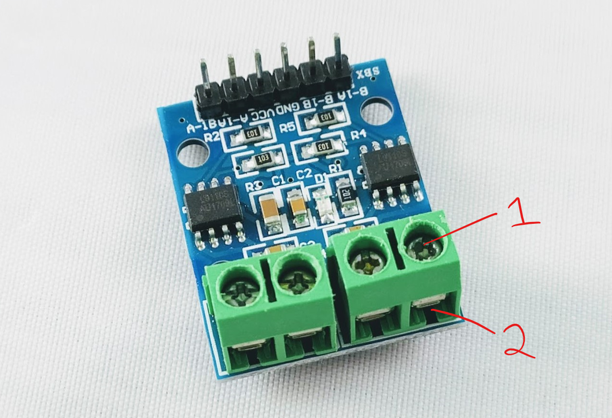
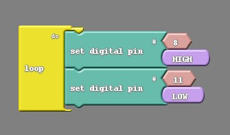
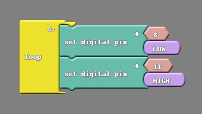
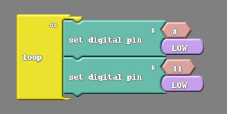
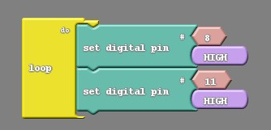
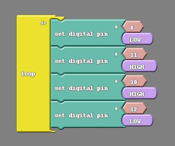
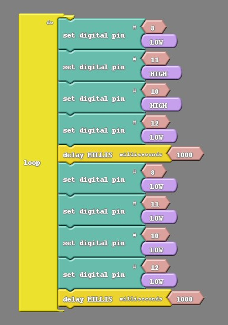

### What You'll Need

Before beginning, make sure you have these items

- 1 x Arduino Uno Compatible Board
- 1 x DC Driver Board
- 1 x Mini Screwdriver
- 6 x Pin-to-Socket Arduino Wires

### Overview

In this section we will explore how DC motors are controlled.  Topics covered include:

- How to wire your servo motors to your Arduino Uno Compatible board
- How to program your DC motors to to turn on, stop and spin both directions

<div markdown = "1">

### Video Lesson - How To Wire & Code (Text) Your DC Motors (Text-Code)



</div>{:.text-based}

### DC Motors

DC motors are commonly used in car projects because they are able to spin continuously in either direction (like a wheel).  They are pretty easy to turn on and off.  If you give it power, it turns on.  If you disconnect the power, it turns off.  The trickier part is changing the direction that the motor spins, changing its speed and giving the motor enough power so that it can actually spin.  Because of this, we use another piece of hardware that makes working with DC motors a little easier - the DC driver board.

Find your DC motors (you should have two of them).  Notice that each motor has two wires coming out of it.  These wires will be used to connect your motors to the DC driver board.

### DC Driver Board


The DC driver board can be thought of as the muscle that gives the DC motor the power to move.  Our Uno board, which is the brain, will send signals to the DC driver to move and the DC driver converts the signals into actual movement in the motor.

### Wire Your DC Motors

#### Wiring Diagram

The wiring diagram below shows the connections that we need to make between our Uno and our driver board.



#### Wire DC Motors

Let's go ahead and wire your DC Motors to your DC driver!

To begin, let's start with the green connectors on the driver board. Looking straight down onto them, you can see four screws (labeled #1).  From the side view you will find four contact ports where you can connect wires (labeled #2).  



The screws are used loosened to allow wires to be pushed in and out, and tightened to fasten wires in place.  

If the screws aren't loosened yet, go ahead and loosen all four screws so that we can stick wires into the contact ports.  Be careful not to loosen too much as you don't want to screw to come all the way out and fall out!

Now wire the DC motors!

Make sure that the pair of wires from DC Motor A is connected to the two ports labeled Motor A and the pair of wires from DC Motor B is connected to the two ports labeled Motor B.

#### Wire Control Signals

Now we need to connect the motor drive board to the Uno board.  

Find the 6 pin headers on the other side of the driver board.  They are labeled from left to right: B-1A, B-1B, GND, VCC, A-1A, A-1B. 

GND and VCC will provide the power to the driver board.  Connect VCC to 5V on the Uno and GND to GND on the Uno.

The other four pins can be separated into pairs: (A-1A, A-1B) and (B-1A, B-1B). Each of these pairs of pins are used to control one motor.  (A-1A, A-1B) control Motor A and (B-1A, B-1B) control Motor B.

**Note:** Some driver boards have the Motor B control pin labels as (B-1A, B-2A) instead of (B-1A, B-1B). 

Go ahead and make the follow connections.

| DC Driver Board | Arduino Uno Compatible Board |
| :-------------: | :--------------------------: |
|      A-1A       |            Pin 8             |
|      A-1B       |            Pin 11            |
|      B-1A       |            Pin 10            |
| B-1B  (or B-2A) |            Pin 12            |

### DC Driver Board Control

Before we begin to program, let's first examine how the Uno Board will use pins 8, 11, 10 and 12 to control the motors.  The Uno will be able to change the status of these pins between LOW and HIGH, which basically turns the power on and off on those pins.  One way to think about it is that you have 4 light switches that you can turn on and off.  If you have them all on, all off, one on and three off, etc.  All these different combinations will cause your DC motors to turn on, turn off, move backward, move forward, etc.

The table below describes what happens to Motor A as you control A-1A (Pin 8) and A-1B (Pin 11).  

<p align=center>Motor A Control Table</p>

| A-1A Signal (Pin 8) | A-1B Signal (Pin 11) | DC Motor Movement                |
| :-----------------: | :------------------: | -------------------------------- |
|         Low         |         Low          | Stop Slowly (Deceleration Stop)  |
|         Low         |         High         | Turn One Way                     |
|        High         |         Low          | Turn The Other Way               |
|        High         |         High         | Stop Right Away (Emergency Stop) |

A few notes:

- If one signal is low and the other signal high, the motor moves.  Will the motor spin forwards or backwards (clockwise or counter-clockwise)?  This will actually be determined by how you wired the DC motor to Motor A.  The key thing to note here is that if you flip the Low/High status between the two control signals, the motor will spin the opposite direction.  This will be useful to you when you are trying to figure out how to make your car go backwards and forwards.
- If both signals are high, the motor stops right away.  This is called an **emergency stop**.  You would want to do this if you're about to crash and you want to stop immediately.  The downside of this type of stop is that you cause stress to your car.  Imagine you're in a car and you press on the brake fully all of a sudden.  Your body feel some stress!  Your robot will feel this same kind of stress and it can wear down over time.
- If both signals are low, the motor stops slowly.  This is called a **deceleration stop**.  It is a lot smoother and is the preferred way to stop your motor.  Unlike the emergency stop, it provides less stress to your robot.

See below for a control table for Motor B.  Notice that everything is the same except we're looking at B-1B and B-1B signals.

<p align=center>Motor B Control Table</p>

| B-1A Signal (Pin 10) | B-1B (or B-2A) Signal (Pin 12) | DC Motor Movement                |
| :------------------: | :----------------------------: | -------------------------------- |
|         Low          |              Low               | Stop Slowly (Deceleration Stop)  |
|         Low          |              High              | Turn One Way                     |
|         High         |              Low               | Turn The Other Way               |
|         High         |              High              | Stop Right Away (Emergency Stop) |


### Move A Single Motor Both Directions

The code below moves motor A in one direction.  Try uploading this code to your Uno board and see if the motor starts spinning.



```c
void setup()
{
  pinMode(8,OUTPUT);
  pinMode(11,OUTPUT);
}

void loop()
{
  digitalWrite(8,HIGH);
  digitalWrite(11,LOW);
}
```
{:.text-based}

This code moves the same motor A in the opposite direction.  Notice we just change the high/low for both pins.  Try uploading this code.  Your motor should spin in the opposite direction




```c
void setup()
{
  pinMode(8,OUTPUT);
  pinMode(11,OUTPUT);
}

void loop()
{
  digitalWrite(8,LOW);
  digitalWrite(11,HIGH);
}
```
{:.text-based}

Now let's stop the motor.  Following the chart from the previous section, we just need to set both signals to low or both to high.  Try both to make sure that both emergency stop and deceleration stop do what they are supposed to do.






```c
void setup()
{
  pinMode(8,OUTPUT);
  pinMode(11,OUTPUT);
}

void loop()
{
  digitalWrite(8,LOW);
  digitalWrite(11,LOW);
}
```
{:.text-based}


```c
void setup()
{
  pinMode(8,OUTPUT);
  pinMode(11,OUTPUT);
}

void loop()
{
  digitalWrite(8,HIGH);
  digitalWrite(11,HIGH);
}
```
{:.text-based}

#### Challenge #1: Motor B

Now try to get Motor B to move both directions and stop by uploading similar code.  

Hint: Change pin 8 to pin 10 and change pin 11 to pin 12.

### Move Both Motors

Now that we know how to move a single motor in both directions, let's see if we can move both motors at the same time.  The code below has four blocks because need two blocks to control each motors.  Try uploading the code.




```c
void setup()
{
  pinMode(8,OUTPUT);
  pinMode(11,OUTPUT);
  pinMode(10,OUTPUT);
  pinMode(12,OUTPUT);
}

void loop()
{
  digitalWrite(8,LOW);
  digitalWrite(11,HIGH);
  digitalWrite(10,HIGH);
  digitalWrite(12,LOW);
}
```
{:.text-based}

Do both motors spin in the same direction?  Or are they opposite?  Try the challenges below.

#### Challenge #1: Same Direction

Program the motors spin in the same direction.  

Hint: To change the direction of a motor, just flip the high/low on the signal pair.  

Another Hint:  8 and 11 is the signal pair for motor A.  10 and 12 is the signal pair for motor B.

#### Challenge #2: Opposite Direction

Using what you have learned, program the motors spin in opposite directions.

### Move And Stop

Now that we know how to move the motors back and forth, let's create a simple program where the motor moves both motors for 1 second, stops both motors for 1 second and the continues in a forever loop.




```c
void setup()
{
  pinMode(8,OUTPUT);
  pinMode(11,OUTPUT);
  pinMode(10,OUTPUT);
  pinMode(12,OUTPUT);
}

void loop()
{
  digitalWrite(8,LOW);
  digitalWrite(11,HIGH);
  digitalWrite(10,HIGH);
  digitalWrite(12,LOW);
    
  delay(1000);
    
  digitalWrite(8,LOW);
  digitalWrite(11,LOW);
  digitalWrite(10,LOW);
  digitalWrite(12,LOW);
    
  delay(1000);
    
}
```
{:.text-based}

A few notes:

- Commands 1-4 command both motors to spin
- Command 5 (delay MILLIS) tells the code to wait there for 1000 milliseconds (same as 1 second) before executing any new commands
- Commands 6-9 both motors to decelerate to a stop
- Command 10 (delay MILLIS) tells the code to wait there for 1000 milliseconds (same as 1 second) before executing any new commands
- After command 10 finishes executing, the code loops to command 1 and keeps going

#### Practice #1: Reduce The Delay

Modify the code so that it only waits 1/2 a second after stopping and going.  See the answer below.  Note that 500 milliseconds is 1 second.


```c
void setup()
{
  pinMode(8,OUTPUT);
  pinMode(11,OUTPUT);
  pinMode(10,OUTPUT);
  pinMode(12,OUTPUT);
}

void loop()
{
  digitalWrite(8,LOW);
  digitalWrite(11,HIGH);
  digitalWrite(10,HIGH);
  digitalWrite(12,LOW);
    
  delay(500);
    
  digitalWrite(8,LOW);
  digitalWrite(11,LOW);
  digitalWrite(10,LOW);
  digitalWrite(12,LOW);
    
  delay(500);
    
}
```
{:.text-based}
