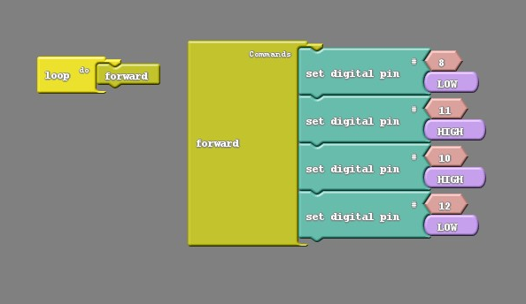

### Overview

In this section we will be programming our Barnabas Rover to do all the basic operations of navigation: move forward, move backwards and turn.  In order to d this, we'll need to cover:

- Subroutines
- Basic subroutines (forward, backward, turn)
- How to trigger your code with your button

### About Subroutines

Up to this point we have been issuing commands to our robot in a painstaking way. To move the robot forward we need to give orders to four different pins (8,11, 10, 12) and then specify a time that they continue obeying that order. It would be nice if we could instead give only one order to our robot, like move forward, and have it understand what we mean. 

Think of when you're told to take out the trash.  Your parents don't tell you: 

1. Open the trash can, then take the trashbag out
2. Tie it
3. Go outside and put it in the bin
4. Come inside and put another trashbag in the can
5. Then close the lid

Instead, they just tell you to "take the trash out".  The reason is because at some point you were already taught all the necessary steps required to accomplish the task.  Our robot can do this same thing where we make it understand one command as a longer list of orders.

We are going to achieve this by using **subroutines**. 

### Creating A Subroutine

To create a subroutine is to create a little sub-program within your code.  Take a look at the code below where we create a subroutine that moves the car forward.  Notice that the name of the subroutine matches what it does.  This way it is easy to keep track what our subroutines do.


```c
void forward() {
  digitalWrite(8,LOW);
  digitalWrite(11,HIGH);
  digitalWrite(10,HIGH);
  digitalWrite(12,LOW);
}
```
{:.text-based}

### Calling A Subroutine

To call a subroutine, simple use the name of the subroutine in your main loop.  Try uploading the code to see if your robot moves forward.  If it doesn't, you'll need to modify the code.  Remember if one of the wheels is spinning the wrong way, you just need to flip the high/low on your motor pair (8,11 or 10, 12).




```c
void forward() {
  digitalWrite(8,LOW);
  digitalWrite(11,HIGH);
  digitalWrite(10,HIGH);
  digitalWrite(12,LOW);
}

void setup()
{
  pinMode(8,OUTPUT);
  pinMode(11,OUTPUT);
  pinMode(10,OUTPUT);
  pinMode(12,OUTPUT);
}

void loop()
{
  forward();
}
```
{:.text-based}

#### Practice #1: Move Forward and Backward

Using subroutines, create code that moves your car forward for a second, stops for a second, moves backwards for a second, stops for a second and then repeats.


```c
void forward() {
  digitalWrite(8,LOW);
  digitalWrite(11,HIGH);
  digitalWrite(10,HIGH);
  digitalWrite(12,LOW);
}

void backward() {
  digitalWrite(8,HIGH);
  digitalWrite(11,LOW);
  digitalWrite(10,LOW);
  digitalWrite(12,HIGH);
}

void stop() {
  digitalWrite(8,LOW);
  digitalWrite(11,LOW);
  digitalWrite(10,LOW);
  digitalWrite(12,LOW);
}

void setup()
{
  pinMode(8,OUTPUT);
  pinMode(11,OUTPUT);
  pinMode(10,OUTPUT);
  pinMode(12,OUTPUT);
}

void loop()
{
  forward();
  delay(1000);
  stop();
  delay(1000);
  backward();
  delay(1000);
  stop();
  delay(1000);
}
```
{:.text-based}

#### Practice #2: Make more subroutines

Create the following subroutines and test them inside your main loop to make sure that they work

| Name        | Action                                         |
| ----------- | ---------------------------------------------- |
| *stop*      | Stops all motors                               |
| *rstop*     | Stops the right motor only                     |
| *lstop*     | Stops the left motor only                      |
| *left*      | Moves the left motor forward only              |
| *lbackward* | Move the left motor backward only              |
| *right*     | Moves the right motor forward only             |
| *rback*ward | Moves the right motor backward only            |
| *forward*   | Moves both the left and right motor forward.   |
| *backward*  | Moves both the left and right motor backwards. |


### Adding Your Button

Since we have started to program our car to move, you may have noticed that at times your car starts moving before you're ready to test your code.  To make things a bit more convenient for us, we're going to add a bit of code so that you car doesn't begin its program until you press your button.  

In order to accomplish this, we're going to need to use something called a while loop.  The while loop is like an if/else block.  How it works is: 

"Do what ever is inside the loop WHILE this thing is true"

So what we're going to do is tell it to do nothing WHILE the button is not pressed, and then jump out of the while loop once the button is pressed.  This is what it looks like in code.  Give it a try!


```c
void forward() {
  digitalWrite(8,LOW);
  digitalWrite(11,HIGH);
  digitalWrite(10,HIGH);
  digitalWrite(12,LOW);
}

void backward() {
  digitalWrite(8,HIGH);
  digitalWrite(11,LOW);
  digitalWrite(10,LOW);
  digitalWrite(12,HIGH);
}

void stop() {
  digitalWrite(8,LOW);
  digitalWrite(11,LOW);
  digitalWrite(10,LOW);
  digitalWrite(12,LOW);
}

void setup()
{
  pinMode(8,OUTPUT);
  pinMode(11,OUTPUT);
  pinMode(10,OUTPUT);
  pinMode(12,OUTPUT);
  pinMode(2,INTPUT);
}

void loop()
{
  while (digitalRead(2)==HIGH) {
     //- do nothing
  }
  forward();
  delay(1000);
  stop();
  delay(1000);
  backward();
  delay(1000);
  stop();
  delay(1000);
}
```
{:.text-based}

### Create A Turn

To create a turn, we'll need to:

1. Program on wheel to move forward while the other one is stopped.  
2. Determine how long we want the one wheel to turn before we stop it

See below for code that turns right, stops for 3 seconds and then turns left and stops for 3 seconds.  Try it out!  Remember that you need to push the button first before it moves because of the button code inside the while loop.


```c
void rightTurn() {
  digitalWrite(8,LOW);
  digitalWrite(11,HIGH);
  digitalWrite(10,LOW);
  digitalWrite(12,LOW);
  delay(300);
  stop();
}

void leftTurn() {
  digitalWrite(8,LOW);
  digitalWrite(11,LOW);
  digitalWrite(10,HIGH);
  digitalWrite(12,LOW);
  delay(300);
  stop();
}

void stop() {
  digitalWrite(8,LOW);
  digitalWrite(11,LOW);
  digitalWrite(10,LOW);
  digitalWrite(12,LOW);
}

void setup()
{
  pinMode(8,OUTPUT);
  pinMode(11,OUTPUT);
  pinMode(10,OUTPUT);
  pinMode(12,OUTPUT);
  pinMode(2,INTPUT);
}

void loop()
{
  while (digitalRead(2)==HIGH) {
     //- do nothing
  }
  rightTurn();
  delay(3000);
  leftTurn();
  delay(3000);
}
```
{:.text-based}

#### Challenge #1: Adjust The Turn Amount To Ex

Change the delay inside the subroutines to adjust how much it turns.

#### Challenge #2: Create Right Angle Turns

Change the delay inside the subroutines so that the left and right turns create exactly 90 degree turns.

#### Challenge #3: Adjust The Turn Direction

Change the low/high values to change the direction of the turn so that it turns backwards instead of forwards.