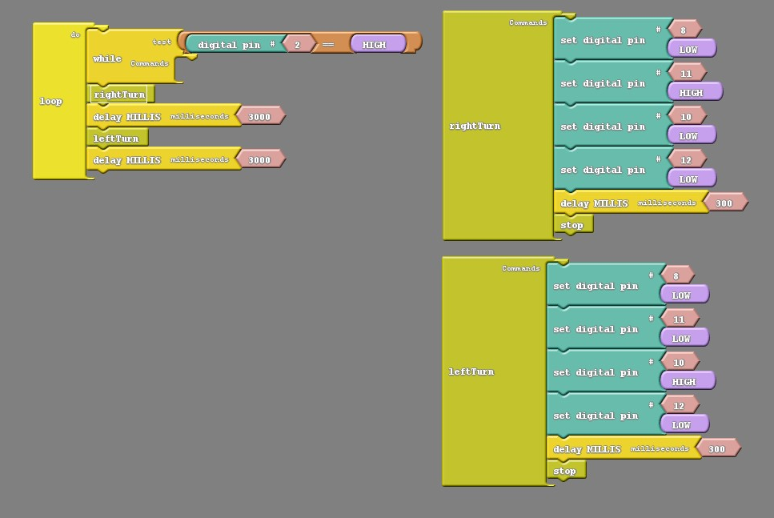

### Overview

In this section we will be programming our Barnabas Rover to turn!

### Create A Turn

To create a turn, we'll need to:

1. Program on wheel to move forward while the other one is stopped.  
2. Determine how long we want the one wheel to turn before we stop it

See below for code that turns right, stops for 3 seconds and then turns left and stops for 3 seconds.  Try it out!  Remember that you need to push the button first before it moves because of the button code inside the while loop.



```c
void forward() {
  digitalWrite(8,LOW);
  digitalWrite(11,HIGH);
  digitalWrite(10,HIGH);
  digitalWrite(12,LOW);
}

void backward() {
  digitalWrite(8,HIGH);
  digitalWrite(11,LOW);
  digitalWrite(10,LOW);
  digitalWrite(12,HIGH);
}

void rightTurn() {
  digitalWrite(8,LOW);
  digitalWrite(11,HIGH);
  digitalWrite(10,LOW);
  digitalWrite(12,LOW);
  delay(300);
  stop();
}

void leftTurn() {
  digitalWrite(8,LOW);
  digitalWrite(11,LOW);
  digitalWrite(10,HIGH);
  digitalWrite(12,LOW);
  delay(300);
  stop();
}

void stop() {
  digitalWrite(8,LOW);
  digitalWrite(11,LOW);
  digitalWrite(10,LOW);
  digitalWrite(12,LOW);
}

void setup()
{
  pinMode(8,OUTPUT);
  pinMode(11,OUTPUT);
  pinMode(10,OUTPUT);
  pinMode(12,OUTPUT);
  pinMode(2,INPUT);
}

void loop()
{
  while (digitalRead(2)==HIGH) {
     //- do nothing
  }
  rightTurn();
  delay(3000);
  leftTurn();
  delay(3000);
}
```
{:.text-based}

#### Challenge #1: Adjust The Turn Amount

Change the delay inside the subroutines to adjust how much it turns.

#### Challenge #2: Create Right Angle Turns

Change the delay inside the subroutines so that the left and right turns create exactly 90 degree turns.

#### Challenge #3: Adjust The Turn Direction

Change the low/high values to change the direction of the turn so that it turns backwards instead of forwards.
