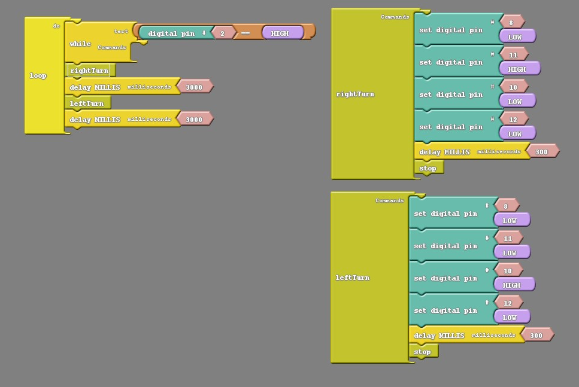

### Overview

In this section we will be programming our Barnabas Rover to turn!

### Create A Turn

To create a turn, we'll need to:

1. Program on wheel to move forward while the other one is stopped.  
2. Determine how long we want the one wheel to turn before we stop it

<div markdown = "1">

See below for code that turns right, stops for 3 seconds and then turns left and stops for 3 seconds.  Try it out!  Remember that you need to push the button first before it moves because of the button code inside the while loop.



#### Challenge #1: Adjust The Turn Amount

Change the delay inside the subroutines to adjust how much it turns.

#### Challenge #2: Create Right Angle Turns

Change the delay inside the subroutines so that the left and right turns create exactly 90 degree turns.

#### Challenge #3: Adjust The Turn Direction

Change the low/high values to change the direction of the turn so that it turns backwards instead of forwards.

</div>{:.block-based}

<div markdown = "1">



Note: This uses pins 3,11 and 9,11 for the DC driver.  There is also an additional challenge to move forward by distance.  I don't get it quite right, but I show you the process.  Feel free to try it out too! :)

</div>{:.text-based}

```c
/*
Challenges:
1) moveforward using speed + distance
*/

int motb_pin1 = 3;
int motb_pin2 = 11;

int mota_pin1 = 9;
int mota_pin2 = 10;

int button_pin = 2;

void setup() {
  
  //-Control Motor B
  pinMode(motb_pin1,OUTPUT);
  pinMode(motb_pin2,OUTPUT);
  
  //-Control Motor A
  pinMode(mota_pin1,OUTPUT);
  pinMode(mota_pin2,OUTPUT);
  
  //- button
  pinMode(button_pin,INPUT_PULLUP);
  
}

//- turn 90 degrees
void turnRight() {
  
  //- motor b is stopped
  analogWrite(motb_pin1,0);
  analogWrite(motb_pin2,0);
  
  //- motor a moves forward
  analogWrite(mota_pin1,255);
  analogWrite(mota_pin2,0);
  
  delay(600);
  
  //- stop motor a
  analogWrite(mota_pin1,0);
  analogWrite(mota_pin2,0);
  
}

void turnLeft() {
  
  //- motor a is stopped
  analogWrite(mota_pin1,0);
  analogWrite(mota_pin2,0);
  
  //- motor b moves forward
  analogWrite(motb_pin1,0);
  analogWrite(motb_pin2,255);
  
  delay(800);
  
  //- stop motor b
  analogWrite(motb_pin1,0);
  analogWrite(motb_pin2,0);
  
}

void stop() {
  //- motor a
  analogWrite(mota_pin1,255);
  analogWrite(mota_pin2,255);
  
  //- motor b
  analogWrite(motb_pin1,255);
  analogWrite(motb_pin2,255);
}

void moveForward(int speeda, int speedb, int inches) {
  
  int myDelay;
  
  //- motor a
  analogWrite(mota_pin1,speeda);
  analogWrite(mota_pin2,0);
  
  //- motor b
  analogWrite(motb_pin1,0);
  analogWrite(motb_pin2,speedb);
  
  //- move forward the distance in inches
  myDelay = inches*125;
  delay(myDelay);
  
  //- stop
  stop();
  
}

void moveBackward(int speeda, int speedb) {
  
  //- motor a
  analogWrite(mota_pin1,0);
  analogWrite(mota_pin2,speeda);
  
  //- motor b
  analogWrite(motb_pin1,speedb);
  analogWrite(motb_pin2,0);
  
}

void loop() {
  
  if (digitalRead(button_pin)==LOW) {
      moveForward(110,110,10);   
  }
  else {
    stop();
  }

}
```
{:.text-based}


