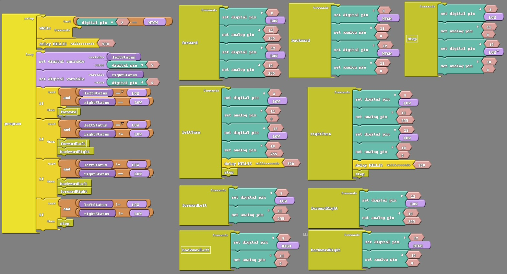

---

layout: lesson
title: Lesson 12 &middot; Line Following

suggested_time: 60-75 minutes  

videos:
    - link: https://youtu.be/MGxP-yhvOD8
      text: How to wire and code a single IR sensor module (Text-code)
    - link: https://youtu.be/6JP4tyrF_q8
      text: How to code line following (Text-code)
    - link: https://youtu.be/xmdW76WxKyo
      text: Line & Light Following Demo With Barnabas Rover
---


### Overview

In this section we'll learn how to use IR sensors to get our robot to follow a line!

### What You'll Need

Before we get started, let's make sure that we have all the parts.

- 1 x Arduino Uno Compatible Board
- 2 x IR Sensor Modules
- 6 x Pin to Socket Arduino Wires
- 2 x Double-stick foam

### Demo Video



### IR Sensor Module 


IR Sensor modules include two special LEDs.  One LED is a IR transmitter (the clear one) and the other is a IR receiver (the dark one).  

The transmitter sends a IR signal into the air.  While the IR travels through the air, it will bounce off of near by objects, sending IR back to the module.  The IR receiver looks for any IR signals that are bounced back and reports back to your robot if it does - which means that there is an object near by.  

There is a caveat here, though.  If IR hits black color, it won't bounce back because the black color absorbs the IR.  We can use this caveat to tell the different between white and black!  

Use two modules, and you now have the ability to cause the robot to follow a line!

### Mounting Your Modules 

Mount your modules to the front bumper using double-stick foam.


**Note:** Newer versions include 2 x 90 degree angle mounts to ease mounting.  See photos below for mounting instructions.

|  |  |
| ------------------------------------------------------------ | ------------------------------------------------------------ |
|  |  |

<div markdown = "1">

### Video Lesson - How to wire and code a single IR module



</div>{:.text-based}

### Wire Your IR Modules

The IR modules have three pins: VCC, GND and OUT.  

VCC and GND provide power to the module.  OUT is the signal that goes to the controller board, which our code will look at to see whether we see white or black.

Let's wire the IR modules to your Arduino-Compatible board using the following connections.

| Left Sensor | Arduino-Uno Compatible Board |
| ----------- | ---------------------------- |
| VCC         | 5V                           |
| GND         | GND                          |
| OUT         | 5 (or 12)                    |

| Right Sensor | Arduino-Uno Compatible Board |
| ------------ | ---------------------------- |
| VCC          | 5V                           |
| GND          | GND                          |
| OUT          | 6                            |


<div markdown = "1">

### Video Lesson - How to code line following



</div>{:.text-based}

### Coding Your IR Modules



```c
int trig = 3;
int echo = 4;
int led = 7;
int leftSensor = 5;
int rightSensor = 6;


void forward() {
  digitalWrite(8,LOW);
  digitalWrite(11,HIGH);
  digitalWrite(10,HIGH);
  digitalWrite(12,LOW);
}

void backward() {
  digitalWrite(8,HIGH);
  digitalWrite(11,LOW);
  digitalWrite(10,LOW);
  digitalWrite(12,HIGH);
}

void rightTurn() {
  digitalWrite(8,LOW);
  digitalWrite(11,HIGH);
  digitalWrite(10,LOW);
  digitalWrite(12,LOW);
  delay(300);
  stop();
}

void leftTurn() {
  digitalWrite(8,LOW);
  digitalWrite(11,LOW);
  digitalWrite(10,HIGH);
  digitalWrite(12,LOW);
  delay(300);
  stop();
}

void forwardLeft() {
  digitalWrite(8,LOW);
  digitalWrite(11,HIGH);
}

void backwardLeft() {
  digitalWrite(8,HIGH);
  digitalWrite(11,LOW);
}

void backwardRight() {
  digitalWrite(10,LOW);
  digitalWrite(12,HIGH);
}

void forwardRight() {
  digitalWrite(10,HIGH);
  digitalWrite(12,LOW);
}

void stop() {
  digitalWrite(8,LOW);
  digitalWrite(11,LOW);
  digitalWrite(10,LOW);
  digitalWrite(12,LOW);
}

void setup() {
  pinMode(trig, OUTPUT);
  pinMode(echo, INPUT);
  pinMode(led, OUTPUT);
  
  pinMode(leftSensor, INPUT);
  pinMode(rightSensor, INPUT);
  
  pinMode(8, OUTPUT);
  pinMode(11, OUTPUT);
  pinMode(10, OUTPUT);
  pinMode(12, OUTPUT);
    
  pinMode(2, INPUT);
}

void loop() {

    //- wait for button press before doing anything
    while (digitalRead(2) == HIGH) {
      //- do nothing
    }
    delay(500);

    //- loop here forever after the button is pressed
    while (true) {
      // 0: no line, 1: line
      int leftStatus = digitalRead(leftSensor); 
      int rightStatus = digitalRead(rightSensor);
  
      if (leftStatus == 0 && rightStatus == 0) {
        forward();
      }
  
      if (leftStatus == 0 && rightStatus != 0) {
        forwardLeft();
        backwardRight();
      }
  
      if (leftStatus != 0 && rightStatus == 0) {
        backwardLeft();
        forwardRight();
      }
  
      if (leftStatus != 0 && rightStatus != 0) {
        stop();
      }
    }
}
```
{:.text-based}


### Troubleshooting Tips

- Your rover may be heading in the wrong direction when it sees the line.  If that's the case, you probably have your left/right sensor mixed up.  Check your wiring and code.
- You may find that your rover reacts too slowly and and veers off the track before it can turn.  If that's the case, try slowing down your racer by moving at half speed.  See lesson 8 if you need a refresher on how to do that.