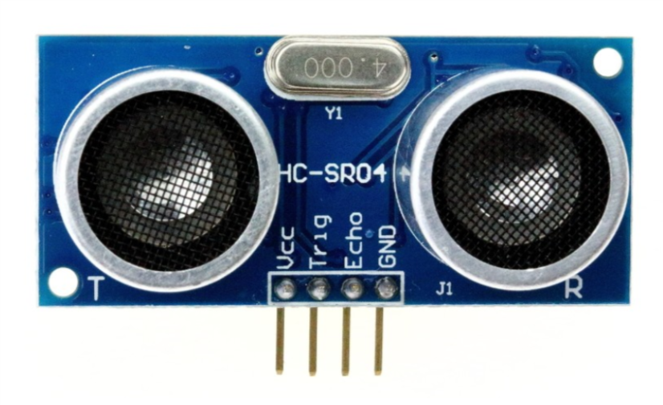

### Overview

In this section you will be learning how to add an ultrasonic sensor to your Barnabas Racer, which will allow it to see objects in front of it!

### The Ultrasonic Sensor



Our ultrasonic sensor is going to give our robot the ability to sense the world around it.  It almost looks like it's staring at you, right? On the front side there are two large speaker-like objects.  On its backside it has a lot of parts (resistors, capacitors, ICs).  The only thing we need to worry about are those speaker-like objects and the four pins sticking out from the bottom of the board.

Those four pins are labeled **Vcc**, **Trig**, **Echo** and **GND**. The pin labeled GND, unsurprisingly must be connected to the GND pin on our Barnabas Uno board.  The Vcc pin is the power pin of the sensor, so it will be connected to 5V of the Uno.

That leaves only the Trig and Echo pins to explain. 

Uno and will be programmed as an output. 

The Echo pin is an input pin.  It will be used to listen for sounds coming back to the sensor. This pin will be connected to the Uno and will be programmed as an input. 

### Wiring The Ultrasonic Sensor
#### Placing Your Hardware

Before wiring your sensor, place your sensor onto your breadboard (see below).

Notes: 

- Each of the four pins are on its own row (i.e. they are not connected with each other)
- Make sure that none of the four pins of the ultrasonic sensor are in the same row as any other component (resistor, LED or button)
- The speakers of the ultrasonic sensor are facing out in front of the car


##### Ultrasonic Sensor Wiring Chart

The wiring chart below shows the connections that we need to make between the ultrasonic sensor and the Uno.

| Ultrasonic Sensor | Uno   | Type of Connection |
| ----------------- | ----- | ------------------ |
| Vcc               | 5V    | Power (+)          |
| Trig              | Pin 3 | Output             |
| Echo              | Pin 4 | Input              |
| Gnd               | Gnd   | Power (-)          |

| Ultrasonic Sensor | Uno   | Type of Connection |
| ----------------- | ----- | ------------------ |
| Vcc               | 5V    | Power (+)          |
| Trig              | Pin 4 | Output             |
| Echo              | Pin 5 | Input              |
| Gnd               | Gnd   | Power (-)          |

### Coding the Ultrasonic Sensor

#### Science


Before we start coding, we need to first understand the science of how this sensor works.  Let's first go over how the ultrasonic sensor sends and receives signals.  The diagram on the right shows how a sensor sends an outgoing sound to an object which is reflected back to the sensor when it bounces off the same object.  The sensor does some math on the time that it takes the initial sound to come back to the sensor to find out how far away the object is.  This is how animals like bats and whales use echo location to tell how far objects are.  

#### The Math 

Now that we know the science behind echo location, let's use some math to figure out a formula to calculate distance from the sound.

We're going to use a formula that gives us distance from time and speed.

<p align="center"><b>Distance = Speed x Time </b></p>

We know that the speed of sound in air is *340 meters/second*, so if we know the time, we can then solve for distance!


You might think that our math is done, but not quite yet!  If we follow the path of the sound, it needs to travel to the object, bounce off of the object, and then travel back to the sensor. 

Therefore, the distance that the sound wave travels is actually *twice* the distance between the sensor and the object. 

For that reason the equation describing the distance read by the sensor is as follows:

<p align="center"><b>2 x Distance = 340m/s x time</b></p>

This is the equation we will use in our computer code for the sensor to behave appropriately.  If you're using block-coding, you won't need to code the formula as it is built into the block for you.  However, it's still good to know what is going on behind the scenes!

#### Reading the Distance

Our first coding challenge is to take what the ultrasonic sensor is reading and display it on our computer screen.  



Note: The ultrasonic sensor uses pins 4 and 5 for trigger and echo connections, respectively.

```c
int motb_pin1 = 3;
int motb_pin2 = 11;

int mota_pin1 = 9;
int mota_pin2 = 10;

int button_pin = 2;

int trig_pin = 4;
int echo_pin = 5;

void setup() {
  
  //-Control Motor B
  pinMode(motb_pin1,OUTPUT);
  pinMode(motb_pin2,OUTPUT);
  
  //-Control Motor A
  pinMode(mota_pin1,OUTPUT);
  pinMode(mota_pin2,OUTPUT);
  
  //- button
  pinMode(button_pin,INPUT_PULLUP);
  
  //-ultrasonic pin
  pinMode(trig_pin,OUTPUT);
  pinMode(echo_pin,INPUT);
  
  Serial.begin(9600);
  
}

//-sends sound out and receives sound
//-returns the distance in centimeters
int ultrasonic() {
  
  long time;
  float distance;
  
  //-trigger a sound 
  // send out trigger signal
  digitalWrite(trig_pin, LOW);
  delayMicroseconds(2);
  digitalWrite(trig_pin, HIGH);
  delayMicroseconds(20);
  digitalWrite(trig_pin, LOW);
  
  //- a sound has gone out!!
  //- wait for a sound to come back
  
  time = pulseIn(echo_pin, HIGH);
  
  //- calculate the distance in centimeters
  distance = 0.01715 * time;
  
  return distance;

}

//- turn 90 degrees
void turnRight() {
  
  //- motor b is stopped
  analogWrite(motb_pin1,0);
  analogWrite(motb_pin2,0);
  
  //- motor a moves forward
  analogWrite(mota_pin1,255);
  analogWrite(mota_pin2,0);
  
  delay(600);
  
  //- stop motor a
  analogWrite(mota_pin1,0);
  analogWrite(mota_pin2,0);
  
}

void turnLeft() {
  
  //- motor a is stopped
  analogWrite(mota_pin1,0);
  analogWrite(mota_pin2,0);
  
  //- motor b moves forward
  analogWrite(motb_pin1,0);
  analogWrite(motb_pin2,255);
  
  delay(800);
  
  //- stop motor b
  analogWrite(motb_pin1,0);
  analogWrite(motb_pin2,0);
  
}

void stop() {
  //- motor a
  analogWrite(mota_pin1,255);
  analogWrite(mota_pin2,255);
  
  //- motor b
  analogWrite(motb_pin1,255);
  analogWrite(motb_pin2,255);
}


void moveToWall(int speeda, int speedb) {
  
  //- move forward!
  //- motor a
  analogWrite(mota_pin1,speeda);
  analogWrite(mota_pin2,0);
  
  //- motor b
  analogWrite(motb_pin1,0);
  analogWrite(motb_pin2,speedb);
  
  //-stop when you hit a wall!!
  
  int distance = ultrasonic();
  
  while (distance > 5) {
    //-do nothing except check distance
    distance = ultrasonic();
  }
  
  //-stop!!!
  stop();
  
}


void moveForward(int speeda, int speedb, int inches) {
  
  int myDelay;
  
  //- motor a
  analogWrite(mota_pin1,speeda);
  analogWrite(mota_pin2,0);
  
  //- motor b
  analogWrite(motb_pin1,0);
  analogWrite(motb_pin2,speedb);
  
  //- move forward the distance in inches
  
  
  
  myDelay = inches*125;
  delay(myDelay);
  
  //- stop
  stop();
  
}

void moveBackward(int speeda, int speedb) {
  
  //- motor a
  analogWrite(mota_pin1,0);
  analogWrite(mota_pin2,speeda);
  
  //- motor b
  analogWrite(motb_pin1,speedb);
  analogWrite(motb_pin2,0);
  
}


void loop() {
  
  Serial.println(ultrasonic());
  delay(100);

}
```